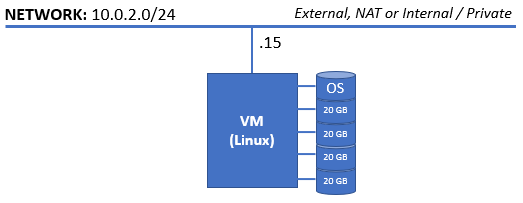

# Practice M1: Local Storage and Additional Techniques (Debian)

This practice assumes that you are working in an on-premises environment

All tasks can be achieved under different configurations (host OS and/or
virtualization solution) with the appropriate adjustments

This practice is oriented towards **Debian**-based distributions and
more precisely, **Debian 12.9**. You can use any other distribution from
the same family as **Ubuntu 22.x Server**, **Ubuntu 24.x Server**,
**Debian 11.x**, **Debian 12.x**, etc. but may have to make some
adjustments here and there

For this practice we will need an infrastructure like this one:



Machine(s) can be with or without graphical environment

Network settings shown on the picture reflect the ones used during the
demonstration. You should adjust them according to your setup

## Part 1: Local Storage

Make sure, that you have prepared the required set of folders

```sh
sudo mkdir -p /storage/{raid,lvm,btrfs,ext4,xfs}
```

Every station has its **hosts** file prepared with records for other
network members

### Software RAID

Let's first examine our spare hard disks with

```sh
lsblk
```

They should appear as four **20G** drives named **sdb**, **sdc**,
**sdd**, and **sde**

Now, that we know the drives, let's initialize them

We can use **fdisk** to prepare the **sdb** drive

```sh
sudo fdisk /dev/sdb
```

Make sure that you set the partition table to be **MBR**, create one
primary partition with default values and set the type to **Linux raid
autodetect** which is **fd**

There is a faster and script-ready way. Let's execute the following for
**sdc** drive

```sh
sudo parted -s /dev/sdc \-- mklabel msdos mkpart primary 2048s -0m set 1 raid on
```

_If the **parted** tool is not part of your installation, then install
it and repeat the above command_

Let's check if both approaches led to the same results

```sh
sudo fdisk -l /dev/sd{b,c}
```

Both partitions should look the same

We can process the other two drives following the second approach

```sh
sudo parted -s /dev/sdd \-- mklabel msdos mkpart primary 2048s -0m set 1 raid on

sudo parted -s /dev/sde \-- mklabel msdos mkpart primary 2048s -0m set 1 raid on
```

Now, we have our drives ready

Let's make sure that we have the necessary tools installed

```sh
sudo apt-get update

sudo apt-get install mdadm
```

_You may need to reboot the system_

We can receive usage information for the **mdadm** with

```sh
sudo mdadm \--help
```

In order to ask for a specific set of commands, for example for array
creation, execute

```sh
sudo mdadm \--create \--help
```

#### RAID 0

In order to create a RAID 0 array, we need at least two devices

So, let's use **sdb1** and **sdc1** to create the array

```sh
sudo mdadm \--create /dev/md0 \--level 0 \--raid-devices 2 /dev/sd{b,c}1
```

We can check its status with

```sh
cat /proc/mdstat
```

It appears that our array is using **512k** sized chunks. It is the
default value

Let's change it, but first we will stop our array

```sh
sudo mdadm \--stop /dev/md0
```

Erase the MD superblocks from the devices

```sh
sudo mdadm \--zero-superblock /dev/sd{b,c}1
```

Use the following command to create a new array with **128k** chunks

```sh
sudo mdadm \--create /dev/md0 \--level 0 \--chunk 128 \--raid-devices 2 /dev/sd{b,c}1
```

Alternative approach to check the status of an array is to use

```sh
sudo mdadm \--detail /dev/md0
```

We can shorten the command by substituting **\--detail** with **-D**.
Other actions have short names as well

#### RAID 1

Be sure that you stopped the array and clean up the devices

```sh
sudo mdadm \--stop /dev/md0

sudo mdadm \--zero-superblock /dev/sd{b,c}1
```

Use the following command to create a new RAID 1 array

```sh
sudo mdadm \--create /dev/md0 \--level 1 \--raid-devices 2 /dev/sd{b,c}1
```

You will be asked to either change the metadata version with
**\--metadata 0.90** if you plan to use the array for **/boot**

If not, and asked, type **yes** and hit **Enter** to create the array

Check its status with

```sh
sudo mdadm \--detail /dev/md0
```

#### RAID 5

Be sure that you stopped the array and clean up the devices

```sh
sudo mdadm \--stop /dev/md0

sudo mdadm \--zero-superblock /dev/sd{b,c}1
```

Use the following command to create a new RAID 5 array with **64k**
chunks

```sh
sudo mdadm \--create /dev/md0 \--level 5 \--chunk 64 \--raid-devices 3 /dev/sd{b,c,d}1
```

Check its status with

```sh
sudo mdadm \--detail /dev/md0
```

Let's add one more device

```sh
sudo mdadm /dev/md0 \--add /dev/sde1
```

We can check the status

```sh
sudo mdadm \--detail /dev/md0
```

Now, we must reconfigure the array to use the new drive as well

```sh
sudo mdadm /dev/md0 \--grow \--raid-devices 4 \--backup-file /tmp/md0-grow.bak
```

As a final step, we must extend the filesystem, if any, residing on the
array

#### RAID 10

Be sure that you stopped the array and clean up the devices

```sh
sudo mdadm \--stop /dev/md0

sudo mdadm \--zero-superblock /dev/sd{b,c,d,e}1
```

Use the following command to create a new RAID 10 array with **64k**
chunks

```sh
sudo mdadm \--create /dev/md0 \--level 10 \--chunk 64 \--raid-devices 4 /dev/sd{b..e}1
```

Check its status with

```sh
sudo mdadm \--detail /dev/md0
```

#### Using an array

We must take some extra measures to ensure that the array will
re-assemble automatically after reboot

There is a special configuration file **/etc/mdadm.conf** that must
contain information about the array

The easiest way to achieve this is to execute

```sh
sudo mdadm \--detail \--brief /dev/md0 \| sudo tee -a /etc/mdadm.conf
```

Alternatively, if we had multiple freshly created arrays, we could add
all of them in one step

```sh
sudo mdadm \--detail \--scan \| sudo tee -a /etc/mdadm.conf
```

Now, let's create an **ext4** filesystem on the array

```sh
sudo mkfs.ext4 /dev/md0
```

We can mount the array in the **/storage/raid** folder

```sh
sudo mount /dev/md0 /storage/raid
```

To check if the mount was successful, we can use either **mount -l**,
**lsblk**, **/etc/mtab** or **/proc/mounts**

Should we want these changes to persist, we must change the
**/etc/fstab** file as well

For this we will need to find the **UUID** with

```sh
sudo blkid /dev/md0
```

Don't forget to update the **initramfs** if you want the array to be
available during boot

```sh
sudo update-initramfs -u
```

_**[Do not add]** a record to the **/etc/fstab** file now,
as we are about to destroy the array_

#### Clean up

Unmount the array

```sh
sudo umount /dev/md0
```

Be sure that you stopped the array

```sh
sudo mdadm \--stop /dev/md0
```

And then clean up the devices by erasing the **MD** superblocks from
them

```sh
sudo mdadm \--zero-superblock /dev/sd{b,c,d,e}1
```

Furthermore, you can use **dd** to mangle the drives' content

If you added the array to the **/etc/mdadm.conf** file, remove it

```sh
sudo rm /etc/mdadm.conf
```

If you edited the **/etc/fstab** file, revert the changes

Finally, use **wipefs** to remove any remaining structures on disks

```sh
sudo wipefs \--all /dev/sd{b..e}
```

Check the result with **lsblk**

### LVM2

We will assume that we are starting with four clean spare hard disks

For the purpose of LVM, we can work with either hard drives or
partitions

First, depending on our installation, we may need to install the
required packages with:

```sh
sudo apt-get update

sudo apt-get install lvm2
```

####

_You may need to restart the system_

#### Physical volumes

Knowing that we have **sdb**, **sdc**, **sdd**, and **sde**, we can
start with LVM header creation

Let's initialize the first available drive

```sh
sudo pvcreate /dev/sdb
```

We can ask for detailed information for the physical volume we just
created with

```sh
sudo pvdisplay /dev/sdb
```

In order to increase the verbosity level, we can use **-v** (it is on by
default), **-vv**, **-vvv**, or **-vvvv**

By default, each physical volume contains one copy of LVM metadata just
after the LVM label

We can create a physical volume with either none or for example two
copies of metadata. Let's create with two

```sh
sudo pvcreate \--metadatacopies 2 /dev/sdc
```

Verbosity can be added and/or increased for other commands as well, for
example for the **pvcreate**

Let's remove the two PVs

```sh
sudo pvremove /dev/sdb /dev/sdc
```

And create four PVs out of the four available drives

```sh
sudo pvcreate /dev/sd{b..e} -v
```

Once done, we can ask for PV details with

```sh
sudo pvs -v
```

#### Volume groups

Let's create a volume group using one of the PVs created so far

```sh
sudo vgcreate vg_demo /dev/sdb
```

Now, let's get a short information about the available VGs with

```sh
sudo vgs
```

Okay, let's increase the verbosity level

```sh
sudo vgs -v
```

We can ask for detailed information about a particular VG with

```sh
sudo vgdisplay vg_demo
```

And again, we can increase the verbosity with

```sh
sudo vgdisplay vg_demo -v
```

Let's create a second VG but this time with a different extent size

```sh
sudo vgcreate vg_test \--physicalextentsize 8 /dev/sdc
```

And check the summary with

```sh
sudo vgs -v
```

Now, that we know how to create a VG with different extent size, let's
delete it

```sh
sudo vgremove vg_test
```

And extend the one that we created first to include the other three PVs.
First, add just the **sdc**

```sh
sudo vgextend vg_demo /dev/sdc
```

Check the detailed information

```sh
sudo vgdisplay vg_demo -v
```

And add the other two available PVs

```sh
sudo vgextend vg_demo /dev/sdd /dev/sde
```

#### Logical volumes

Let's create one logical volume with 1GB in size

```sh
sudo lvcreate -L 1G -n lv_demo vg_demo
```

And another one with smaller size

```sh
sudo lvcreate -L 25M -n lv_demo_tiny vg_demo
```

We can see that the second logical volume was created with a different
size not the requested one. A logical volume size must be a
**multiplication** of the **extent size**

Ask for a brief information about the logical volumes

```sh
sudo lvs -v
```

Now, let's execute the **lsblk** command

```sh
lsblk
```

It appears that both logical volumes are residing on the **sdb** device.
This has to do with the space allocation process

Let's remove the smaller LV with

```sh
sudo lvremove vg_demo/lv_demo_tiny
```

Confirm with **y**

#### Using a logical volume

Let's create an **ext4** filesystem on the logical volume

```sh
sudo mkfs.ext4 /dev/vg_demo/lv_demo
```

_Or we can use the alternative device file (via device-mapper), i.e.
**/dev/mapper/vg_demo-lv_demo**_

We can mount the array in the **/storage/lvm** folder

```sh
sudo mount /dev/vg_demo/lv_demo /storage/lvm
```

Create a **hello.txt** file with some text and store it in the
**/storage/lvm** folder

```sh
echo 'Hello LVM' | sudo tee /storage/lvm/hello.txt
```

#### Growing a logical volume

Let's extend our logical volume

We can give a fixed new/required size with

```sh
sudo lvextend -L 10G /dev/vg_demo/lv_demo
```

_The same can be written without the space_

```sh
_sudo lvextend -L10G /dev/vg_demo/lv_demo_
```

Extending can be done with an amount of space to be added (thus the plus
sign)

**sudo lvextend -L +5G /dev/vg_demo/lv_demo**

_The long option for this (**-L**) is **--size**_

In the same way, we can use extents both as required target size or as
amount to be added

For this, we can use the short option **-l** (lower case L) or the long
one **--extents**

For example, to add 100 more extents, we can execute

```sh
sudo lvextend --extents +100 /dev/vg_demo/lv_demo
```

Of course, we can ask the logical volume to occupy the whole available
space on the PVs with

```sh
sudo lvextend -l 100%PVS /dev/vg_demo/lv_demo
```

Now, we must extend our filesystem as well with

```sh
sudo resize2fs /dev/vg_demo/lv_demo
```

And check if the file is still there and readable

```sh
cat /storage/lvm/hello.txt
```

#### Shrinking a logical volume

When shrinking a logical volume and the filesystem residing on it, first
we should **ALWAYS** do a **BACKUP** of **OUR** **DATA**

Next step is to unmount the filesystem with

```sh
sudo umount /storage/lvm
```

Let's check the filesystem with

```sh
sudo e2fsck -f /dev/vg_demo/lv_demo
```

Now, we are ready to reduce or shrink the filesystem down to 5GB for
example

```sh
sudo resize2fs /dev/vg_demo/lv_demo 5G
```

We are ready to reduce the logical volume

We can do it with a subtraction, for example with 10GB

```sh
sudo lvreduce -L -10G vg_demo/lv_demo
```

_If asked for confirmation, enter **y** and press **Enter**_

Or we can use a desired size

```sh
sudo lvreduce -L 5G vg_demo/lv_demo
```

_If asked for confirmation, enter **y** and press **Enter**_

Re-check the filesystem just in case

```sh
sudo e2fsck -f /dev/vg_demo/lv_demo
```

Finally, we can re-mount our filesystem

```sh
sudo mount /dev/vg_demo/lv_demo /storage/lvm
```

And check if our file is there and readable

```sh
cat /storage/lvm/hello.txt
```

Everything should be just fine

#### Snapshots

Let's create a snapshot of our logical volume

```sh
sudo lvcreate -s -L 1G -n lv_demo_snap /dev/vg_demo/lv_demo
```

And check its details

```sh
sudo lvdisplay vg_demo/lv_demo_snap
```

Now, check the details of the initial logical volume

```sh
sudo lvdisplay vg_demo/lv_demo
```

Let's check with

```sh
sudo lvs
```

And let's execute **lsblk**

```sh
lsblk
```

It appears that one more level has been created

Prepare a mount point

```sh
sudo mkdir /storage/lvm-snap
```

And mount the snapshot as well

```sh
sudo mount /dev/vg_demo/lv_demo_snap /storage/lvm-snap
```

We can compare both the original and the snapshot, they should be the
same

```sh
diff /storage/lvm/hello.txt /storage/lvm-snap/hello.txt
```

Now, change the text in the original file with:

```sh
echo '... some more text' | sudo tee -a /storage/lvm/hello.txt
```

And compare them again

```sh
diff /storage/lvm/hello.txt /storage/lvm-snap/hello.txt
```

The one in the snapshot should remain unchanged

Okay, let's delete the **hello.txt** file from the original volume

```sh
sudo rm /storage/lvm/hello.txt
```

Now, check if the file is still available in the snapshot

```sh
ls -al /storage/lvm-snap/
```

Yes, it should be there

We can restore the original one by just copying back from the snapshot,
or restore the whole snapshot

Depending on the circumstances, we can go either way

Let's restore the whole snapshot

First, we must unmount both the origin and the snapshot

```sh
sudo umount /storage/lvm /storage/lvm-snap
```

The actual operation is called **merge** and it is started with

```sh
sudo lvconvert --merge /dev/vg_demo/lv_demo_snap
```

Then, we can check all logical volumes with

```sh
sudo lvs
```

And then, mount the origin

```sh
sudo mount /dev/vg_demo/lv_demo /storage/lvm
```

And finally, check if the file is back there

```sh
cat /storage/lvm/hello.txt
```

#### Thin provisioning

Let's prepare a new logical volume

```sh
sudo lvcreate -L 1G --thinpool tp_demo vg_demo
```

Let's check

```sh
sudo lvs
```

Our new **tp_demo** appears, beside the existing ones

Now, let's create a volume with

```sh
sudo lvcreate -V 5G --thin -n tp_demo_lv vg_demo/tp_demo
```

_Because we asked for more space than actually available, we got a
warning_

We can ask for list of volumes with

```sh
sudo lvs
```

Make a mount point

```sh
sudo mkdir /storage/lvm-thin
```

Create a filesystem

```sh
sudo mkfs.ext4 /dev/vg_demo/tp_demo_lv
```

And mount it

```sh
sudo mount /dev/vg_demo/tp_demo_lv /storage/lvm-thin
```

Now, let's check the effect of creating a filesystem on the volume

```sh
sudo lvdisplay vg_demo/tp_demo_lv
```

And on the pool

```sh
sudo lvdisplay vg_demo/tp_demo
```

Some space has been consumed, so we should monitor and be pro-active

If we start copying files, this space will go away, and the filesystem
will crash. We should be careful

#### Striping {#striping}

By default, space coming from PVs is consumed in a linear fashion

We can create a striped logical volume

```sh
sudo lvcreate -L 1G -n lv_demo_stripe1 -i 4 vg_demo
```

Now, check how the stripes are distributed with

```sh
sudo lvdisplay vg_demo/lv_demo_stripe1 -m
```

Okay, let's create one more, but this time with different stripe size
and distribution

**sudo lvcreate -L 1G -n lv_demo_stripe2 -i 2 -I 128 vg_demo /dev/sdc
/dev/sdd**

And check its details

```sh
sudo lvdisplay vg_demo/lv_demo_stripe2 -m
```

Let's execute **lsblk**

The picture gets messy

#### Clean up

First unmount all LVM related mounts

```sh
sudo umount /storage/lvm*
```

Next, delete the volume group together with all logical volumes

```sh
sudo vgremove vg_demo --force
```

Wipe all four drives

```sh
sudo wipefs --all /dev/sd[b-e]
```

## Part 2: Advanced Filesystems

Let's explore both the **BTRFS** and ZFS

We will need just one machine. Let's continue with the server from the
first part

### Advanced Filesystems (BTRFS)

Let's start with **BTRFS**

First, we must make sure that the required packages are installed:

```sh
sudo apt-get update

sudo apt-get install btrfs-progs
```

_You may need to reboot the system_

#### Single disk

Let's create a filesystem over a single disk

```sh
sudo mkfs.btrfs -d single /dev/sdb
```

As we can see both the metadata and system data are duplicated

_Should we want, we can set them to single mode as well_

```sh
sudo mkfs.btrfs -d single -m single -f /dev/sdb
```

We can mount it with

```sh
sudo mount /dev/sdb /storage/btrfs
```

Let's create a few small files with

```sh
for i in \$(seq 1 5); do sudo dd if=/dev/zero of=/storage/btrfs/file\$i.img bs=1M count=10 ; sync ; done
```

Check with

```sh
df -hT
```

Now, check device status with

```sh
sudo btrfs device usage /storage/btrfs
```

Repeat the procedure with files creation but create bigger files

```sh
for i in \$(seq 1 5); do sudo dd if=/dev/zero of=/storage/btrfs/file\$i.img bs=10M count=100 ; sync ; done
```

Check disk usage again

```sh
df -hT
```

And now the device usage

```sh
sudo btrfs device usage /storage/btrfs
```

#### Multiple disks (Linear)

Now, we can add two more disks with

```sh
sudo btrfs device add /dev/sdc /dev/sdd /storage/btrfs
```

Check disk usage again

```sh
df -hT
```

And now the device usage

```sh
sudo btrfs device usage /storage/btrfs
```

We can have another view on this with

```sh
sudo btrfs filesystem show /storage/btrfs
```

Let's re-balance the filesystem

```sh
sudo btrfs balance start -d -m /storage/btrfs
```

Check disk usage again

```sh
df -hT
```

No changes here

And now the device usage

```sh
sudo btrfs device usage /storage/btrfs
```

And the alternative view

```sh
sudo btrfs filesystem show /storage/btrfs
```

Why not remove one drive? Let's do it

Remove the third drive with

```sh
sudo btrfs device delete /dev/sdd /storage/btrfs
```

The data is first relocated and then the device is removed

We can use the known commands to check

```sh
sudo btrfs device usage /storage/btrfs

sudo btrfs filesystem show /storage/btrfs
```

#### Multiple disks (RAID)

Let's convert the existing filesystem to RAID1

```sh
sudo btrfs balance start -dconvert=raid1 -mconvert=raid1 /storage/btrfs
```

And of course, check again what is the situation

```sh
sudo btrfs device usage /storage/btrfs

sudo btrfs filesystem show /storage/btrfs
```

Now, let's add the other two disks

```sh
sudo btrfs device add /dev/sdd /dev/sde /storage/btrfs
```

And convert the file system to RAID10 for data and RAID1 for metadata

```sh
sudo btrfs balance start -dconvert=raid10 -mconvert=raid1 /storage/btrfs
```

And of course, check again what is the situation

```sh
sudo btrfs device usage /storage/btrfs
```

#### Subvolumes

We can use subvolumes to introduce alternative roots which function as
independent filesystems

Let's create one

```sh
sudo btrfs subvolume create /storage/btrfs/svol
```

Now, we can ask for a list of subvolumes

```sh
sudo btrfs subvolume list /storage/btrfs
```

Create an empty file there

```sh
sudo touch /storage/btrfs/svol/empty_file
```

And check the hierarchy

```sh
tree /storage/btrfs
```

Let's create another mount point for the subvolume

```sh
sudo mkdir -p /storage/btrfs-svol
```

And mount it there

```sh
sudo mount -o subvolid=\<ID\> /dev/sdb /storage/btrfs-svol
```

_Change the **\<ID\>** to what you saw as output of the **subvolume
list** command_

Now, if we execute the standard command **df** we will see something
strange at first look

```sh
df -hT
```

_Instead, we can use **btrfs filesystem df** or **btrfs filesystem du**_

Should we want to delete a subvolume, first we must make sure that it is
empty and then use (**skip it for now**)

```sh
sudo btrfs subvolume delete /storage/btrfs/svol
```

#### Snapshots

Snapshots are a special type of subvolume. They contain a copy of the
current state of another subvolume

Let's create a simple text file

```sh
echo 'Hello BTRFS' | sudo tee /storage/btrfs/hello.txt
```

And then create a snapshot of the main (root) BTRFS volume

```sh
sudo btrfs subvolume snapshot /storage/btrfs /storage/btrfs/snap
```

Check the directory hierarchy

```sh
tree /storage/btrfs
```

Change the original text file

```sh
echo '... some additional text' | sudo tee -a /storage/btrfs/hello.txt
```

Check the content of both files

```sh
cat /storage/btrfs/hello.txt

cat /storage/btrfs/snap/hello.txt
```

_The snapshot data is unchanged_

Now, if we remove the original file, we can easily copy the one from the
snapshot (either by mounting it as a regular filesystem or directly)

Unmount all BTRFS filesystems

```sh
sudo umount /storage/btrfs /storage/btrfs-svol
```

And clean the devices

```sh
sudo wipefs \--all /dev/sd{b..e}
```

### Advanced Filesystems (ZFS)

Let's continue with ZFS on Linux (or OpenZFS)

First, we may need to add additional repository -- the **contrib** one

```sh
sudo apt-get install software-properties-common

sudo apt-add-repository contrib
```

Install the necessary packages

```sh
sudo apt-get update

sudo apt-get install zfsutils-linux
```

Okay, we have the binaries, the module and the services are
auto-loading, and four spare 20GB drives, so let's start

Create a few mount points

```sh
sudo mkdir -p /storage/zfs{m,s,r}
```

And then either reboot the system or load the module

```sh
sudo modprobe zfs
```

#### Striped pool

In order to create a striped pool, we must execute (**skip it**)

```sh
sudo zpool create zfs-stripe /dev/sdb /dev/sdc
```

This will mount the pool in **/zfs-stripe** folder

Should we want a custom mount point, we can execute

```sh
sudo zpool create -m /storage/zfss zfs-stripe /dev/sdb /dev/sdc
```

Now, we can ask for its status with

```sh
sudo zpool status zfs-stripe
```

Or we can list all pools with

```sh
sudo zfs list
```

#### Mirrored pool

More or less the procedure is the same as with the stripe mode

In order to create a mirrored pool, but mount it in a custom point

```sh
sudo zpool create -m /storage/zfsm zfs-mirror mirror /dev/sdd /dev/sde
```

Now, we can ask for its status with

```sh
sudo zpool status zfs-mirror
```

Or we can list all pools with

```sh
sudo zfs list
```

#### RAID5-like pool

Let's unmount both pools

```sh
sudo umount /storage/zfs\*
```

Then execute the **destroy** command

```sh
sudo zpool destroy zfs-mirror

sudo zpool destroy zfs-stripe
```

Then clean the drives

```sh
sudo wipefs --all /dev/sd[b-e]
```

In order to create a RAID5-like (RAIDZ) pool, but mount it in a custom
point, we must execute

```sh
sudo zpool create -m /storage/zfsr zfs-raidz raidz /dev/sdb /dev/sdc /dev/sdd
```

Check the status with the known commands

```sh
sudo zpool list

sudo zpool status zfs-raidz

df -hT
```

#### Clean up

In order to delete a pool, first we must unmount it

```sh
sudo umount /storage/zfsr
```

Then execute the **destroy** command

```sh
sudo zpool destroy zfs-raidz
```

We can clean the drives

```sh
sudo wipefs \--all /dev/sd\[b-e\]
```

## Part 3: Additional Storage Techniques

Let's explore a few more storage topics

We will need just one machine. Let's continue with the server from the
second part

### Quotas

Prepare drive **sdb** by creating a partition and filesystem

```sh
sudo parted -s /dev/sdb \-- mklabel msdos mkpart primary 2048s -0m set 1

sudo mkfs.ext4 /dev/sdb1
```

_When asked to confirm if you want to continue, do it_

Prepare drive **sdc** by creating a partition and filesystem

```sh
sudo parted -s /dev/sdc \-- mklabel msdos mkpart primary 2048s -0m set 1*

sudo mkfs.xfs -f /dev/sdc1
```

_You may need to install the **xfsprogs** package_

Add both in **/etc/fstab** by adding the following two rows at the end

```plain
/dev/sdb1 /storage/ext4 ext4 defaults 0 0

/dev/sdc1 /storage/xfs xfs defaults 0 0
```

And mount them with

```sh
sudo mount -av
```

#### Ext4 quotas

Install the missing packages

```sh
sudo apt-get update

sudo apt-get install quota
```

Open the **/etc/fstab** and change the record for the **ext4**
filesystem to enable user quota

Just substitute **defaults** with **usrquota**

Save and close the file

Unmount the filesystem

```sh
sudo umount /storage/ext4
```

And mount it again

```sh
sudo mount -av
```

Now, let's create the quota database

```sh
sudo quotacheck -mu /dev/sdb1
```

_If the command is missing, you can install the following package and
then re-run the command_

**_sudo apt-get install quota_**

Let's check the filesystem's content

```sh
*ls -al /storage/ext4/
```

We can see that there is a quota file (database) for users

Turn on the quota for the partition

```sh
sudo quotaon /dev/sdb1
```

Check the current state of space usage (or quota utilization) on the
partition

```sh
sudo repquota -uv /dev/sdb1
```

Let's create a new **demo** user

```sh
sudo useradd -m demo
```

And set its password to something easy

```sh
sudo passwd demo
```

Now, set the quota for the demo user

```sh
sudo setquota -u demo 20000 25000 0 0 /dev/sdb1
```

And check the quota utilization again

```sh
sudo repquota -uv /dev/sdb1
```

Let's change the quota with

```sh
sudo edquota -u demo
```

Set the soft limit to **18000**

Save and close

Let's add one more user named **knight**

```sh
sudo useradd -m knight
```

And set quota for it based on the **demo** user

```sh
sudo edquota -u knight -p demo
```

Check the quota utilization again

```sh
sudo repquota -uv /dev/sdb1
```

Now, let's give right to everyone to write in the folder with

```sh
sudo chmod 777 /storage/ext4
```

Switch to the **demo** user

```sh
su demo
```

Create a **5 MB** file named **fill.dat** with

```sh
dd if=/dev/zero of=/storage/ext4/fill.dat
```

Ooops, we forgot to set block size and block count

Fortunately, because of the quota the operation was interrupted

Delete the file and this time create a file with the right size

```sh
rm /storage/ext4/fill.dat

dd if=/dev/zero of=/storage/ext4/fill.dat bs=1M count=5
```

Everything is going as expected

Add one more file but **15 MB** in size

```sh
dd if=/dev/zero of=/storage/ext4/fill-15M.dat bs=15M count=1
```

We received a warning

Exit to the regular user

```sh
exit
```

Ask for the quota utilization

```sh
sudo repquota -uv /dev/sdb1
```

We can see that the **soft quota is breached** for the **demo** user

#### XFS quotas

Open the **/etc/fstab** and change the record for the **xfs** filesystem
to enable user quota

Just substitute **defaults** with **usrquota,uqnoenforce**

Save and close the file

Unmount the filesystem

```sh
sudo umount /storage/xfs
```

And mount it again

```sh
sudo mount -av
```

Now, let us set some quota limits

```sh
sudo xfs_quota -xc \'limit -u bsoft=20m bhard=25m demo\' /dev/sdc1
```

Change folder's permissions

```sh
sudo chmod 777 /storage/xfs
```

Switch to the **demo** user

```sh
su demo
```

And create a **15 MB** file

```sh
dd if=/dev/zero of=/storage/xfs/fill-15M.dat bs=15M count=1
```

Return to the regular user

```sh
exit
```

And ask for quota utilization report

```sh
sudo xfs_quota -c \'quota demo\' /dev/sdc1
```

We can switch again to the **demo** user

```sh
su demo
```

Let's try to create a second file but this time **20 MB** file

```sh
dd if=/dev/zero of=/storage/xfs/fill-20M.dat bs=20M count=1
```

It allowed us. Strange

Exit the user

```sh
exit
```

And ask for a report

```sh
sudo xfs_quota -c \'quota demo\' /dev/sdc1
```

Most probably this situation has something to do with the options in the
**/etc/fstab**

So, with XFS we can monitor and report on quota breaches and at the same
time not disrupting the users

Should we want to enforce quota rules, we must remove the
**uqnoenforce** option in the **fstab** file

We can use the **xfs_quota** in interactive manner as well

### Encryption

#### Preparation

For this part we will need the **DM_CRYPT** module

Let's check is it available as part of the kernel or it is loadable on
demand

```sh
grep -i DM_CRYPT /boot/config-\$(uname -r)
```

We can check if it is already loaded with

```sh
sudo lsmod \| grep dm_crypt
```

If not, we can try to load it

```sh
sudo modprobe dm_crypt
```

And check again if it is loaded

```sh
sudo lsmod \| grep dm_crypt
```

Make sure that the **cryptsetup** package is installed

```sh
sudo apt-get install cryptsetup
```

Finally, make sure that there is a partition available for encryption

Let's create a small partition on one of the spare drives

```sh
sudo parted -s /dev/sdd \-- mklabel msdos mkpart primary 2048s 1024m set 1
```

#### Encrypt a partition

It is a good practice to **shred** the partition before the encryption
process. This will make harder to be determined where the encrypted data
resides

Initiate the encryption procedure

```sh
sudo cryptsetup -y luksFormat /dev/sdd1
```

Answer with **YES**

Then enter and re-enter encryption passphrase

Now, we can check what options were used during the encryption

```sh
sudo cryptsetup luksDump /dev/sdd1
```

Usually, there is a tab-completion for the sub-commands

We can explore the set of sub-commands

```sh
sudo cryptsetup \--help
```

For example, we can try the **isLuks** and test our encrypted and some
other partition

Then, we must use the **echo \$?** command to check the result (after
every **isLuks** sub-command)

For example

```sh
cryptsetup isLuks /dev/sdd1

echo \$?
```

_Should return 0 as it is encrypted_

```sh
cryptsetup isLuks /dev/sdb1

echo \$?
```

_Should return 1 as it is not encrypted_

#### Work with encrypted partition

Let's open the encrypted partition

```sh
sudo cryptsetup luksOpen /dev/sdd1 encr
```

Now, check for the **encr** partition

```sh
ls /dev/mapper/
```

Let's create a filesystem on it

```sh
sudo mkfs.xfs /dev/mapper/encr
```

Once we are done, we can close the partition

```sh
sudo cryptsetup luksClose encr
```

Let's open it again but this time with a different name

```sh
sudo cryptsetup luksOpen /dev/sdd1 enc-data
```

Of course, it appears with the new name

```sh
ls /dev/mapper
```

#### Mount encrypted partition on boot

Prepare a mount point

```sh
sudo mkdir -p /storage/enc
```

We must either use one and the same name every time in order to be able
to use it in **/etc/fstab** or obtain the UUID

```sh
sudo blkid /dev/sdd1
```

Now open the **/etc/crypttab** file

```sh
sudo vi /etc/crypttab
```

And paste

```sh
enc-data UUID=\<uuid\>
```

Save and close the file

_Or use this command, instead_

```sh
echo "enc-data $(sudo blkid /dev/sdd1 | cut -d ' ' -f 2)" | sudo tee /etc/crypttab
```

Now, open the **/etc/fstab** file

```sh
sudo vi /etc/fstab
```

As last record enter

```sh
/dev/mapper/enc-data /storage/enc xfs defaults 0 0
```

Save and close the file

Close the encrypted partition if open

```sh
sudo cryptsetup luksClose enc-data
```

Then, re-open it

```sh
sudo cryptsetup luksOpen /dev/sdd1 enc-data
```

Now, try to mount it

```sh
sudo mount -av
```

Now, reboot the machine and use the console of the virtualization
solution to interact with the VM

When the booting stops, it will ask you to enter the password to open
the encrypted partition

Once, you enter it correctly the boot process will continue

### Automounting

Let's install the required package

```sh
sudo apt-get install autofs
```

Now, that we have the package installed, let's examine the set of
configuration files

```sh
ls -al /etc/auto\*
```

The main configuration file is the **/etc/autofs.conf**

Explore its content with

```sh
cat /etc/autofs.conf
```

Should we want to change, for example, the timeout after which to
unmount the resource, we must do it here

Before we continue, we must change something. Open one of the
configuration files

```sh
sudo vi /etc/auto.master
```

And make sure that the **/misc** and **/net** rows are not commented

Save and close it

And restart the service

```sh
sudo systemctl restart autofs
```

#### Automount encrypted device

Remove the **/etc/fstab** entry related to the mounting of the encrypted
partition

```sh
sudo vi /etc/fstab
```

Remove the **/etc/crypttab** entry or file as well

```sh
sudo vi /etc/crypttab
```

Unmount it

```sh
sudo umount /storage/enc
```

And then close it

```sh
sudo cryptsetup luksClose enc-data
```

Open the **/etc/auto.misc** file

```sh
sudo vi /etc/auto.misc
```

And add a row bellow the **cd** one

```sh
enc -fstype=xfs :/dev/mapper/enc-data
```

Close and save the file

Restart the **autofs** service

```sh
sudo systemctl restart autofs
```

Open the encrypted volume

```sh
sudo cryptsetup luksOpen /dev/sdd1 enc-data
```

If asked for the password used during the encryption, then enter it

Check the **/misc** directory

```sh
ls -al /misc
```

It is empty

Navigate to **/misc/enc**

```sh
cd /misc/enc
```

You are allowed to enter

Now, if you execute either of the following commands

```sh
mount -l

df -hT
```

You will notice that the one, residing on the encrypted partition is
currently mounted

#### Automount NFS export

_You can test this in a later stage when we complete the M3 module_

Check what are NFS exports we have currently

```sh
sudo exportfs -s
```

Try to mount it locally

```sh
sudo mount server:/storage/nfs/share /mnt
```

Check with

```sh
mount -l
```

Now, unmount it

```sh
sudo umount /mnt
```

Let's edit the **/etc/auto.misc** file and add

```sh
nfs -fstype=nfs,ro,soft,intr server:/storage/nfs/share
```

Save and close the file

Restart the **autofs** service

Go to **/misc/nfs** folder

If you check the mounts, you will notice that it was auto-mounted

You can browse its content
