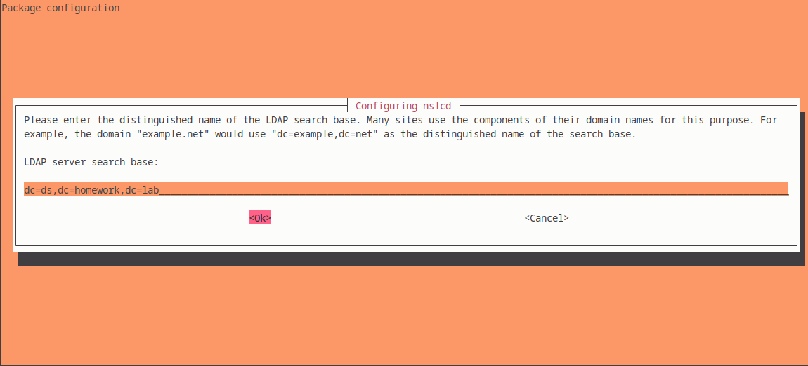

# Research and implement a 389-ds single-node solution

## Create a directory with three users and two groups. One of the users should belong to two groups, while the other two just to one of them

### Server setup (192.168.99.101)

1. Install 389 Directory Server
   - **389-ds-base**- Core Server Package
   - **389-ds** - Adding 389 administration tools and extra utilities (like **cockpit-389-ds**)
```sh
$ sudo apt update
$ sudo apt install -y 389-ds 389-ds-base
```

2. Run the Setup script. Initialize the 389 Directory Server instance.
```sh
$ sudo dscreate interactive
Install Directory Server (interactive mode)
===========================================
selinux is disabled, will not relabel ports or files.

Selinux support will be disabled, continue? [yes]: yes

Enter system's hostname [ds.homework.lab]: ds.homework.lab

Enter the instance name [ds]: ds

Enter port number [389]: 389

Create self-signed certificate database [yes]: yes

Enter secure port number [636]: 636

Enter Directory Manager DN [cn=Directory Manager]: 

Enter the Directory Manager password: 
Confirm the Directory Manager Password: 

Enter the database suffix (or enter "none" to skip) [dc=ds,dc=homework,dc=lab]: 

Create sample entries in the suffix [no]: no

Create just the top suffix entry [no]: yes

Do you want to start the instance after the installation? [yes]: yes

Are you ready to install? [no]: yes
Starting installation ...
Validate installation settings ...
Create file system structures ...
Create self-signed certificate database ...
selinux is disabled, will not relabel ports or files.
selinux is disabled, will not relabel ports or files.
Create database backend: dc=ds,dc=homework,dc=lab ...
Perform post-installation tasks ...
Completed installation for instance: slapd-ds
```
3. Start and Enable the 389 Directory Server
```sh
$ sudo systemctl start dirsrv@ds

$ sudo systemctl enable dirsrv@ds

$ sudo systemctl status dirsrv@ds
● dirsrv@ds.service - 389 Directory Server ds.
     Loaded: loaded (/lib/systemd/system/dirsrv@.service; enabled; preset: enabled)
    Drop-In: /usr/lib/systemd/system/dirsrv@.service.d
             └─custom.conf
     Active: active (running) since Sat 2025-02-08 09:58:21 EET; 6min ago
   Main PID: 19322 (ns-slapd)
     Status: "slapd started: Ready to process requests"
      Tasks: 29 (limit: 2306)
     Memory: 111.6M
        CPU: 7.585s
     CGroup: /system.slice/system-dirsrv.slice/dirsrv@ds.service
             └─19322 /usr/sbin/ns-slapd -D /etc/dirsrv/slapd-ds -i /run/dirsrv/slapd-ds.pid

Feb 08 09:58:21 ds ns-slapd[19322]: [08/Feb/2025:09:58:21.590356665 +0200] - ERR - attrcrypt_cipher_init - No symmetric key found for cipher AES in backend userroot, attemp>
Feb 08 09:58:21 ds ns-slapd[19322]: [08/Feb/2025:09:58:21.593796457 +0200] - INFO - attrcrypt_cipher_init - Key for cipher AES successfully generated and stored
Feb 08 09:58:21 ds ns-slapd[19322]: [08/Feb/2025:09:58:21.594657484 +0200] - ERR - attrcrypt_cipher_init - No symmetric key found for cipher 3DES in backend userroot, attem>
Feb 08 09:58:21 ds ns-slapd[19322]: [08/Feb/2025:09:58:21.596967310 +0200] - INFO - attrcrypt_cipher_init - Key for cipher 3DES successfully generated and stored
Feb 08 09:58:21 ds ns-slapd[19322]: [08/Feb/2025:09:58:21.633893077 +0200] - INFO - connection_table_new - conntablesize:63936
Feb 08 09:58:21 ds ns-slapd[19322]: [08/Feb/2025:09:58:21.653557352 +0200] - INFO - slapd_daemon - slapd started.  Listening on All Interfaces port 389 for LDAP requests
Feb 08 09:58:21 ds ns-slapd[19322]: [08/Feb/2025:09:58:21.655408073 +0200] - INFO - slapd_daemon - Listening on All Interfaces port 636 for LDAPS requests
Feb 08 09:58:21 ds ns-slapd[19322]: [08/Feb/2025:09:58:21.656350628 +0200] - INFO - slapd_daemon - Listening on /run/slapd-ds.socket for LDAPI requests
Feb 08 09:58:21 ds systemd[1]: Started dirsrv@ds.service - 389 Directory Server ds..
Feb 08 09:58:24 ds ns-slapd[19322]: [08/Feb/2025:09:58:24.657084636 +0200] - INFO - vattr_check_thread - No role/cos definition in dc=ds,dc=homework,dc=lab
```
4. Allow LDAP Traffic Through Firewall (Optional)
```sh
# check if UFW is installed
$ sudo ufw status verbose

# if not isntalled, install it
$ sudo apt update && sudo apt install ufw -y

# allow LDAP ports
$ sudo ufw allow 389/tcp comment "Allow LDAP traffic"
Rules updated
Rules updated (v6)

$ sudo ufw allow 636/tcp comment "Allow Secure LDAP (LDAPS) traffic"
Rules updated
Rules updated (v6)

# reaload and enable
$ sudo ufw enable
Command may disrupt existing ssh connections. Proceed with operation (y|n)? y
Firewall is active and enabled on system startup

$ sudo ufw reload
Firewall reloaded

# check LDAP ports are open
$ sudo ss -tulnp | grep -E "389|636"
tcp   LISTEN 0      128                *:636             *:*    users:(("ns-slapd",pid=19322,fd=9))
tcp   LISTEN 0      128                *:389             *:*    users:(("ns-slapd",pid=19322,fd=8))
```
5. Test LDAP Connection
```sh
# Install LDAP Client Utilities if not installed
$ sudo apt install ldap-utils -y

# try connection without authentication
$ ldapsearch -x -H ldap://localhost -s base -b "" namingContexts
# extended LDIF
#
# LDAPv3
# base <> with scope baseObject
# filter: (objectclass=*)
# requesting: namingContexts 
#

#
dn:
namingContexts: dc=ds,dc=homework,dc=lab

# search result
search: 2
result: 0 Success

# numResponses: 2
# numEntries: 1

# try connection as Directory Manager
$ ldapsearch -x -H ldap://localhost -D "cn=Directory Manager" -W -b "dc=ds,dc=homework,dc=lab"
Enter LDAP Password: # writecown the password from initialization
# extended LDIF
#
# LDAPv3
# base <dc=ds,dc=homework,dc=lab> with scope subtree
# filter: (objectclass=*)
# requesting: ALL
#

# ds.homework.lab
dn: dc=ds,dc=homework,dc=lab
objectClass: top
objectClass: domain
dc: ds
description: dc=ds,dc=homework,dc=lab

# search result
search: 2
result: 0 Success

# numResponses: 2
# numEntries: 1
```

6. Create OU People

- Prepare LDIF file for UO creation `add_people_ou.ldif`
```ldif
dn: ou=People,dc=ds,dc=homework,dc=lab
objectClass: top
objectClass: organizationalUnit
ou: People
```
- Apply the file to LDAP
```sh
$ ldapadd -x -D "cn=Directory Manager" -W -f add_people_ou.ldif
Enter LDAP Password: # eneter the password
adding new entry "ou=People,dc=ds,dc=homework,dc=lab"
```
- Check LDAP after creation
```sh
$ ldapsearch -x -H ldap://localhost -D "cn=Directory Manager" -W -b "dc=ds,dc=homework,dc=lab"
Enter LDAP Password: # enter the password
...

# ds.homework.lab
dn: dc=ds,dc=homework,dc=lab
objectClass: top
objectClass: domain
dc: ds
description: dc=ds,dc=homework,dc=lab

# People, ds.homework.lab
dn: ou=People,dc=ds,dc=homework,dc=lab
objectClass: top
objectClass: organizationalUnit
ou: People

...
  ```
7. Create OU Groups
- Prepare LDIF file for UO creation `add_groups_ou.ldif`
```ldif
dn: ou=Groups,dc=ds,dc=homework,dc=lab
objectClass: top
objectClass: organizationalUnit
ou: Groups
```
- Apply the LDIF file
```sh
$ ldapadd -x -D "cn=Directory Manager" -W -f add_groups_ou.ldif
Enter LDAP Password: # enter the password
adding new entry "ou=Groups,dc=ds,dc=homework,dc=lab"
```
- Verify
```sh
$ ldapsearch -x -LLL -D "cn=Directory Manager" -W -b "dc=ds,dc=homework,dc=lab" | grep "^dn:"
Enter LDAP Password: # enter the password
dn: dc=ds,dc=homework,dc=lab
dn: ou=People,dc=ds,dc=homework,dc=lab
dn: ou=Groups,dc=ds,dc=homework,dc=lab
```
8. Create three users
- Prepre LDIF file for user creation `add_users.ldif`
```ldif
dn: uid=ivan.ivanov,ou=People,dc=ds,dc=homework,dc=lab
objectClass: top
objectClass: person
objectClass: organizationalPerson
objectClass: inetOrgPerson
cn: Ivan
sn: Ivanov
displayName: Ivan Ivanov
uid: ivan.ivanov
userPassword: pass_123456

dn: uid=mariya.ilieva,ou=People,dc=ds,dc=homework,dc=lab
objectClass: top
objectClass: person
objectClass: organizationalPerson
objectClass: inetOrgPerson
cn: Mariya
sn: Ilieva
displayName: Mariya Ilieva
uid: mariya.ilieva
userPassword: pass_123456

dn: uid=petar.radev,ou=People,dc=ds,dc=homework,dc=lab
objectClass: top
objectClass: person
objectClass: organizationalPerson
objectClass: inetOrgPerson
cn: Petar
sn: Radev
displayName: Petar Radev
uid: petar.radev
userPassword: pass_123123
```
- Apply the file to LDAP
```sh
$ ldapadd -x -D "cn=Directory Manager" -W -f add_users.ldif
Enter LDAP Password: # enter the password
adding new entry "uid=ivan.ivanov,ou=People,dc=ds,dc=homework,dc=lab"
adding new entry "uid=mariya.ilieva,ou=People,dc=ds,dc=homework,dc=lab"
adding new entry "uid=petar.radev,ou=People,dc=ds,dc=homework,dc=lab"
```
- Veryfy the users
```sh
$ ldapsearch -x -LLL -D "cn=Directory Manager" -W -b "ou=People,dc=ds,dc=homework,dc=lab" uid displayName
Enter LDAP Password: # enter the password
dn: ou=People,dc=ds,dc=homework,dc=lab

dn: uid=ivan.ivanov,ou=People,dc=ds,dc=homework,dc=lab
uid: ivan.ivanov
displayName: Ivan Ivanov

dn: uid=mariya.ilieva,ou=People,dc=ds,dc=homework,dc=lab
uid: mariya.ilieva
displayName: Mariya Ilieva

dn: uid=petar.radev,ou=People,dc=ds,dc=homework,dc=lab
uid: petar.radev
displayName: Petar Radev
```
9. Create two groups
- Create LDIF file `add_groups.ldif`
```ldif
dn: cn=Accountant,ou=Groups,dc=ds,dc=homework,dc=lab
objectClass: top
objectClass: groupOfNames
cn: Accountant
member: cn=Directory Manager,dc=ds,dc=homework,dc=lab

dn: cn=Commercial,ou=Groups,dc=ds,dc=homework,dc=lab
objectClass: top
objectClass: groupOfNames
cn: Commercial
member: cn=Directory Manager,dc=ds,dc=homework,dc=lab
```
- Apply the file to LDAP
```sh
$ ldapadd -x -D "cn=Directory Manager" -W -f add_groups.ldif 
Enter LDAP Password: 
adding new entry "cn=Accountant,ou=Groups,dc=ds,dc=homework,dc=lab"

adding new entry "cn=Commercial,ou=Groups,dc=ds,dc=homework,dc=lab"
```
- Verify
```sh
$ ldapsearch -x -LLL -D "cn=Directory Manager" -W -b "ou=Groups,dc=ds,dc=homework,dc=lab" dn
Enter LDAP Password: 
dn: ou=Groups,dc=ds,dc=homework,dc=lab

dn: cn=Accountant,ou=Groups,dc=ds,dc=homework,dc=lab

dn: cn=Commercial,ou=Groups,dc=ds,dc=homework,dc=lab
```
10.   Add user `ivan.ivanov` to groups `Accountant` and `Commercial`
- Prepare LDIF file `add_users_to_groups.ldif`
```ldif
dn: cn=Accountant,ou=Groups,dc=ds,dc=homework,dc=lab
changetype: modify
add: member
member: uid=ivan.ivanov,ou=People,dc=ds,dc=homework,dc=lab

dn: cn=Commercial,ou=Groups,dc=ds,dc=homework,dc=lab
changetype: modify
add: member
member: uid=ivan.ivanov,ou=People,dc=ds,dc=homework,dc=lab
```
- Apply the file against LDAP
```sh
$ ldapmodify -x -D "cn=Directory Manager" -W -f add_user_to_groups.ldif
Enter LDAP Password: # enter the password
modifying entry "cn=Accountant,ou=Groups,dc=ds,dc=homework,dc=lab"

modifying entry "cn=Commercial,ou=Groups,dc=ds,dc=homework,dc=lab"
```
- Verify
```sh
$ ldapsearch -x -LLL -D "cn=Directory Manager" -W -b "ou=Groups,dc=ds,dc=homework,dc=lab" member
Enter LDAP Password: 
dn: ou=Groups,dc=ds,dc=homework,dc=lab

dn: cn=Accountant,ou=Groups,dc=ds,dc=homework,dc=lab
member: cn=Directory Manager,dc=ds,dc=homework,dc=lab
member: uid=ivan.ivanov,ou=People,dc=ds,dc=homework,dc=lab

dn: cn=Commercial,ou=Groups,dc=ds,dc=homework,dc=lab
member: cn=Directory Manager,dc=ds,dc=homework,dc=lab
member: uid=ivan.ivanov,ou=People,dc=ds,dc=homework,dc=lab
```

> [!IMPORTANT]
> We found that when groups are created `cn=Directory Manager` was automatically added. As a proctice in corporate organization Directory manager should not be part of departments groups.

- Prepare new LDIF file `remove_directory_manager.ldif` for removing Directory Manager from departments groups.
```ldif
dn: cn=Accountant,ou=Groups,dc=ds,dc=homework,dc=lab
changetype: modify
delete: member
member: cn=Directory Manager,dc=ds,dc=homework,dc=lab

dn: cn=Commercial,ou=Groups,dc=ds,dc=homework,dc=lab
changetype: modify
delete: member
member: cn=Directory Manager,dc=ds,dc=homework,dc=lab
```
- Apply the file against the LDAP
```sh
$ ldapmodify -x -D "cn=Directory Manager" -W -f remove_directory_manager.ldif
Enter LDAP Password: # enter the password
modifying entry "cn=Accountant,ou=Groups,dc=ds,dc=homework,dc=lab"

modifying entry "cn=Commercial,ou=Groups,dc=ds,dc=homework,dc=lab"
```
- Verify
```sh
$ ldapsearch -x -LLL -D "cn=Directory Manager" -W -b "ou=Groups,dc=ds,dc=homework,dc=lab" member
Enter LDAP Password: # enter the password
dn: ou=Groups,dc=ds,dc=homework,dc=lab

dn: cn=Accountant,ou=Groups,dc=ds,dc=homework,dc=lab
member: uid=ivan.ivanov,ou=People,dc=ds,dc=homework,dc=lab

dn: cn=Commercial,ou=Groups,dc=ds,dc=homework,dc=lab
member: uid=ivan.ivanov,ou=People,dc=ds,dc=homework,dc=lab
```
11. Add two users to two groups.
- Prepare LDIF file `add_two_users_to_two_groups.ldif`
```ldif
dn: cn=Accountant,ou=Groups,dc=ds,dc=homework,dc=lab
changetype: modify
add: member
member: uid=mariya.ilieva,ou=People,dc=ds,dc=homework,dc=lab

dn: cn=Commercial,ou=Groups,dc=ds,dc=homework,dc=lab
changetype: modify
add: member
member: uid=petar.radev,ou=People,dc=ds,dc=homework,dc=lab
```
- Apply the file against the LDAP
```sh
$ ldapmodify -x -D "cn=Directory Manager" -W -f add_two_users_to_two_groups.ldif 
Enter LDAP Password: 
modifying entry "cn=Accountant,ou=Groups,dc=ds,dc=homework,dc=lab"

modifying entry "cn=Commercial,ou=Groups,dc=ds,dc=homework,dc=lab"
```
- Verify
```sh
$ ldapsearch -x -LLL -D "cn=Directory Manager" -W -b "ou=Groups,dc=ds,dc=homework,dc=lab" member
Enter LDAP Password: 
dn: ou=Groups,dc=ds,dc=homework,dc=lab

dn: cn=Accountant,ou=Groups,dc=ds,dc=homework,dc=lab
member: uid=ivan.ivanov,ou=People,dc=ds,dc=homework,dc=lab
member: uid=mariya.ilieva,ou=People,dc=ds,dc=homework,dc=lab

dn: cn=Commercial,ou=Groups,dc=ds,dc=homework,dc=lab
member: uid=ivan.ivanov,ou=People,dc=ds,dc=homework,dc=lab
member: uid=petar.radev,ou=People,dc=ds,dc=homework,dc=lab
```
12. Extracts the server certificate (Server-Cert) from the 389-DS internal certificate database and saves it as PEM format in `/etc/dirsrv/slapd-ds/ca.crt`
```sh
$ sudo certutil -d /etc/dirsrv/slapd-ds/ -L -n "Server-Cert" -a | sudo tee /etc/dirsrv/slapd-ds/ca.crt > /dev/null
```
13. Adjust Permissions and Copy the File
```sh
$ sudo chmod 644 /etc/dirsrv/slapd-ds/ca.crt

$ su
Password: # enter root password
```
14. Copy the CA certificate to the client machine (192.168.99.102)
```sh
$ scp /etc/dirsrv/slapd-ds/ca.crt vagrant@192.168.99.102:/tmp/
```
15. Fix `ivan.ivanov` user to had:
- uidNumber
- gidNumber
- loginShell
- homeDirectory
  
Create LDIF file `fix_ivan_ldap.ldif`
```ldif
dn: uid=ivan.ivanov,ou=People,dc=ds,dc=homework,dc=lab
changetype: modify
add: objectClass
objectClass: posixAccount
-
add: uidNumber
uidNumber: 10001
-
add: gidNumber
gidNumber: 10001
-
add: loginShell
loginShell: /bin/bash
-
add: homeDirectory
homeDirectory: /home/ivan.ivanov
```
16. Apply the file against the LDAP
```sh
$ ldapmodify -x -D "cn=Directory Manager" -W -f fix_ivan_ldap.ldif 
Enter LDAP Password: # enter the password
modifying entry "uid=ivan.ivanov,ou=People,dc=ds,dc=homework,dc=lab"
```
17. Verify the fix
```sh
$ ldapsearch -x -LLL -D "cn=Directory Manager" -W -b "dc=ds,dc=homework,dc=lab" "(uid=ivan.ivanov)"
Enter LDAP Password: 
dn: uid=ivan.ivanov,ou=People,dc=ds,dc=homework,dc=lab
objectClass: top
objectClass: person
objectClass: organizationalPerson
objectClass: inetOrgPerson
objectClass: posixAccount
cn: Ivan
sn: Ivanov
displayName: Ivan Ivanov
uid: ivan.ivanov
userPassword:: e1BCS0RGMi1TSEE1MTJ9MTAwMDAkcG9YYWJyc0VuYlU2WjBEMElNMFVjSDgrQnB
 rTHdOaUckSXpaRFFzUVF3Ym5LaWtHT1JPQUtIV2tlVksxUE5jOHc4MWFyUEpqbHMyY2NLYXRNOVEw
 QThCdE5QR0RPdWJVei9YQ1lsY2ZNSFRNak1PcDBXWGk4bWc9PQ==
uidNumber: 10001
gidNumber: 10001
loginShell: /bin/bash
homeDirectory: /home/ivan.ivanov
```
### Clien setup (192.168.99.102)
1. Install required packages
```sh
$ sudo apt update && sudo apt install -y libnss-ldap libpam-ldap ldap-utils nscd
```
1. Perform the interactive setup (comes form `libnss-ldap` and `libpam-ldap`)
- LDAP server URI:


- Distinguished name
  

- Encrypted connection


- Essential options
- 
These are the minimum required for login to work via LDAP:

**passwd** -> Enables LDAP for user authentication

**group** -> Enables LDAP for group membership

**shadow** -> Enables LDAP for password storage


3. Ensure that Debian will use LDAP for user and group lookups by modifying `/etc/nsswitch.conf`. Add `ldap` on first three uncommented rows.
```conf
# /etc/nsswitch.conf
#
# Example configuration of GNU Name Service Switch functionality.
# If you have the `glibc-doc-reference' and `info' packages installed, try:
# `info libc "Name Service Switch"' for information about this file.

passwd:         files systemd ldap
group:          files systemd ldap
shadow:         files systemd ldap
gshadow:        files systemd

hosts:          files dns
networks:       files

protocols:      db files
services:       db files
ethers:         db files
rpc:            db files

netgroup:       nis
```
4. Restart service if needed
```sh
$ sudo systemctl restart nscd
```
5. Move the CA certificate to the trusted directory
```sh
$ sudo mv /tmp/ca.crt /usr/local/share/ca-certificates/ldap-ca.crt
```
1. Update the CA store
```sh
$ sudo update-ca-certificates
Updating certificates in /etc/ssl/certs...
rehash: warning: skipping ca-certificates.crt,it does not contain exactly one certificate or CRL
1 added, 0 removed; done.
Running hooks in /etc/ca-certificates/update.d...
done.
```
7. Configure LDAP client authentication. Edit `/etc/ldap/ldap.conf`. Fix uri from `ldaps://192.168.99.101` to `ldaps://ds.homework.lab`, because of the LDAP server (389-ds) has a certificate with CN (Common Name) ds.homework.lab, NOT 192.168.99.101.
```conf
#
# LDAP Defaults
#

# See ldap.conf(5) for details
# This file should be world readable but not world writable.

#BASE   dc=example,dc=com
#URI    ldap://ldap.example.com ldap://ldap-provider.example.com:666

#SIZELIMIT      12
#TIMELIMIT      15
#DEREF          never

# TLS certificates (needed for GnuTLS)
# TLS_CACERT    /etc/ssl/certs/ca-certificates.crt

BASE    dc=ds,dc=homework,dc=lab
URI     ldaps://192.168.99.101
TLS_CACERT /etc/ssl/certs/ldap-ca.pem
```
8. Ckeck `/etc/nslcd.conf`
```conf
# /etc/nslcd.conf
# nslcd configuration file. See nslcd.conf(5)
# for details.

# The user and group nslcd should run as.
uid nslcd
gid nslcd

# The location at which the LDAP server(s) should be reachable.
uri ldaps://ds.homework.lab/

# The search base that will be used for all queries.
base dc=ds,dc=homework,dc=lab

# The LDAP protocol version to use.
#ldap_version 3

# The DN to bind with for normal lookups.
#binddn cn=annonymous,dc=example,dc=net
#bindpw secret

# The DN used for password modifications by root.
#rootpwmoddn cn=admin,dc=example,dc=com

# SSL options
#ssl off
tls_reqcert allow
tls_cacertfile /etc/ssl/certs/ldap-ca.pem # chaneged

# The search scope.
#scope **sub**
```
9. Restart services
```sh
$ sudo systemctl restart nslcd
```
10. Check user `ivan.ivanov` exists
```sh
$ ldapsearch -x -LLL -D "cn=Directory Manager" -W -H ldaps://ds.homework.lab -b "dc=ds,dc=homework,dc=lab" "(uid=ivan.ivanov)"
Enter LDAP Password: 
dn: uid=ivan.ivanov,ou=People,dc=ds,dc=homework,dc=lab
objectClass: top
objectClass: person
objectClass: organizationalPerson
objectClass: inetOrgPerson
cn: Ivan
sn: Ivanov
displayName: Ivan Ivanov
uid: ivan.ivanov
userPassword:: e1BCS0RGMi1TSEE1MTJ9MTAwMDAkcG9YYWJyc0VuYlU2WjBEMElNMFVjSDgrQnB
 rTHdOaUckSXpaRFFzUVF3Ym5LaWtHT1JPQUtIV2tlVksxUE5jOHc4MWFyUEpqbHMyY2NLYXRNOVEw
 QThCdE5QR0RPdWJVei9YQ1lsY2ZNSFRNak1PcDBXWGk4bWc9PQ==
```
11. Check user authentication
```sh
$ ldapwhoami -x -D "uid=ivan.ivanov,ou=People,dc=ds,dc=homework,dc=lab" -W -H ldaps://ds.homework.lab
Enter LDAP Password: 
dn: uid=ivan.ivanov,ou=people,dc=ds,dc=homework,dc=lab
```