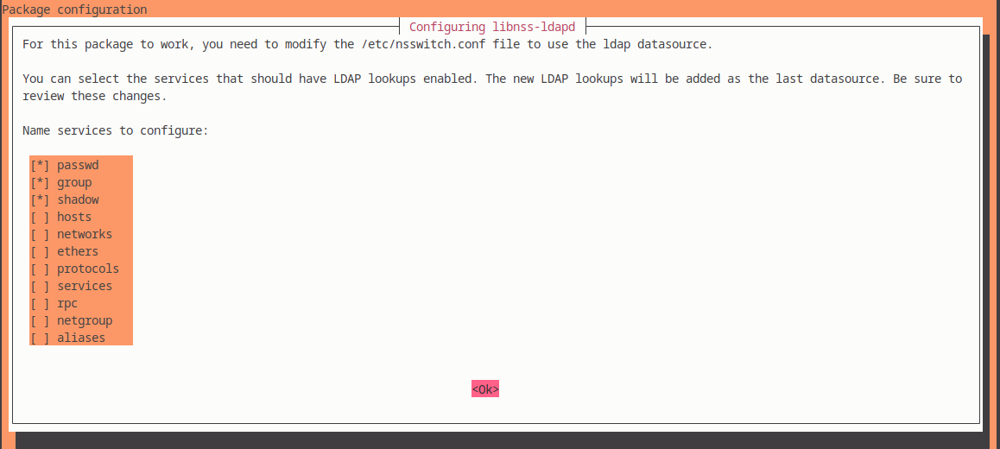

# Research and implement a 389-ds single-node solution

## Create a directory with three users and two groups. One of the users should belong to two groups, while the other two just to one of them

### Server setup (192.168.99.101)

1. Install 389 Directory Server
   - **389-ds-base**- Core Server Package
   - **389-ds** - Adding 389 administration tools and extra utilities (like **cockpit-389-ds**)
```sh
$ sudo apt update
$ sudo apt install -y 389-ds 389-ds-base
```

2. Run the Setup script. Initialize the 389 Directory Server instance.
```sh
$ sudo dscreate interactive
Install Directory Server (interactive mode)
===========================================
selinux is disabled, will not relabel ports or files.

Selinux support will be disabled, continue? [yes]: yes

Enter system's hostname [ds.homework.lab]: ds.homework.lab

Enter the instance name [ds]: ds

Enter port number [389]: 389

Create self-signed certificate database [yes]: yes

Enter secure port number [636]: 636

Enter Directory Manager DN [cn=Directory Manager]: cn=Admin

Enter the Directory Manager password: 
Confirm the Directory Manager Password: 

Enter the database suffix (or enter "none" to skip) [dc=ds,dc=homework,dc=lab]: dc=ds,dc=homework,dc=lab

Create sample entries in the suffix [no]: no

Create just the top suffix entry [no]: no

Do you want to start the instance after the installation? [yes]: yes 

Are you ready to install? [no]: yes
Starting installation ...
Validate installation settings ...
Create file system structures ...
Create self-signed certificate database ...
selinux is disabled, will not relabel ports or files.
selinux is disabled, will not relabel ports or files.
Create database backend: dc=ds,dc=homework,dc=lab ...
Perform post-installation tasks ...
Completed installation for instance: slapd-ds
```
3. Start and Enable the 389 Directory Server
```sh
$ sudo systemctl start dirsrv@ds
$ sudo systemctl enable dirsrv@ds
$ sudo systemctl status dirsrv@ds
● dirsrv@ds.service - 389 Directory Server ds.
     Loaded: loaded (/lib/systemd/system/dirsrv@.service; enabled; preset: enabled)
    Drop-In: /usr/lib/systemd/system/dirsrv@.service.d
             └─custom.conf
     Active: active (running) since Sat 2025-02-08 19:02:01 EET; 56s ago
   Main PID: 42149 (ns-slapd)
     Status: "slapd started: Ready to process requests"
      Tasks: 29 (limit: 2306)
     Memory: 112.2M
        CPU: 1.593s
     CGroup: /system.slice/system-dirsrv.slice/dirsrv@ds.service
             └─42149 /usr/sbin/ns-slapd -D /etc/dirsrv/slapd-ds -i /run/dirsrv/slapd-ds.pid

Feb 08 19:02:01 ds ns-slapd[42149]: [08/Feb/2025:19:02:01.267212894 +0200] - NOTICE - bdb_start_autotune - total cache size: 522559488 B;
Feb 08 19:02:01 ds ns-slapd[42149]: [08/Feb/2025:19:02:01.268897348 +0200] - ERR - attrcrypt_cipher_init - No symmetric key found for cipher AES in back>
Feb 08 19:02:01 ds ns-slapd[42149]: [08/Feb/2025:19:02:01.271607677 +0200] - INFO - attrcrypt_cipher_init - Key for cipher AES successfully generated an>
Feb 08 19:02:01 ds ns-slapd[42149]: [08/Feb/2025:19:02:01.272462031 +0200] - ERR - attrcrypt_cipher_init - No symmetric key found for cipher 3DES in bac>
Feb 08 19:02:01 ds ns-slapd[42149]: [08/Feb/2025:19:02:01.274872930 +0200] - INFO - attrcrypt_cipher_init - Key for cipher 3DES successfully generated a>
Feb 08 19:02:01 ds ns-slapd[42149]: [08/Feb/2025:19:02:01.308975879 +0200] - INFO - connection_table_new - conntablesize:63936
Feb 08 19:02:01 ds ns-slapd[42149]: [08/Feb/2025:19:02:01.326909569 +0200] - INFO - slapd_daemon - slapd started.  Listening on All Interfaces port 389 >
Feb 08 19:02:01 ds ns-slapd[42149]: [08/Feb/2025:19:02:01.329849389 +0200] - INFO - slapd_daemon - Listening on All Interfaces port 636 for LDAPS reques>
Feb 08 19:02:01 ds ns-slapd[42149]: [08/Feb/2025:19:02:01.331750510 +0200] - INFO - slapd_daemon - Listening on /run/slapd-ds.socket for LDAPI requests
Feb 08 19:02:01 ds systemd[1]: Started dirsrv@ds.service - 389 Directory Server ds..
```
4. Allow LDAP Traffic Through Firewall (Optional)
```sh
# check if UFW is installed
$ sudo ufw status verbose

# if not isntalled, install it
$ sudo apt update && sudo apt install ufw -y

# allow LDAP ports
$ sudo ufw allow 389/tcp comment "Allow LDAP traffic"
Rules updated
Rules updated (v6)

$ sudo ufw allow 636/tcp comment "Allow Secure LDAP (LDAPS) traffic"
Rules updated
Rules updated (v6)

# reaload and enable
$ sudo ufw enable
Command may disrupt existing ssh connections. Proceed with operation (y|n)? y
Firewall is active and enabled on system startup

$ sudo ufw reload
Firewall reloaded

# check LDAP ports are open
$ sudo ss -tulnp | grep -E "389|636"
tcp   LISTEN 0      128                *:636             *:*    users:(("ns-slapd",pid=19322,fd=9))
tcp   LISTEN 0      128                *:389             *:*    users:(("ns-slapd",pid=19322,fd=8))
```
5. Test LDAP Connection
```sh
# Install LDAP Client Utilities if not installed
$ sudo apt install ldap-utils -y

# try connection without authentication
$ ldapsearch -x -H ldap://localhost -s base -b "" namingContexts
# extended LDIF
#
# LDAPv3
# base <> with scope baseObject
# filter: (objectclass=*)
# requesting: namingContexts 
#

#
dn:
namingContexts: dc=ds,dc=homework,dc=lab

# search result
search: 2
result: 0 Success

# numResponses: 2
# numEntries: 1

# try connection as Directory Manager
$ $ ldapsearch -x -H ldap://localhost -D "cn=Admin" -W -b "dc=ds,dc=homework,dc=lab"
Enter LDAP Password: # write down the password from initialization
# extended LDIF
#
# LDAPv3
# base <dc=ds,dc=homework,dc=lab> with scope subtree
# filter: (objectclass=*)
# requesting: ALL
#

# ds.homework.lab
dn: dc=ds,dc=homework,dc=lab
objectClass: top
objectClass: domain
dc: ds
description: dc=ds,dc=homework,dc=lab

# search result
search: 2
result: 0 Success

# numResponses: 2
# numEntries: 1
```

6. Create Root Domain Object `add_root.ldif`
```ldif
dn: dc=ds,dc=homework,dc=lab
objectClass: top
objectClass: domain
dc: ds
description: LDAP Root for ds.homework.lab
```
7. Import it into the LDAP database
```sh
$ ldapadd -x -D "cn=Admin" -W -f add_root.ldif
```

8. Create OU People

- Prepare LDIF file for UO creation `add_people_ou.ldif`
```ldif
dn: ou=People,dc=ds,dc=homework,dc=lab
objectClass: top
objectClass: organizationalUnit
ou: People
```
- Apply the file to LDAP
```sh
$ ldapadd -x -D "cn=Admin" -W -f add_people_ou.ldif
Enter LDAP Password: # enter the password
adding new entry "ou=People,dc=ds,dc=homework,dc=lab"
```
- Check LDAP after creation
```sh
$ ldapsearch -x -H ldap://localhost -D "cn=Admin" -W -b "dc=ds,dc=homework,dc=lab"
Enter LDAP Password: # enter the password
...

# ds.homework.lab
dn: dc=ds,dc=homework,dc=lab
objectClass: top
objectClass: domain
dc: ds
description: dc=ds,dc=homework,dc=lab

# People, ds.homework.lab
dn: ou=People,dc=ds,dc=homework,dc=lab
objectClass: top
objectClass: organizationalUnit
ou: People

...
  ```
7. Create OU Groups
- Prepare LDIF file for UO creation `add_groups_ou.ldif`
```ldif
dn: ou=Groups,dc=ds,dc=homework,dc=lab
objectClass: top
objectClass: organizationalUnit
ou: Groups
```
- Apply the LDIF file
```sh
$ ldapadd -x -D "cn=Admin" -W -f add_groups_ou.ldif
Enter LDAP Password: # enter the password
adding new entry "ou=Groups,dc=ds,dc=homework,dc=lab"
```
- Verify
```sh
$ ldapsearch -x -LLL -D "cn=Admin" -W -b "dc=ds,dc=homework,dc=lab" | grep "^dn:"
Enter LDAP Password: 
dn: dc=ds,dc=homework,dc=lab
dn: ou=People,dc=ds,dc=homework,dc=lab
dn: ou=Groups,dc=ds,dc=homework,dc=la
```
8. Create three users
- Prepre LDIF file for user creation `add_users.ldif`
```ldif
dn: uid=ivan.ivanov,ou=People,dc=ds,dc=homework,dc=lab
objectClass: top
objectClass: person
objectClass: organizationalPerson
objectClass: inetOrgPerson
objectClass: posixAccount
cn: Ivan
sn: Ivanov
displayName: Ivan Ivanov
uid: ivan.ivanov
uidNumber: 10001
gidNumber: 10001
homeDirectory: /home/ivan.ivanov
loginShell: /bin/bash
userPassword: pass_123456

dn: uid=mariya.ilieva,ou=People,dc=ds,dc=homework,dc=lab
objectClass: top
objectClass: person
objectClass: organizationalPerson
objectClass: inetOrgPerson
objectClass: posixAccount
cn: Mariya
sn: Ilieva
displayName: Mariya Ilieva
uid: mariya.ilieva
uidNumber: 10002
gidNumber: 10002
homeDirectory: /home/mariya.ilieva
loginShell: /bin/bash
userPassword: pass_123456

dn: uid=petar.radev,ou=People,dc=ds,dc=homework,dc=lab
objectClass: top
objectClass: person
objectClass: organizationalPerson
objectClass: inetOrgPerson
objectClass: posixAccount
cn: Petar
sn: Radev
displayName: Petar Radev
uid: petar.radev
uidNumber: 10003
gidNumber: 10003
homeDirectory: /home/petar.radev
loginShell: /bin/bash
userPassword: pass_123123

```
- Apply the file to LDAP
```sh
$ ldapadd -x -D "cn=Admin" -W -f add_users.ldif
Enter LDAP Password: # enter the password
adding new entry "uid=ivan.ivanov,ou=People,dc=ds,dc=homework,dc=lab"
adding new entry "uid=mariya.ilieva,ou=People,dc=ds,dc=homework,dc=lab"
adding new entry "uid=petar.radev,ou=People,dc=ds,dc=homework,dc=lab"
```
- Veryfy the users
```sh
$ ldapsearch -x -LLL -D "cn=Admin" -W -b "ou=People,dc=ds,dc=homework,dc=lab" uid displayName
Enter LDAP Password: # enter the password
dn: ou=People,dc=ds,dc=homework,dc=lab

dn: uid=ivan.ivanov,ou=People,dc=ds,dc=homework,dc=lab
uid: ivan.ivanov
displayName: Ivan Ivanov

dn: uid=mariya.ilieva,ou=People,dc=ds,dc=homework,dc=lab
uid: mariya.ilieva
displayName: Mariya Ilieva

dn: uid=petar.radev,ou=People,dc=ds,dc=homework,dc=lab
uid: petar.radev
displayName: Petar Radev
```
9. Create two groups
- Create LDIF file `add_groups.ldif`
```ldif
dn: cn=Accountant,ou=Groups,dc=ds,dc=homework,dc=lab
objectClass: top
objectClass: groupOfNames
cn: Accountant

dn: cn=Commercial,ou=Groups,dc=ds,dc=homework,dc=lab
objectClass: top
objectClass: groupOfNames
cn: Commercial
```
- Apply the file to LDAP
```sh
$ ldapadd -x -D "cn=Admin" -W -f add_groups.ldif 
Enter LDAP Password: 
adding new entry "cn=Accountant,ou=Groups,dc=ds,dc=homework,dc=lab"

adding new entry "cn=Commercial,ou=Groups,dc=ds,dc=homework,dc=lab"
```
- Verify
```sh
$ ldapsearch -x -LLL -D "cn=Admin" -W -b "ou=Groups,dc=ds,dc=homework,dc=lab" dn
Enter LDAP Password: 
dn: ou=Groups,dc=ds,dc=homework,dc=lab

dn: cn=Accountant,ou=Groups,dc=ds,dc=homework,dc=lab

dn: cn=Commercial,ou=Groups,dc=ds,dc=homework,dc=lab
```
10.   Add users to groups
- Prepare LDIF file `add_users_to_groups.ldif`
```ldif
dn: cn=Accountant,ou=Groups,dc=ds,dc=homework,dc=lab
changetype: modify
add: member
member: uid=ivan.ivanov,ou=People,dc=ds,dc=homework,dc=lab
member: uid=mariya.ilieva,ou=People,dc=ds,dc=homework,dc=lab

dn: cn=Commercial,ou=Groups,dc=ds,dc=homework,dc=lab
changetype: modify
add: member
member: uid=ivan.ivanov,ou=People,dc=ds,dc=homework,dc=lab
member: uid=patar.radev,ou=People,dc=ds,dc=homework,dc=lab
```
- Apply the file against LDAP
```sh
$ ldapmodify -x -D "cn=Admin" -W -f add_users_to_groups.ldif
Enter LDAP Password: # enter the password
modifying entry "cn=Accountant,ou=Groups,dc=ds,dc=homework,dc=lab"

modifying entry "cn=Commercial,ou=Groups,dc=ds,dc=homework,dc=lab"
```
- Verify
```sh
$ ldapsearch -x -LLL -D "cn=Admin" -W -b "ou=Groups,dc=ds,dc=homework,dc=lab" member
Enter LDAP Password: 
dn: ou=Groups,dc=ds,dc=homework,dc=lab

dn: cn=Accountant,ou=Groups,dc=ds,dc=homework,dc=lab
member: uid=ivan.ivanov,ou=People,dc=ds,dc=homework,dc=lab
member: uid=mariya.ilieva,ou=People,dc=ds,dc=homework,dc=lab

dn: cn=Commercial,ou=Groups,dc=ds,dc=homework,dc=lab
member: uid=ivan.ivanov,ou=People,dc=ds,dc=homework,dc=lab
member: uid=patar.radev,ou=People,dc=ds,dc=homework,dc=lab
```
### Clien setup (192.168.99.102)

#### SSSD (Working)

1. Install SSSD and necessary utilities
```sh
$ sudo apt update
$ sudo apt install -y sssd sssd-tools libnss-sss libpam-sss ldap-utils
```
2. Confire SSSD. Create or modify `/etc/sssd/sssd.conf`
```conf
[sssd]
config_file_version = 2
services = nss, pam
domains = ds.homework.lab

[domain/ds.homework.lab]
id_provider = ldap
auth_provider = ldap
chpass_provider = ldap
ldap_uri = ldap://192.168.99.101
ldap_search_base = dc=ds,dc=homework,dc=lab
ldap_tls_reqcert = never
cache_credentials = true
enumerate = true

ldap_schema = rfc2307bis
ldap_user_search_base = ou=People,dc=ds,dc=homework,dc=lab
ldap_group_search_base = ou=Groups,dc=ds,dc=homework,dc=lab
ldap_user_object_class = posixAccount
ldap_group_object_class = posixGroup
ldap_default_bind_dn = cn=Admin,dc=ds,dc=homework,dc=lab
ldap_default_authtok = New_123123

[nss]
homedir_substring = /home
```
3. Set correct permissions
```sh
$ sudo chmod 600 /etc/sssd/sssd.conf
$ sudo chown root:root /etc/sssd/sssd.conf
```
4. Enable and start SSSD service
```sh
$ sudo systemctl enable sssd --now
Synchronizing state of sssd.service with SysV service script with /lib/systemd/systemd-sysv-install.
Executing: /lib/systemd/systemd-sysv-install enable sssd

$ sudo systemctl restart sssd
```
5. Check SSSD service status
```sh
$ systemctl status sssd
● sssd.service - System Security Services Daemon
     Loaded: loaded (/lib/systemd/system/sssd.service; enabled; preset: enabled)
     Active: active (running) since Sun 2025-02-09 09:28:06 EET; 32s ago
   Main PID: 26281 (sssd)
      Tasks: 4 (limit: 2306)
     Memory: 43.3M
        CPU: 76ms
     CGroup: /system.slice/sssd.service
             ├─26281 /usr/sbin/sssd -i --logger=files
             ├─26283 /usr/libexec/sssd/sssd_be --domain ds.homework.lab --uid 0 --gid 0 --logger=files
             ├─26284 /usr/libexec/sssd/sssd_nss --uid 0 --gid 0 --logger=files
             └─26285 /usr/libexec/sssd/sssd_pam --uid 0 --gid 0 --logger=files
```
6. Testing LDAP user resolution
```sh
$ sudo sssctl user-show ivan.ivanov
Name: ivan.ivanov
Cache entry creation date: 02/09/25 10:03:31
Cache entry last update time: 02/09/25 10:03:31
Cache entry expiration time: 02/09/25 11:33:31
Initgroups expiration time: Initgroups were not yet performed
Cached in InfoPipe: No
```
7. Try login
```sh
vagrant@client:~$ su - ivan.ivanov
Password: 
Creating directory '/home/ivan.ivanov'.
ivan.ivanov@client:~$
```

#### nscd - Name service cache daemon (Not working)

1. Install required packages
```sh
$ sudo apt update && sudo apt install -y libnss-ldap libpam-ldap ldap-utils nscd nslcd
```
1. Perform the interactive setup (comes form `libnss-ldap` and `libpam-ldap`)
- LDAP server URI:


- Distinguished name
  


- Essential options. These are the minimum required for login to work via LDAP:

**passwd** -> Enables LDAP for user authentication

**group** -> Enables LDAP for group membership

**shadow** -> Enables LDAP for password storage


1. Ensure that Debian will use LDAP for user and group lookups by modifying `/etc/nsswitch.conf`. Add `ldap` on first three uncommented rows.
```conf
# /etc/nsswitch.conf
#
# Example configuration of GNU Name Service Switch functionality.
# If you have the `glibc-doc-reference' and `info' packages installed, try:
# `info libc "Name Service Switch"' for information about this file.

passwd:         files systemd ldap
group:          files systemd ldap
shadow:         files systemd ldap
gshadow:        files systemd

hosts:          files dns
networks:       files

protocols:      db files
services:       db files
ethers:         db files
rpc:            db files

netgroup:       nis
```
4. Configure `/etc/nslcd.conf`
```conf
# The user and group nslcd should run as.
uid nslcd
gid nslcd

# The location at which the LDAP server(s) should be reachable.
uri ldap://ds.homework.lab

# The search base that will be used for all queries.
base dc=ds,dc=homework,dc=lab

# The LDAP protocol version to use.
#ldap_version 3

# The DN to bind with for normal lookups.
binddn cn=Admin
bindpw New_123123

filter passwd (objectClass=posixAccount)
filter group (objectClass=posixGroup)
```
5. Restart services
```sh
$ sudo systemctl restart nslcd
$ sudo systemctl restart nscd
```
6. Verify `getent passwd` works
```sh
$ getent passwd ivan.ivanov
ivan.ivanov:*:10001:10001:Ivan:/home/ivan.ivanov:/bin/bash
```
7. Try loggin
```sh
$ su - ivan.ivanov
su: Authentication failure
```

