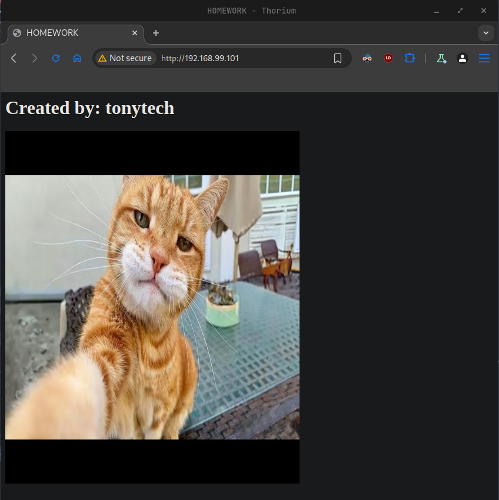

# Tasks

Chose and implement one or more of the following

- Research and create own LXC template (a distribution of your choice with web server)

- Create own Docker image based on CentOS or openSUSE that includes Apache web server and custom index page with some text (for example your SoftUni username) and a picture (of a cat, a dog, or whatever you like)

---
## Research and create own LXC template (a distribution of your choice with web server)

1. Install Incus (LXD + LXC Community Project)
```sh
# install EPEL repository
$ sudo dnf install epel-release
$ sudo dnf copr enable neil/incus

# enable CodeReady Builder (CRB)
$ sudo dnf config-manager --enable crb

# install Incus
$ sudo dnf install incus incus-tools
```
2. Add out user to the **incus-admin** group
```sh
$ sudo usermod -aG incus-admin vagrant
```
3. Adjust **subuid** and **subgid**
```sh
$ echo "root:1000000:1000000000" | sudo tee -a /etc/subuid /etc/subgid
root:1000000:1000000000
```
4. Start and enable the incus service
```sh
$ sudo systemctl enable --now incus
Created symlink /etc/systemd/system/multi-user.target.wants/incus-startup.service → /usr/lib/systemd/system/incus-startup.service.
Created symlink /etc/systemd/system/sockets.target.wants/incus.socket → /usr/lib/systemd/system/incus.socket.
```
5. Initialize **Incus**
```sh
$ sudo incus admin init
Would you like to use clustering? (yes/no) [default=no]: no
Do you want to configure a new storage pool? (yes/no) [default=yes]: yes
Name of the new storage pool [default=default]: hw-storage
Name of the storage backend to use (dir, lvm, lvmcluster) [default=dir]: dir
Where should this storage pool store its data? [default=/var/lib/incus/storage-pools/hw-storage]: 
Would you like to create a new local network bridge? (yes/no) [default=yes]: yes
What should the new bridge be called? [default=incusbr0]: 
What IPv4 address should be used? (CIDR subnet notation, “auto” or “none”) [default=auto]: 
What IPv6 address should be used? (CIDR subnet notation, “auto” or “none”) [default=auto]: none
Would you like the server to be available over the network? (yes/no) [default=no]: yes
Address to bind to (not including port) [default=all]: 
Port to bind to [default=8443]: 
Would you like stale cached images to be updated automatically? (yes/no) [default=yes]: 
Would you like a YAML "init" preseed to be printed? (yes/no) [default=no]: yes
config:
  core.https_address: '[::]:8443'
networks:
- config:
    ipv4.address: auto
    ipv6.address: none
  description: ""
  name: incusbr0
  type: ""
  project: default
storage_pools:
- config: {}
  description: ""
  name: hw-storage
  driver: dir
profiles:
- config: {}
  description: ""
  devices:
    eth0:
      name: eth0
      network: incusbr0
      type: nic
    root:
      path: /
      pool: hw-storage
      type: disk
  name: default
projects: []
cluster: null
```
6. Setup firewall if needed
```sh
$ sudo firewall-cmd --zone=trusted --change-interface=incusbr0 --permanen
success
$ sudo firewall-cmd --reload
success

# restart Incus service
$ sudo systemctl restart incus
```
7. Search for base image (we chose debian12)
```sh
$ incus image list images: | grep debian/12
```
8. Create a container from chosen image
```sh
$ incus launch images:debian/12 debian-template
Launching debian-template
```
9. Check running containers
```sh
$ incus list 
+-----------------+---------+---------------------+------+-----------+-----------+
|      NAME       |  STATE  |        IPV4         | IPV6 |   TYPE    | SNAPSHOTS |
+-----------------+---------+---------------------+------+-----------+-----------+
| debian-template | RUNNING | 10.69.94.179 (eth0) |      | CONTAINER | 0         |
+-----------------+---------+---------------------+------+-----------+-----------+
```
10. Access the container
```sh
$ incus exec debian-template -- bash
```
11. Update package list and install web server (Nginx)
```sh
$ apt update && apt upgrade -y

$ apt install -y nginx
```

12. Start and enable Nginx service. Verify.
```sh
$ systemctl enable --now nginx
Synchronizing state of nginx.service with SysV service script with /lib/systemd/systemd-sysv-install.
Executing: /lib/systemd/systemd-sysv-install enable nginx

# verify nginx service is running
$ systemctl status nginx
● nginx.service - A high performance web server and a reverse proxy server
     Loaded: loaded (/lib/systemd/system/nginx.service; enabled; preset: enabled)
    Drop-In: /run/systemd/system/service.d
             └─zzz-lxc-service.conf
     Active: active (running) since Sat 2025-02-15 08:04:59 UTC; 1min 46s ago
       Docs: man:nginx(8)
   Main PID: 707 (nginx)
      Tasks: 3 (limit: 4339)
     Memory: 2.3M
        CPU: 13ms
     CGroup: /system.slice/nginx.service
             ├─707 "nginx: master process /usr/sbin/nginx -g daemon on; master_process on;"
             ├─710 "nginx: worker process"
             └─711 "nginx: worker process"

Feb 15 08:04:59 debian-template systemd[1]: Starting nginx.service - A high performance web server and a reverse proxy server...
Feb 15 08:04:59 debian-template systemd[1]: Started nginx.service - A high performance web server and a reverse proxy server.
```
13. Verify service serving the page locally
```sh
$ curl -I http://localhost
HTTP/1.1 200 OK
Server: nginx/1.22.1
Date: Sat, 15 Feb 2025 08:08:14 GMT
Content-Type: text/html
Content-Length: 615
Last-Modified: Sat, 15 Feb 2025 08:04:58 GMT
Connection: keep-alive
ETag: "67b04aaa-267"
Accept-Ranges: bytes
```
14. Verify service serving the page from host
```sh
$ curl -I http://10.69.94.179
HTTP/1.1 200 OK
Server: nginx/1.22.1
Date: Sat, 15 Feb 2025 08:23:28 GMT
Content-Type: text/html
Content-Length: 615
Last-Modified: Sat, 15 Feb 2025 08:04:58 GMT
Connection: keep-alive
ETag: "67b04aaa-267"
Accept-Ranges: bytes
```
15. Stop `debian-template` container
```sh
$ incus stop debian-template 
```
16. Crete image from `debian-template` container
```sh
$ incus publish debian-template --alias debian-nginx
Instance published with fingerprint: 99078fcd6a1479418793abfa8dbbeef798a9266fd3c421ddc45675b5db13f3fa
```
17. Change the description of our new image
```sh
$ incus image edit debian-nginx
```
18. Check images after creation
```sh
$ incus image list
+--------------+--------------+--------+----------------------------------------+--------------+-----------+-----------+----------------------+
|    ALIAS     | FINGERPRINT  | PUBLIC |              DESCRIPTION               | ARCHITECTURE |   TYPE    |   SIZE    |     UPLOAD DATE      |
+--------------+--------------+--------+----------------------------------------+--------------+-----------+-----------+----------------------+
| debian-nginx | 99078fcd6a14 | no     | Debian bookworm amd64 with Nginx       | x86_64       | CONTAINER | 171.54MiB | 2025/02/15 10:37 EET |
+--------------+--------------+--------+----------------------------------------+--------------+-----------+-----------+----------------------+
|              | 9888a4b0bf37 | no     | Debian bookworm amd64 (20250214_05:24) | x86_64       | CONTAINER | 103.13MiB | 2025/02/15 09:55 EET |
+--------------+--------------+--------+----------------------------------------+--------------+-----------+-----------+----------------------+
```
19. Create a new container from our image
```sh
$ incus launch debian-nginx homework-web-container
Launching homework-web-container

# verify running container
$ incus list
+------------------------+---------+---------------------+------+-----------+-----------+
|          NAME          |  STATE  |        IPV4         | IPV6 |   TYPE    | SNAPSHOTS |
+------------------------+---------+---------------------+------+-----------+-----------+
| debian-template        | STOPPED |                     |      | CONTAINER | 0         |
+------------------------+---------+---------------------+------+-----------+-----------+
| homework-web-container | RUNNING | 10.69.94.109 (eth0) |      | CONTAINER | 0         |
+------------------------+---------+---------------------+------+-----------+-----------+
```
20. Verify that nginx is running inside container
```sh
 incus exec homework-web-container -- systemctl status nginx
● nginx.service - A high performance web server and a reverse proxy server
     Loaded: loaded (/lib/systemd/system/nginx.service; enabled; preset: enabled)
    Drop-In: /run/systemd/system/service.d
             └─zzz-lxc-service.conf
     Active: active (running) since Sat 2025-02-15 08:43:14 UTC; 1min 38s ago
       Docs: man:nginx(8)
    Process: 163 ExecStartPre=/usr/sbin/nginx -t -q -g daemon on; master_process on; (code=exited, status=0/SUCCESS)
    Process: 164 ExecStart=/usr/sbin/nginx -g daemon on; master_process on; (code=exited, status=0/SUCCESS)
   Main PID: 165 (nginx)
      Tasks: 3 (limit: 4339)
     Memory: 2.3M
        CPU: 7ms
     CGroup: /system.slice/nginx.service
             ├─165 "nginx: master process /usr/sbin/nginx -g daemon on; master_process on;"
             ├─166 "nginx: worker process"
             └─167 "nginx: worker process"

Feb 15 08:43:14 homework-web-container systemd[1]: Starting nginx.service - A high performance web server and a reverse proxy server...
Feb 15 08:43:14 homework-web-container systemd[1]: Started nginx.service - A high performance web server and a reverse proxy server.
```
21. Test nginx serving page form host (192.168.99.101)
```sh
$ curl -I http://10.69.94.109
HTTP/1.1 200 OK
Server: nginx/1.22.1
Date: Sat, 15 Feb 2025 08:47:01 GMT
Content-Type: text/html
Content-Length: 615
Last-Modified: Sat, 15 Feb 2025 08:04:59 GMT
Connection: keep-alive
ETag: "67b04aab-267"
Accept-Ranges: bytes
```
22. Make container visible outside Incus host
```sh
# creates a new table called nat
$ sudo nft add table ip nat
# Create a PREROUTING chain for incoming NAT
$ sudo nft add chain ip nat prerouting { type nat hook prerouting priority -100 \; }
# Create a POSTROUTING chain for outgoing NAT
$ sudo nft add chain ip nat postrouting { type nat hook postrouting priority 100 \; }
# add port forwarding rule
$ sudo nft add rule ip nat prerouting ip daddr 192.168.99.101 tcp dport 80 dnat to 10.69.94.109:80
# add masquerade rule
$ sudo nft add rule ip nat postrouting ip daddr 10.69.94.109 tcp dport 80 masquerade
# Save the rules to /etx/nftables.conf
sudo nft list ruleset | sudo tee /etc/nftables.conf
```
23. Restart nftables service
```sh
$ sudo systemctl restart nftables
```
24. Check access outside Incus host
```sh
$ curl -I http://192.168.99.101
HTTP/1.1 200 OK
Server: nginx/1.22.1
Date: Sat, 15 Feb 2025 09:09:55 GMT
Content-Type: text/html
Content-Length: 615
Last-Modified: Sat, 15 Feb 2025 08:04:59 GMT
Connection: keep-alive
ETag: "67b04aab-267"
Accept-Ranges: bytes
```

## Create own Docker image based on CentOS or openSUSE that includes Apache web server and custom index page with some text (for example your SoftUni username) and a picture (of a cat, a dog, or whatever you like)

1. Add official **Docker** repository
```sh
$ sudo dnf config-manager --add-repo=https://download.docker.com/linux/centos/docker-ce.repo
Adding repo from: https://download.docker.com/linux/centos/docker-ce.repo
```
2. Install Docker
```sh
$ sudo dnf install docker-ce
```
3. Add user to docker group
```sh
$ sudo usermod -aG docker vagrant
```
4. Start and enable docker service
```sh
$ sudo systemctl enable --now docker
Created symlink /etc/systemd/system/multi-user.target.wants/docker.service → /usr/lib/systemd/system/docker.service.
```
5. Create directory for Apache server files 
```sh
$ mkdir apache-server
$ cd apache-server
```
6. Crete `Dockerfile`
```Dockerfile
FROM centos/httpd

# Set the working directory
WORKDIR /var/www/html

# Copy index.html into WORKDIR 
COPY index.html .

# Set correct permissions for WORKDIR
RUN chmod -R 755 .

# Expose port 80
EXPOSE 80

# Start Apache in foreground mode
ENTRYPOINT ["httpd","-D","FOREGROUND"]
```
7. Create `index.html`
```html
<html>
  <head>
    <title>HOMEWORK</title>
  </head>
  <body>
    <h1>Created by: tonytech</h1>
    
  </body>
</html>
```
8. Build and tag the Docker image
```sh
$ docker build -t homework:1.0 .
```
9. Check current images
```sh
$ docker images
REPOSITORY   TAG       IMAGE ID       CREATED          SIZE
homework     1.0       2a678737e85b   51 seconds ago   258MB
```
10. Run the Docker image as a container
```sh
$ docker run --name homework-container -d -p 80:80 homework:1.0  
fa635a7b81c64d8565fe9bd12c31b53735bed3e4ee646788b4f544bd0a96c5c8
```
11. Check web server from Docker host (192.168.99.101)
```sh
$ curl http://localhost:80
<html>
  <head>
    <title>HOMEWORK</title>
  </head>
  <body>
    <h1>Created by: tonytech</h1>
    
  </body>
</html>
```
12. Check web server outside of Docker host


