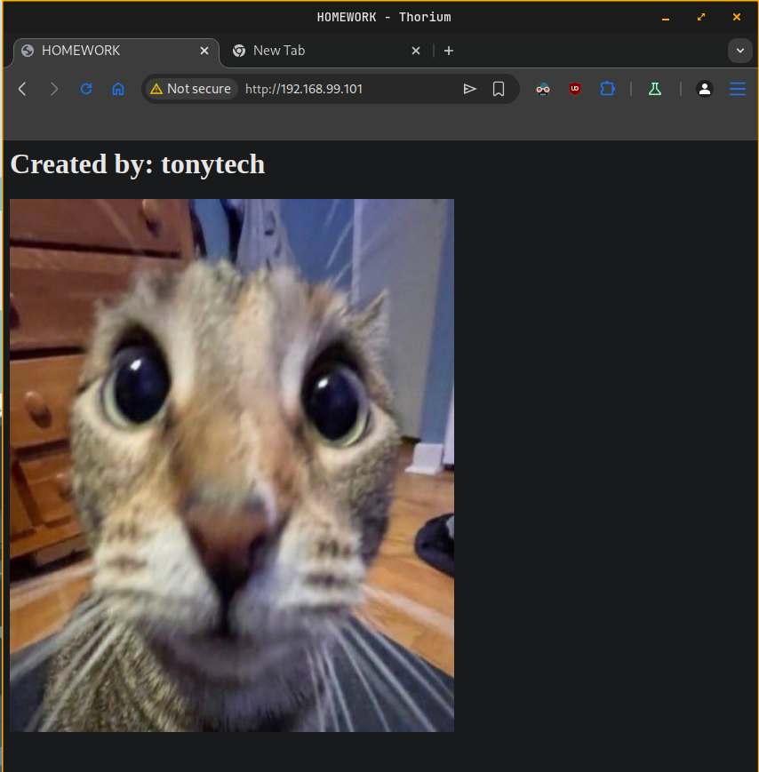

# Tasks
Chose and implement one or more of the following

- Research and create own LXC template (a distribution of your choice with web server)

- Create own Docker image based on CentOS or openSUSE that includes Apache web server and custom index page with some text (for example your SoftUni username) and a picture (of a cat, a dog, or whatever you like)
---
## Research and create own LXC template (a distribution of your choice with web server)

1. Install Incus and required dependencies
```sh
# add Backport repository 
$ echo "deb http://deb.debian.org/debian bookworm-backports main contrib non-free non-free-firmware" | sudo tee -a /etc/apt/sources.list

# update repos list
$ sudo apt update

# install Incus and optionally, Incus tools
$ sudo apt -t bookworm-backports install incus incus-tools
```
2. Add user to incus-admins group to grant admin access
```sh
$ sudo usermod -aG incus-admin vagrant # logout and login
```
3. Start and enable Incus service
```sh
$ sudo systemctl enable --now incus
Synchronizing state of incus.service with SysV service script with /lib/systemd/systemd-sysv-install.
Executing: /lib/systemd/systemd-sysv-install enable incus
```
4. Initialize **Incus**
```sh
$$ sudo incus admin init
Would you like to use clustering? (yes/no) [default=no]: no
Do you want to configure a new storage pool? (yes/no) [default=yes]: yes
Name of the new storage pool [default=default]: debian-storage
Where should this storage pool store its data? [default=/var/lib/incus/storage-pools/debian-storage]: 
Would you like to create a new local network bridge? (yes/no) [default=yes]: yes
What should the new bridge be called? [default=incusbr0]: 
What IPv4 address should be used? (CIDR subnet notation, “auto” or “none”) [default=auto]: 
What IPv6 address should be used? (CIDR subnet notation, “auto” or “none”) [default=auto]: 
Would you like the server to be available over the network? (yes/no) [default=no]: yes
Address to bind to (not including port) [default=all]: 
Port to bind to [default=8443]: 
Would you like stale cached images to be updated automatically? (yes/no) [default=yes]: yes
Would you like a YAML "init" preseed to be printed? (yes/no) [default=no]: yes
config:
  core.https_address: '[::]:8443'
networks:
- config:
    ipv4.address: auto
    ipv6.address: auto
  description: ""
  name: incusbr0
  type: ""
  project: default
storage_pools:
- config: {}
  description: ""
  name: debian-storage
  driver: dir
profiles:
- config: {}
  description: ""
  devices:
    eth0:
      name: eth0
      network: incusbr0
      type: nic
    root:
      path: /
      pool: debian-storage
      type: disk
  name: default
projects: []
cluster: null
```
5. Setup firewall if needed
```sh
# check if firewall is active
$ sudo ufw status
Status: active

# allow Incus bridge
$ sudo ufw allow in on incusbr0
$ sudo ufw route allow in on incusbr0
$ sudo ufw route allow out on incusbr0

# reload firewall configuration
$ sudo ufw reload
Firewall reloaded
```
6. Restart Incus service
```sh
$ sudo systemctl restart incus
```
7. Search for base image (lets chose Fedora)
```sh
$ incus image list images:| grep fedora
```
8. Create a container from chosen image
```sh
$ incus launch images:fedora/41 fedora-template
Launching fedora-template
```
9. Check running containers
```sh
$ incus list                        
+-----------------+---------+----------------------+-----------------------------------------------+-----------+-----------+
|      NAME       |  STATE  |         IPV4         |                     IPV6                      |   TYPE    | SNAPSHOTS |
+-----------------+---------+----------------------+-----------------------------------------------+-----------+-----------+
| fedora-template | RUNNING | 10.36.231.215 (eth0) | fd42:84c8:a7b5:f187:216:3eff:fec4:eebc (eth0) | CONTAINER | 0         |
+-----------------+---------+----------------------+-----------------------------------------------+-----------+-----------+
```
10. Install nginx from Incus host
```sh
incus exec fedora-template -- dnf install -y nginx
```
11. Start and enable Incus service inside container
```sh
$ incus exec fedora-template -- systemctl enable --now nginx
Created symlink '/etc/systemd/system/multi-user.target.wants/nginx.service' → '/usr/lib/systemd/system/nginx.service'.
```
12. Verify **nginx** is running inside container
```sh
$ incus exec fedora-template -- systemctl status nginx
● nginx.service - The nginx HTTP and reverse proxy server
     Loaded: loaded (/usr/lib/systemd/system/nginx.service; enabled; preset: disabled)
    Drop-In: /usr/lib/systemd/system/service.d
             └─10-timeout-abort.conf, 50-keep-warm.conf
             /run/systemd/system/service.d
             └─zzz-lxc-service.conf
     Active: active (running) since Sat 2025-02-15 18:03:21 UTC; 14s ago
 Invocation: 0338a6fdac63402fac1f84a4041e0e76
    Process: 731 ExecStartPre=/usr/bin/rm -f /run/nginx.pid (code=exited, status=0/SUCCESS)
    Process: 733 ExecStartPre=/usr/sbin/nginx -t (code=exited, status=0/SUCCESS)
    Process: 735 ExecStart=/usr/sbin/nginx (code=exited, status=0/SUCCESS)
   Main PID: 736 (nginx)
      Tasks: 3 (limit: 4644)
     Memory: 3.3M (peak: 3.5M)
        CPU: 40ms
     CGroup: /system.slice/nginx.service
             ├─736 "nginx: master process /usr/sbin/nginx"
             ├─737 "nginx: worker process"
             └─738 "nginx: worker process"

Feb 15 18:03:21 fedora-template systemd[1]: Starting nginx.service - The nginx HTTP and reverse proxy server...
Feb 15 18:03:21 fedora-template nginx[733]: nginx: the configuration file /etc/nginx/nginx.conf syntax is ok
Feb 15 18:03:21 fedora-template nginx[733]: nginx: configuration file /etc/nginx/nginx.conf test is successful
Feb 15 18:03:21 fedora-template systemd[1]: Started nginx.service - The nginx HTTP and reverse proxy server.
```
13. Check web service from Incus host (192.168.99.101)
```sh
$ curl -I http://10.36.231.215
HTTP/1.1 200 OK
Server: nginx/1.26.3
Date: Sun, 16 Feb 2025 08:04:35 GMT
Content-Type: text/html
Content-Length: 8474
Last-Modified: Mon, 20 Feb 2023 17:42:39 GMT
Connection: keep-alive
ETag: "63f3b10f-211a"
Accept-Ranges: bytes
```
14. Stop `fedora-template` container
```sh
$ incus stop fedora-template
```
15. Crete image from `fedora-template` container
```sh
$ incus publish fedora-template --alias fedora-nginx
Instance published with fingerprint: b874108880b47748a567e52427583e992a542d49d26d724d8c614e7216ab98da
```
16. Change the description of newly created image
```sh
$ incus image edit fedora-nginx
```
17. Check images after creation of the new.
```sh
$ incus image list
+--------------+--------------+--------+----------------------------------+--------------+-----------+-----------+----------------------+
|    ALIAS     | FINGERPRINT  | PUBLIC |           DESCRIPTION            | ARCHITECTURE |   TYPE    |   SIZE    |     UPLOAD DATE      |
+--------------+--------------+--------+----------------------------------+--------------+-----------+-----------+----------------------+
| fedora-nginx | b874108880b4 | no     | Fedora 41 with Nginx             | x86_64       | CONTAINER | 231.65MiB | 2025/02/16 10:05 EET |
+--------------+--------------+--------+----------------------------------+--------------+-----------+-----------+----------------------+
|              | 29d6c79ffb12 | no     | Fedora 41 amd64 (20250215_20:33) | x86_64       | CONTAINER | 100.19MiB | 2025/02/16 10:02 EET |
+--------------+--------------+--------+----------------------------------+--------------+-----------+-----------+----------------------+
```
18. Create a new container from our image
```sh
$ incus launch fedora-nginx fedora-nginx-container
Launching fedora-nginx-container

# verify running containers
$ incus list                         
+------------------------+---------+----------------------+-----------------------------------------------+-----------+-----------+
|          NAME          |  STATE  |         IPV4         |                     IPV6                      |   TYPE    | SNAPSHOTS |
+------------------------+---------+----------------------+-----------------------------------------------+-----------+-----------+
| fedora-nginx-container | RUNNING | 10.36.231.185 (eth0) | fd42:84c8:a7b5:f187:216:3eff:fef3:e09d (eth0) | CONTAINER | 0         |
+------------------------+---------+----------------------+-----------------------------------------------+-----------+-----------+
| fedora-template        | STOPPED |                      |                                               | CONTAINER | 0         |
+------------------------+---------+----------------------+-----------------------------------------------+-----------+-----------+
```
19. Verify that nginx web server is running inside container
```sh
$ incus exec fedora-nginx-container -- systemctl status nginx
● nginx.service - The nginx HTTP and reverse proxy server
     Loaded: loaded (/usr/lib/systemd/system/nginx.service; enabled; preset: disabled)
    Drop-In: /usr/lib/systemd/system/service.d
             └─10-timeout-abort.conf, 50-keep-warm.conf
             /run/systemd/system/service.d
             └─zzz-lxc-service.conf
     Active: active (running) since Sun 2025-02-16 08:07:04 UTC; 28s ago
 Invocation: d4369b749d7b4620963d9bf2f5bef2d6
    Process: 182 ExecStartPre=/usr/bin/rm -f /run/nginx.pid (code=exited, status=0/SUCCESS)
    Process: 184 ExecStartPre=/usr/sbin/nginx -t (code=exited, status=0/SUCCESS)
    Process: 186 ExecStart=/usr/sbin/nginx (code=exited, status=0/SUCCESS)
   Main PID: 187 (nginx)
      Tasks: 3 (limit: 4644)
     Memory: 3.2M (peak: 3.4M)
        CPU: 34ms
     CGroup: /system.slice/nginx.service
             ├─187 "nginx: master process /usr/sbin/nginx"
             ├─188 "nginx: worker process"
             └─189 "nginx: worker process"

Feb 16 08:07:04 fedora-nginx-container systemd[1]: Starting nginx.service - The nginx HTTP and reverse proxy server...
Feb 16 08:07:04 fedora-nginx-container nginx[184]: nginx: the configuration file /etc/nginx/nginx.conf syntax is ok
Feb 16 08:07:04 fedora-nginx-container nginx[184]: nginx: configuration file /etc/nginx/nginx.conf test is successful
Feb 16 08:07:04 fedora-nginx-container systemd[1]: Started nginx.service - The nginx HTTP and reverse proxy server.
```
20. Test nginx serving page from Incus host (192.168.99.101)
```sh
$ curl -I http://10.36.231.185
HTTP/1.1 200 OK
Server: nginx/1.26.3
Date: Sun, 16 Feb 2025 08:08:29 GMT
Content-Type: text/html
Content-Length: 8474
Last-Modified: Mon, 20 Feb 2023 17:42:39 GMT
Connection: keep-alive
ETag: "63f3b10f-211a"
Accept-Ranges: bytes
```
21. Make container service visible outside of Incus host
```sh
# creates a new table called nat
$ sudo nft add table ip nat
# Create a PREROUTING chain for incoming NAT
$ sudo nft add chain ip nat prerouting { type nat hook prerouting priority -100 \; }
# Create a POSTROUTING chain for outgoing NAT
$ sudo nft add chain ip nat postrouting { type nat hook postrouting priority 100 \; }
# add port forwarding rule
$ sudo nft add rule ip nat prerouting ip daddr 192.168.99.101 tcp dport 80 dnat to 10.36.231.185
# add masquerade rule
$ sudo nft add rule ip nat postrouting ip daddr 10.36.231.185 tcp dport 80 masquerade
# Save the rules to /etx/nftables.conf
$ sudo nft list ruleset | sudo tee /etc/nftables.conf
```
22. Restart nftables service
```sh
$ sudo systemctl restart nftables
```
23. Check access outside Incus host
```sh
$ curl -I -m 5 http://192.168.99.101
HTTP/1.1 200 OK
Server: nginx/1.26.3
Date: Sun, 16 Feb 2025 08:49:03 GMT
Content-Type: text/html
Content-Length: 8474
Last-Modified: Mon, 20 Feb 2023 17:42:39 GMT
Connection: keep-alive
ETag: "63f3b10f-211a"
Accept-Ranges: bytes
```

## Create own Docker image based on CentOS or openSUSE that includes Apache web server and custom index page with some text (for example your SoftUni username) and a picture (of a cat, a dog, or whatever you like)

1. Install Docker
```sh
# Add Docker's official GPG key:
$ sudo apt-get update
$ sudo apt-get install ca-certificates curl
$ sudo install -m 0755 -d /etc/apt/keyrings
$ sudo curl -fsSL https://download.docker.com/linux/debian/gpg -o /etc/apt/keyrings/docker.asc
$ sudo chmod a+r /etc/apt/keyrings/docker.asc

# Add the repository to Apt sources:
$ echo \
  "deb [arch=$(dpkg --print-architecture) signed-by=/etc/apt/keyrings/docker.asc] https://download.docker.com/linux/debian \
  $(. /etc/os-release && echo "$VERSION_CODENAME") stable" | \
  sudo tee /etc/apt/sources.list.d/docker.list > /dev/null

$ sudo apt-get update

# install Docker
$ sudo apt-get install docker-ce
```
2. Check service is enabled and running
```sh
$ sudo systemctl status docker
● docker.service - Docker Application Container Engine
     Loaded: loaded (/lib/systemd/system/docker.service; enabled; preset: enabled)
     Active: active (running) since Sat 2025-02-15 20:31:42 EET; 25s ago
TriggeredBy: ● docker.socket
       Docs: https://docs.docker.com
   Main PID: 6756 (dockerd)
      Tasks: 8
     Memory: 25.7M
        CPU: 224ms
     CGroup: /system.slice/docker.service
             └─6756 /usr/bin/dockerd -H fd:// --containerd=/run/containerd/containerd.sock

Feb 15 20:31:41 incus systemd[1]: Starting docker.service - Docker Application Container Engine...
Feb 15 20:31:41 incus dockerd[6756]: time="2025-02-15T20:31:41.885986584+02:00" level=info msg="Starting up"
Feb 15 20:31:41 incus dockerd[6756]: time="2025-02-15T20:31:41.886803050+02:00" level=info msg="OTEL tracing is not configured, using no-op tracer provider"
Feb 15 20:31:41 incus dockerd[6756]: time="2025-02-15T20:31:41.972523720+02:00" level=info msg="Loading containers: start."
Feb 15 20:31:42 incus dockerd[6756]: time="2025-02-15T20:31:42.294960087+02:00" level=info msg="Loading containers: done."
Feb 15 20:31:42 incus dockerd[6756]: time="2025-02-15T20:31:42.306202702+02:00" level=info msg="Docker daemon" commit=4c9b3b0 containerd-snapshotter=false storage-driver=o>
Feb 15 20:31:42 incus dockerd[6756]: time="2025-02-15T20:31:42.306286947+02:00" level=info msg="Daemon has completed initialization"
Feb 15 20:31:42 incus dockerd[6756]: time="2025-02-15T20:31:42.329896153+02:00" level=info msg="API listen on /run/docker.sock"
Feb 15 20:31:42 incus systemd[1]: Started docker.service - Docker Application Container Engine.
```
3. Add user to docker group
```sh
sudo usermod -aG docker vagrant # log out and log in
```
4. Create directory for Apache server files
```sh
$ mkdir apache-server
$ cd apache-server
```
5. Create `Dockerfile`
```sh
FROM centos/httpd

# set the working directory
WORKDIR /var/www/html

# copy index.html into WORKDIR 
COPY index.html .

# set correct permissions for WORKDIR
RUN chmod -R 755 .

# expose port 80
EXPOSE 80

# start Apache in foreground mode
ENTRYPOINT ["httpd","-D","FOREGROUND"]
```
6. Create `index.html`
```sh
<html>
  <head>
    <title>HOMEWORK</title>
  </head>
  <body>
    <h1>Created by: tonytech</h1>
    
  </body>
</html>
```
7. Build and tag the Docker image
```sh
$ docker build -t homework:1.0 .
```
8. Check current images
```sh
$ docker images
REPOSITORY   TAG       IMAGE ID       CREATED         SIZE
homework     1.0       26d03b809179   2 minutes ago   258MB`sh
```
9. Run the Docker image as a container
```sh
$ docker run --name homework-container -d -p 80:80 homework:1.0
5744bb922a755ebaf36535cf135ea00fff4279a313327c35719c0d1ec79dda0a
```
10. Check web server from Docker host (192.168.99.101)
```sh
$ curl http://localhost:80
<html>
  <head>
    <title>HOMEWORK</title>
  </head>
  <body>
    <h1>Created by: tonytech</h1>
    
  </body>
</html>
```
11. Check web server outside of Docker host

