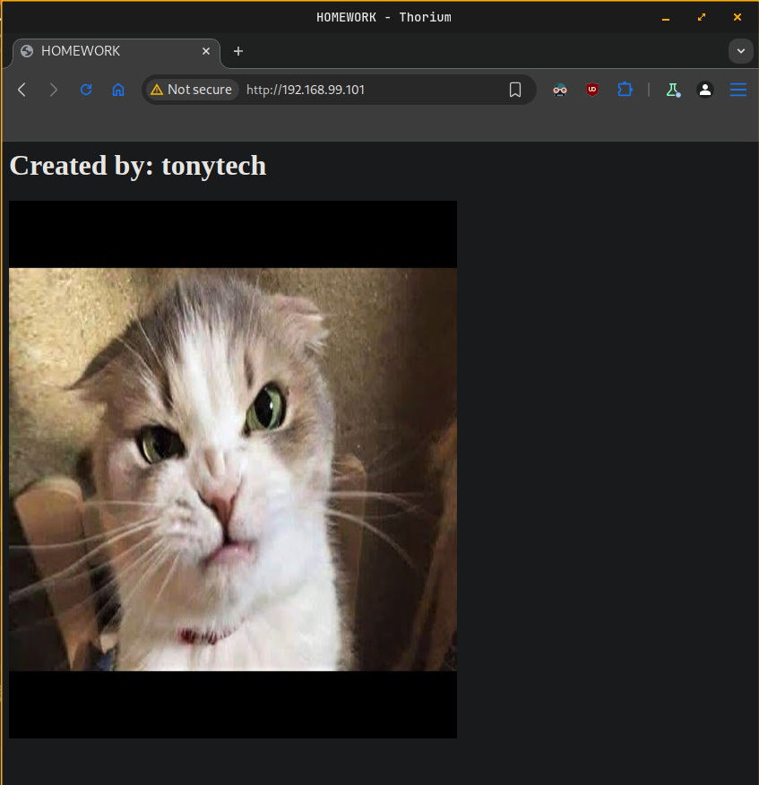

# Homework M5: Virtualization and Containerization

Main goal is to build further on what was demonstrated during the practice

Prerequisites may vary between different tasks. You should adjust your infrastructure according to the task you chose to implement

## Tasks

Chose and implement one or more of the following

- Research and create own LXC template (a distribution of your choice with web server)

- Create own **Docker** image based on **CentOS** or **openSUSE** that includes **Apache** web server and custom index page with some text (for example your SoftUni username) and a picture (of a cat, a dog, or whatever you like)

*Please note, that even if you choose to implement more than one task, they are quite independent and different, so you must create a separate infrastructure (environment) for each

## Proof

Prepare a document that show what you accomplished and how you did it. It can include (not limited to):

- The commands you used to achieve the above tasks

- A few pictures showing intermediary steps or results

## Solutions

- alma/homework-alma.md
- debian/homework-debian.md
- suse/homework-suse.md

## OpenSUSE solution

### Research and create own LXC template (a distribution of your choice with web server)

1. Install **Incus** and **Incus** tools
```sh
$ sudo zypper install incus incus-tools
```
2. Add user to **incus-admins** group to grant admin access
```sh
$ sudo usermod -aG incus-admin vagrant
```
3. Start and enable **Incus** service
```sh
$ sudo systemctl enable --now incus
Created symlink /etc/systemd/system/multi-user.target.wants/incus.service → /usr/lib/systemd/system/incus.service.
Created symlink /etc/systemd/system/multi-user.target.wants/incus-startup.service → /usr/lib/systemd/system/incus-startup.service.
Created symlink /etc/systemd/system/sockets.target.wants/incus.socket → /usr/lib/systemd/system/incus.socket.
```
4. Initialize **Incus**
```sh
$ sudo incus admin init
Would you like to use clustering? (yes/no) [default=no]: no
Do you want to configure a new storage pool? (yes/no) [default=yes]: yes
Name of the new storage pool [default=default]: suse-storage
Name of the storage backend to use (dir, lvm, lvmcluster, btrfs) [default=btrfs]: dir
Where should this storage pool store its data? [default=/var/lib/incus/storage-pools/suse-storage]: 
Would you like to create a new local network bridge? (yes/no) [default=yes]: yes
What should the new bridge be called? [default=incusbr0]: 
What IPv4 address should be used? (CIDR subnet notation, “auto” or “none”) [default=auto]: 
What IPv6 address should be used? (CIDR subnet notation, “auto” or “none”) [default=auto]: none
Would you like the server to be available over the network? (yes/no) [default=no]: yes
Address to bind to (not including port) [default=all]: 
Port to bind to [default=8443]: 
Would you like stale cached images to be updated automatically? (yes/no) [default=yes]: yes
Would you like a YAML "init" preseed to be printed? (yes/no) [default=no]: yes
config:
  core.https_address: '[::]:8443'
networks:
- config:
    ipv4.address: auto
    ipv6.address: none
  description: ""
  name: incusbr0
  type: ""
  project: default
storage_pools:
- config: {}
  description: ""
  name: suse-storage
  driver: dir
profiles:
- config: {}
  description: ""
  devices:
    eth0:
      name: eth0
      network: incusbr0
      type: nic
    root:
      path: /
      pool: suse-storage
      type: disk
  name: default
projects: []
cluster: null
```
5. Setup firewall if needed
```sh
$ sudo firewall-cmd --zone=trusted --change-interface=incusbr0 --permanen
success
$ sudo firewall-cmd --reload
success

# restart Incus service
$ sudo systemctl restart incus
```
6. Search for **base** image (lets chose archlinux)
```sh
$ incus image list images: | grep archlinux
```
7. Create a container from chosen image
```sh
$ incus launch images:archlinux arch-template
Launching arch-template
```
8. Check running containers
```sh
incus list
+---------------+---------+-----------------------+------+-----------+-----------+
|     NAME      |  STATE  |         IPV4          | IPV6 |   TYPE    | SNAPSHOTS |
+---------------+---------+-----------------------+------+-----------+-----------+
| arch-template | RUNNING | 10.112.131.113 (eth0) |      | CONTAINER | 0         |
+---------------+---------+-----------------------+------+-----------+-----------+
```
9. Install **nginx** from **Incus** host
```sh
$ incus exec arch-template -- pacman -Sy --noconfirm nginx
```
10. Start and enable **Incus** service
```sh
$ incus exec arch-template -- systemctl enable --now nginx
```
11. Verify **nginx** is running
```sh
$ incus exec arch-template -- systemctl status nginx
● nginx.service - nginx web server
     Loaded: loaded (/usr/lib/systemd/system/nginx.service; enabled; preset: disabled)
    Drop-In: /run/systemd/system/service.d
             └─zzz-lxc-service.conf
     Active: active (running) since Sat 2025-02-15 15:13:34 UTC; 1min 19s ago
 Invocation: 8fe2fa41c653432488bddf0bc501d6ad
    Process: 431 ExecStart=/usr/bin/nginx (code=exited, status=0/SUCCESS)
   Main PID: 432 (nginx)
      Tasks: 2 (limit: 4671)
     Memory: 2.7M (peak: 3M)
        CPU: 17ms
     CGroup: /system.slice/nginx.service
             ├─432 "nginx: master process /usr/bin/nginx"
             └─433 "nginx: worker process"
```
12. Check web service from Incus host (192.168.99.101)
```sh
$ curl -I http://10.112.131.113
HTTP/1.1 200 OK
Server: nginx/1.26.3
Date: Sat, 15 Feb 2025 15:16:41 GMT
Content-Type: text/html
Content-Length: 615
Last-Modified: Wed, 05 Feb 2025 22:00:23 GMT
Connection: keep-alive
ETag: "67a3df77-267"
Accept-Ranges: bytes
```
13. Stop `arch-template` container
```sh
$ incus stop arch-template
```
14. Crete image from `arch-template` container
```sh
$ incus publish arch-template --alias arch-nginx
Instance published with fingerprint: b6b47aa798b4566faf5b273f27d35536bbcbdb54f2059ef60d01d1a7592e565d
```
15. Change the description of newly created image
```sh
$ incus image edit arch-nginx
```
16. Check images after creation of the new.
```sh
$ incus image list
+------------+--------------+--------+------------------------------------------+--------------+-----------+-----------+----------------------+
|   ALIAS    | FINGERPRINT  | PUBLIC |               DESCRIPTION                | ARCHITECTURE |   TYPE    |   SIZE    |     UPLOAD DATE      |
+------------+--------------+--------+------------------------------------------+--------------+-----------+-----------+----------------------+
| arch-nginx | b6b47aa798b4 | no     | Archlinux with Nginx                     | x86_64       | CONTAINER | 261.76MiB | 2025/02/15 17:19 EET |
+------------+--------------+--------+------------------------------------------+--------------+-----------+-----------+----------------------+
|            | fdbf0cb698da | no     | Archlinux current amd64 (20250215_04:18) | x86_64       | CONTAINER | 196.43MiB | 2025/02/15 17:03 EET |
+------------+--------------+--------+------------------------------------------+--------------+-----------+-----------+----------------------+
```
17. Create a new container from our image
```sh
$ incus launch arch-nginx arch-nginx-container

# verify running containers
$ incus list
+----------------------+---------+-----------------------+------+-----------+-----------+
|         NAME         |  STATE  |         IPV4          | IPV6 |   TYPE    | SNAPSHOTS |
+----------------------+---------+-----------------------+------+-----------+-----------+
| arch-nginx-container | RUNNING | 10.112.131.131 (eth0) |      | CONTAINER | 0         |
+----------------------+---------+-----------------------+------+-----------+-----------+
| arch-template        | STOPPED |                       |      | CONTAINER | 0         |
+----------------------+---------+-----------------------+------+-----------+-----------+
```
18. Verify that nginx web server is running inside container
```sh
$  incus exec arch-nginx-container -- systemctl status nginx
● nginx.service - nginx web server
     Loaded: loaded (/usr/lib/systemd/system/nginx.service; enabled; preset: disabled)
    Drop-In: /run/systemd/system/service.d
             └─zzz-lxc-service.conf
     Active: active (running) since Sat 2025-02-15 15:23:11 UTC; 2min 38s ago
 Invocation: f5915f9ca64040acbf2e242ad3ac4553
    Process: 198 ExecStart=/usr/bin/nginx (code=exited, status=0/SUCCESS)
   Main PID: 199 (nginx)
      Tasks: 2 (limit: 4671)
     Memory: 2.6M (peak: 3.4M)
        CPU: 15ms
     CGroup: /system.slice/nginx.service
             ├─199 "nginx: master process /usr/bin/nginx"
             └─200 "nginx: worker process"
```
19. Test nginx serving page from Incus host (192.168.99.101)
```sh
$ curl -I http://10.112.131.131
HTTP/1.1 200 OK
Server: nginx/1.26.3
Date: Sat, 15 Feb 2025 15:27:20 GMT
Content-Type: text/html
Content-Length: 615
Last-Modified: Wed, 05 Feb 2025 22:00:23 GMT
Connection: keep-alive
ETag: "67a3df77-267"
Accept-Ranges: bytes
```
20. Make container service visible outside of Incus host
```sh
# add net.ipv4.ip_forward=1 to /etc/sysctl.conf
$ sudo sysctl -p
net.ipv4.ip_forward = 1

# use Incus proxy device
$ incus config device add arch-nginx-container myproxy80 proxy listen=tcp:0.0.0.0:80 connect=tcp:10.112.131.131:80

# Check if Incus host listening on port 80
$ sudo ss -tlnp | grep :80
LISTEN 0      4096               *:80              *:*    users:(("incusd",pid=30620,fd=7),("incusd",pid=30620,fd=3))
```
21.  Allow traffic on port 80/tcp 
```sh
$ sudo firewall-cmd --zone=public --add-port=80/tcp --permanent
$ sudo firewall-cmd --reload
```
22. Check access nginx web server outside Incus host
```sh
$ curl -I -m 5 http://192.168.99.101

HTTP/1.1 200 OK
Server: nginx/1.26.3
Date: Sat, 15 Feb 2025 16:33:47 GMT
Content-Type: text/html
Content-Length: 615
Last-Modified: Wed, 05 Feb 2025 22:00:23 GMT
Connection: keep-alive
ETag: "67a3df77-267"
Accept-Ranges: bytes
```

### Create own Docker image based on CentOS or openSUSE that includes Apache web server and custom index page with some text (for example your SoftUni username) and a picture (of a cat, a dog, or whatever you like)

1. Install Docker
```sh
# add the official Docker repository
$ sudo zypper addrepo https://download.opensuse.org/repositories/Virtualization:containers/openSUSE_Leap_15.6/ docker

# refresh repos
sudo zypper refresh

# install Docker
sudo zypper install docker
```
2. Start and enable Docker service
```sh
$ sudo systemctl enable --now docker
Created symlink /etc/systemd/system/multi-user.target.wants/docker.service → /usr/lib/systemd/system/docker.service.
```
3. Add user to **docker** group
```sh
$ sudo usermod -aG docker vagrant # log out and log in
```
4. Create directory for Apache server files
```sh
$ mkdir apache-server
$ cd apache-server
```
5. Crete `Dockerfile`
```Dockerfile
FROM opensuse/leap:15.6

# set the working directory
WORKDIR /srv/www/htdocs

# install Apache
RUN zypper refresh && \
    zypper install -y apache2 && \
    zypper clean --all

# copy index.html to workdir
COPY index.html /srv/www/htdocs/index.html

EXPOSE 80

# Start Apache server
CMD ["/usr/sbin/httpd", "-D", "FOREGROUND"]
```
6. Create `index.html`
```html
<html>
  <head>
    <title>HOMEWORK</title>
  </head>
  <body>
    <h1>Created by: tonytech</h1>
    
  </body>
</html>
```
7. Build and tag the Docker image
```sh
$ docker build -t homework:1.0 .
```
8. Check current images
```sh
$ docker images
REPOSITORY   TAG       IMAGE ID       CREATED         SIZE
homework     1.0       0ab2363ed240   8 seconds ago   134MB
```
9. Run the Docker image as a container
```sh
$ docker run --name homework-container -d -p 80:80 homework:1.0
59eab9cb6c5231763aef8727040a6f0bcbb7672bbdc4400abe2df4c99cf27020
```
10. Check web server from Docker host (192.168.99.101)
```sh
$ curl http://localhost:80
<html>
  <head>
    <title>HOMEWORK</title>
  </head>
  <body>
    <h1>Created by: tonytech</h1>
    
  </body>
</html>
```
11. Check web server outside of Docker host
 
