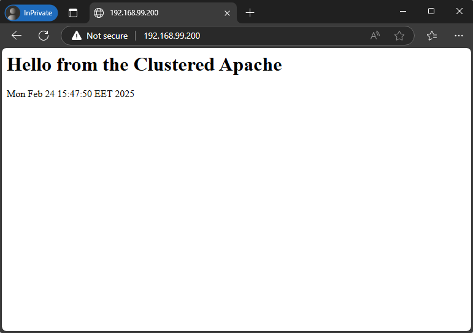
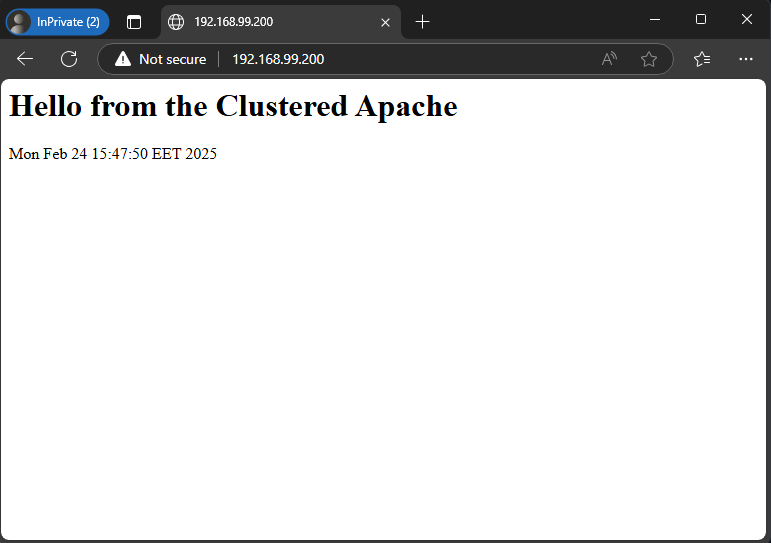

# Tasks

Implement the following:

-  Research and implement two node failover cluster that hosts a web site served by LVM volume group managed by the cluster. The volume group must reside on a separate iSCSI target server

# Solution

### Diagram
```

------------+---------------------------+---------------------------+------------
            |                           |                           |
      enp0s8|192.168.99.101       enp0s8|192.168.99.102       enp0s8|192.168.99.103
+-----------+-----------+   +-----------+-----------+   +-----------+-----------+
|    [ fo-node-1 ]      |   |    [ fo-node-2 ]      |   |    [ iscsi-srv ]      |
|                       |   |                       |   |                       |
| iscsi-initiator-utils |   | iscsi-initiator-utils |   |     targetcli         |
| pacemaker             |   | pacemaker             |   |                       |
| pcs                   |   | pcs                   |   |                       |
|                       |   |                       |   |                       |
|                       |   |                       |   |                       |
|                       |   |                       |   |                       |
+-----------------------+   +-----------------------+   +-----------------------+
```

### Steps
```
Step 1 - Setup iSCSI Target server.
Step 2 - Discover and log in to the iSCSI target on nodes.
Step 3 - Set up Pacemaker & Corosync for failover on nodes.
Step 4 - Create a Cluster Resource for LVM & Filesystem management.
Step 5 - Install Apache and setup Cluster resource for it.
Step 6 - Test failover.
```

### Step 1 - Setup iSCSI Target server.

```sh
lsblk
NAME                    MAJ:MIN RM  SIZE RO TYPE MOUNTPOINTS
sda                       8:0    0   20G  0 disk 
├─sda1                    8:1    0    1G  0 part /boot
└─sda2                    8:2    0   19G  0 part 
  ├─almalinux_vbox-root 253:0    0   17G  0 lvm  /
  └─almalinux_vbox-swap 253:1    0    2G  0 lvm  [SWAP]
sdb                       8:16   0    5G  0 disk 
sr0                      11:0    1 1024M  0 rom 
```

- Install iSCSI required package
    ```sh
    sudo dnf install targetcli
    ```
- Present LVM through iSCSI using Target administration tool
    ```sh
    sudo targetcli
    ```
- Create block device
    ```sh
    /backstores/block create name=iscsi_store dev=/dev/sdb
    ```
- Create target IQN (define new Target)
    ```sh
    /iscsi create iqn.2025-02.lab.homework:iscsi-srv:target
    ```
- Create a LUN
    ```sh
    /iscsi/iqn.2025-02.lab.homework:iscsi-srv:target/tpg1/luns create /backstores/block/iscsi_store 
    ```
- Register initiators
    ```sh
    # register initiator for first node
    iscsi/iqn.2025-02.lab.homework:iscsi-srv:target/tpg1/acls create iqn.2025-02.lab.homework.fo-node-1.init

    # register initiator for second node
    iscsi/iqn.2025-02.lab.homework:iscsi-srv:target/tpg1/acls create iqn.2025-02.lab.homework.fo-node-2.init
    ```
- Set **username** and **password** for initiator
    ```sh
    # set username and password for first initiator
    iscsi/iqn.2025-02.lab.homework:iscsi-srv:target/tpg1/acls/iqn.2025-02.lab.homework.fo-node-1.init/ set auth userid=web-app
    iscsi/iqn.2025-02.lab.homework:iscsi-srv:target/tpg1/acls/iqn.2025-02.lab.homework.fo-node-1.init/ set auth password=New_123123

    # set username and password for second initiator
    iscsi/iqn.2025-02.lab.homework:iscsi-srv:target/tpg1/acls/iqn.2025-02.lab.homework.fo-node-2.init/ set auth userid=web-app
    iscsi/iqn.2025-02.lab.homework:iscsi-srv:target/tpg1/acls/iqn.2025-02.lab.homework.fo-node-2.init/ set auth password=New_123123
    ```
- Set authentication flag on for the target portal group (tpg1)
    ```sh
    /iscsi/iqn.2025-02.lab.homework:iscsi-srv:target/tpg1/ set attribute authentication=1
    ```
- Setup after save and exit.
    ```sh
    sudo targetcli ls
    o- / ......................................................................................................................... [...]
    o- backstores .............................................................................................................. [...]
    | o- block .................................................................................................. [Storage Objects: 1]
    | | o- iscsi_store ...................................................................... [/dev/sdb (5.0GiB) write-thru activated]
    | |   o- alua ................................................................................................... [ALUA Groups: 1]
    | |     o- default_tg_pt_gp ....................................................................... [ALUA state: Active/optimized]
    | o- fileio ................................................................................................. [Storage Objects: 0]
    | o- pscsi .................................................................................................. [Storage Objects: 0]
    | o- ramdisk ................................................................................................ [Storage Objects: 0]
    o- iscsi ............................................................................................................ [Targets: 1]
    | o- iqn.2025-02.lab.homework:iscsi-srv:target ......................................................................... [TPGs: 1]
    |   o- tpg1 .......................................................................................... [no-gen-acls, auth per-acl]
    |     o- acls .......................................................................................................... [ACLs: 2]
    |     | o- iqn.2025-02.lab.homework.fo-node-1.init .................................................. [1-way auth, Mapped LUNs: 1]
    |     | | o- mapped_lun0 ........................................................................... [lun0 block/iscsi_store (rw)]
    |     | o- iqn.2025-02.lab.homework.fo-node-2.init .................................................. [1-way auth, Mapped LUNs: 1]
    |     |   o- mapped_lun0 ........................................................................... [lun0 block/iscsi_store (rw)]
    |     o- luns .......................................................................................................... [LUNs: 1]
    |     | o- lun0 ................................................................ [block/iscsi_store (/dev/sdb) (default_tg_pt_gp)]
    |     o- portals .................................................................................................... [Portals: 1]
    |       o- 0.0.0.0:3260 ..................................................................................................... [OK]
    o- loopback ......................................................................................................... [Targets: 0]
    ```s
- Setup firewall
    ```sh
    sudo firewall-cmd --add-service iscsi-target --permanent
    sudo firewall-cmd --reload
    ```
- Start and enable Target service
    ```sh
    sudo systemctl enable --now target
    ```

### Step 2 - Discover and log in to the iSCSI target on nodes.

- Install iSCSI initiator package
    ```sh
    sudo dnf install iscsi-initiator-utils
    ```
- Open the initiator configuration file for editing `/etc/iscsi/initiatorname.iscsi` (replace **fo-node-1** with **fo-node-2** for other node)
    ```sh
    InitiatorName=iqn.2025-02.lab.homework.fo-node-1.init
    ```
- Adjust the authentication settings in `/etc/iscsi/iscsid.conf` file
    ```sh
    node.session.auth.authmethod = CHAP # uncomment
    node.session.auth.username # uncomment and set iscsi username
    node.session.auth.passwor # uncomment ant set iscsi password
    ```
- Initiate a target discovery
    ```sh
    sudo iscsiadm -m discovery -t sendtargets -p iscsi-srv
    ```
- Show more information from discovered
    ```sh
    sudo iscsiadm -m node -o show
    ```
- Login to the target
    ```sh
    sudo iscsiadm -m node --login
    ```
- Confirm the established session
    ```sh
    sudo iscsiadm -m session -o show
    ```

###  Step 3 - Set up Pacemaker & Corosync for failover on nodes.

- Install the required packages
    ```sh
    # Enable high availability repository
    sudo dnf config-manager --set-enabled highavailability

    # Install of the main packages
    sudo dnf install pacemaker pcs
    ```
- Start and enable Pacemaker service
    ```sh
    sudo systemctl enable --now pcsd
    ```
- Set password for **hacluster** user
    ```sh
    sudo passwd hacluster
    ```
- Setup firewall
    ```sh
    sudo firewall-cmd --add-service=high-availability --permanent
    sudo firewall-cmd --reload
    ```
- Authenticate both nodes (execute only on fo-node-1)
    ```sh
    sudo pcs host auth fo-node-1.homework.lab fo-node-2.homework.lab
    ```
- Create and start the cluster (execute only on fo-node-1)
    ```sh
    sudo pcs cluster setup cluster-1 fo-node-1.homework.lab fo-node-2.homework.lab --start --enable
    ```
- Check the cluster status
    ```sh
    sudo pcs status
    ```
- Disable **STONITH**, we don’t have hardware fencing.
    ```sh
    sudo pcs property set stonith-enabled=false
    ```
### Step 4 - Create a Cluster Resource for LVM & Filesystem management.

- Create a virtual IP address for the cluster (execute on fo-node-1)
    ```sh
    sudo pcs resource create p_IPaddr2 ocf:heartbeat:IPaddr2 \
        ip=192.168.99.200 \
        cidr_netmask=24 \
        op monitor OCF_CHECK_LEVEL="0" timeout="20s" interval="10s" \
        --group web-application
    ```
- Create the isCSI resource (execute on fo-node-1)
    ```sh
    sudo pcs resource create p_iscsi systemd:iscsi \
        op start interval=0 timeout=30 \
        op stop interval=0 timeout=30 \
        op monitor interval=10 timeout=30 \
        --group web-application
    ```
- Open the file `/etc/lvm/lvm.conf` for editing. Ensures LVM is correctly handled in a clustered environment and avoids conflicts when both **fo-node-1** and **fo-node-2** access the same LVM resources.
    ```sh
    use_devicesfile = 0 # uncomment and set to 0 (line 129)
    system_id_source = "uname" # uncomment and set to "uname" (line 1403)
    ```
- Check configuration and if node name matches
    ```sh
    # check configuration
    sudo lvm lvmconfig
    ```
- Check output of commands `lvm systemid` and `uname -n` are same.
- Create partition on `/dev/sdb`
    ```sh
    sudo parted -s /dev/sdb -- mklabel msdos mkpart primary 16384s -0m set 1 lvm on
    ```
- Create a physical volume.
    ```sh
    sudo pvcreate /dev/sdb1
    ```
- Create the Volume group `iscsi_vg`
    ```sh
    sudo vgcreate iscsi_vg /dev/sdb1
    ```
- Check if the system ID is correctly applied
    ```sh
    sudo vgs -o+systemid
    ```
- Create logical volume `web_lv`
    ```sh
    sudo lvcreate -l 100%FREE -n web_lv iscsi_vg
    ```
- Check the result with command
    ```sh
    sudo lvs
    ```
- Create a filesystem
    ```sh
    sudo mkfs.ext4 /dev/iscsi_vg/web_lv
    ```
- Turn Off Automounting. Make sure that the volume groups that will be managed by Pacemaker won’t be auto-loaded/mounted by the system. Check current volume groups
    ```sh
    sudo vgs --noheadings -o vg_name
    ```
- Open again the LVM configuration file `/etc/lvm/lvm.conf`
    ```sh
    # go to line 1588, uncomment and add only system volume group into list
    auto_activation_volume_list = [ "almalinux_vbox" ]
    ```
- Check LVM config after modifications
    ```sh
    sudo lvm lvmconfig
    ```
- Rebuild the **initramfs** by executing
    ```sh
    sudo dracut -H -f /boot/initramfs-$(uname -r).img $(uname -r)
    ```
- Reboot the node.
- Create mounting point on both nodes
    ```sh
    sudo mkdir -p /var/www/html
    ```
- Create Volume Group resource (check where are started resources and execute on this node)
    ```sh
    sudo pcs resource create p_LVM-activate ocf:heartbeat:LVM-activate \
        vgname="iscsi_vg" \
        lvname="web_lv" \
        vg_access_mode="system_id" \
        op monitor timeout="90s" interval="30s" OCF_CHECK_LEVEL="0" \
        --group web-application
    ```
    - `vgname` -> Specifies the Volume Group to activate.
    - `lvname` -> If set, only the specified LV will be activated.
    - `vg_access_mode` -> Ensures LVM only activates on one node (as we already configured system_id_source in lvm.conf).
- Create Filesystem resource
    ```sh
    sudo pcs resource create p_Filesystem ocf:heartbeat:Filesystem \
        device="/dev/iscsi_vg/web_lv" \
        directory="/var/www/html" \
        fstype="ext4" \
        op monitor OCF_CHECK_LEVEL="0" timeout="40s" interval="20s"  \
        --group web-application
    ```
    - `device` -> The Logical Volume to mount.
    - `directory` -> The mount point for the website.
    - `fstype` -> The filesystem type (you formatted it as XFS).
- Check if filesystem is mounted properly.
    ```sh
    df -hT
    ```
### Step 5 - Install Apache and setup Cluster resource for it.

- Install Apache package
    ```sh
    sudo dnf install httpd
    ```
- Start and enable Apache service
    ```sh
    sudo systemctl enable --now httpd
    ```
- Crete index.html on node where resources are started
    ```sh
    sudo echo "<h1>Hello from the Clustered Apache</h1><p>$(date)</p>" | sudo tee /var/www/html/index.html
    ```
- Setup firewall
    ```sh
    sudo firewall-cmd --add-service http --permanent
    sudo firewall-cmd --reload
    ```
- Add Apache resource
    ```sh
    sudo pcs resource create p_apache ocf:heartbeat:apache \
        configfile="/etc/httpd/conf/httpd.conf" \
        statusurl="http://127.0.0.1" \
        op monitor depth="0" timeout="20s" interval="10" \
        --group web-application
    ```

- Status of cluster
    ```sh
    Cluster name: cluster-1
    Cluster Summary:
    * Stack: corosync (Pacemaker is running)
    * Current DC: fo-node-1.homework.lab (version 2.1.8-3.el9-3980678f0) - partition with quorum
    * Last updated: Mon Feb 24 15:57:25 2025 on fo-node-2.homework.lab
    * Last change:  Mon Feb 24 15:57:12 2025 by root via root on fo-node-2.homework.lab
    * 2 nodes configured
    * 4 resource instances configured

    Node List:
    * Node fo-node-2.homework.lab: standby
    * Online: [ fo-node-1.homework.lab ]

    Full List of Resources:
    * Resource Group: web-application:
        * p_IPaddr2 (ocf:heartbeat:IPaddr2):         Started fo-node-1.homework.lab
        * p_iscsi   (systemd:iscsi):         Started fo-node-1.homework.lab
        * p_LVM-activate    (ocf:heartbeat:LVM-activate):    Started fo-node-1.homework.lab
        * p_Filesystem      (ocf:heartbeat:Filesystem):      Started fo-node-1.homework.lab

    Daemon Status:
    corosync: active/enabled
    pacemaker: active/enabled
    pcsd: active/enabled
    ```
- Open webpage from outside
    

Step 6 - Test failover.
- Put **fo-node-1.homework.lab** in standby mode
    ```sh
    sudo pcs node standby fo-node-1.homework.lab
    ```
- Check cluster status after standby of first node
    ```sh
    Cluster name: cluster-1
    Cluster Summary:
    * Stack: corosync (Pacemaker is running)
    * Current DC: fo-node-1.homework.lab (version 2.1.8-3.el9-3980678f0) - partition with quorum
	* Last updated: Mon Feb 24 16:04:07 2025 on fo-node-1.homework.lab
    * Last change:  Mon Feb 24 16:03:52 2025 by root via root on fo-node-2.homework.lab
    * 2 nodes configured
    * 4 resource instances configured

    Node List:
    * Node fo-node-1.homework.lab: standby
    * Online: [ fo-node-2.homework.lab ]

    Full List of Resources:
    * Resource Group: web-application:
        * p_IPaddr2 (ocf:heartbeat:IPaddr2):         Started fo-node-2.homework.lab
        * p_iscsi   (systemd:iscsi):         Started fo-node-2.homework.lab
        * p_LVM-activate    (ocf:heartbeat:LVM-activate):    Started fo-node-2.homework.lab
        * p_Filesystem      (ocf:heartbeat:Filesystem):      Started fo-node-2.homework.lab

    Daemon Status:
    corosync: active/enabled
    pacemaker: active/enabled
    pcsd: active/enabled
    ```
- Open webpage from outside. Our webapp should be served by second node but with same information.
    
