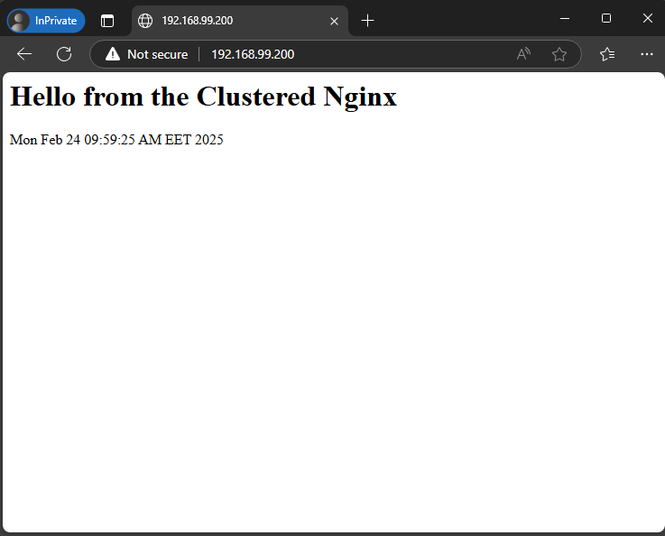
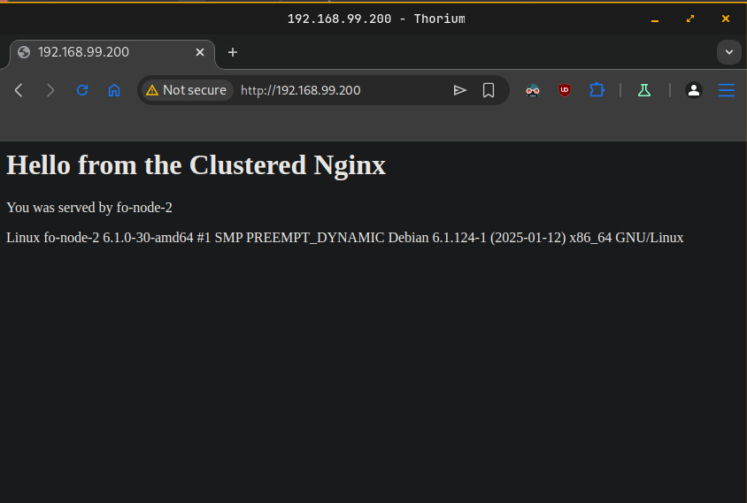

# Tasks
Implement the following:

- Research and implement two node failover cluster that hosts a web site served by LVM volume group managed by the cluster. The volume group must reside on a separate iSCSI target server
# Solution

### Diagram
```

------------+---------------------------+---------------------------+------------
            |                           |                           |
      enp0s8|192.168.99.101       enp0s8|192.168.99.102       enp0s8|192.168.99.103
+-----------+-----------+   +-----------+-----------+   +-----------+-----------+
|    [ fo-node-1 ]      |   |    [ fo-node-2 ]      |   |    [ iscsi-srv ]      |
|                       |   |                       |   |                       |
|  nginx                |   |     nginx             |   |     targetcli-fb      |
|  pacemaker            |   |     pacemaker         |   |                       |
|  pcs                  |   |     pcs               |   |                       |
|  open-iscsi           |   |     open-iscsi        |   |                       |
|  lvm2                 |   |     lvm2              |   |                       |
|                       |   |                       |   |                       |
+-----------------------+   +-----------+-----------+   +-----------------------+
```

### Steps
```
Step 1 - Setup iSCSI Target server.
Step 2 - Discover and log in to the iSCSI target on nodes.
Step 3 - Set up Pacemaker & Corosync for failover on nodes.
Step 4 - Create a Cluster Resource for LVM & Filesystem management.
Step 5 - Install Nginx and setup Cluster resource for it.
Step 6 - Test failover.
```

### Step 1. Setup iSCSI Target server
```sh
lsblk
NAME   MAJ:MIN RM  SIZE RO TYPE MOUNTPOINTS
sda      8:0    0   20G  0 disk 
├─sda1   8:1    0   19G  0 part /
├─sda2   8:2    0    1K  0 part 
└─sda5   8:5    0  975M  0 part [SWAP]
sdb      8:16   0    5G  0 disk 
sr0     11:0    1 1024M  0 rom
```
- Install iSCSI package
  ```sh
  sudo apt update && sudo apt install targetcli-fb -y
  ```
- Start iSCSI administrative tool
  ```sh
  sudo targetcli
  ```
- Create block storage device
  ```sh
  /backstores/block create name=iscsi_disk dev=/dev/sdb
  ```
- Create an iSCSI target
  ```sh
  /iscsi create iqn.2025-02.lab.homework:iscsi-srv.target
  ```
- Attach `/dev/sdb` as LUN
  ```sh
  /iscsi/iqn.2025-02.lab.homework:iscsi-srv.target/tpg1/luns create /backstores/block/iscsi_disk
  ```
- Register initiators
  ```sh
  # create initiator for first node
  /iscsi/iqn.2025-02.lab.homework:iscsi-srv.target/tpg1/acls create iqn.2025-02.lab.homework.fo-node-1.init

  # create initiator for second node
  /iscsi/iqn.2025-02.lab.homework:iscsi-srv.target/tpg1/acls create iqn.2025-02.lab.homework.fo-node-2.init
  ```
- Set **username** and **password** for initiator
  ```sh
  # set username and password for first initiator
  /iscsi/iqn.2025-02.lab.homework:iscsi-srv.target/tpg1/acls/iqn.2025-02.lab.homework.fo-node-1.init/ set auth userid=web-app
  /iscsi/iqn.2025-02.lab.homework:iscsi-srv.target/tpg1/acls/iqn.2025-02.lab.homework.fo-node-1.init/ set auth password=New_123123

  # set username and password for second initiator
  /iscsi/iqn.2025-02.lab.homework:iscsi-srv.target/tpg1/acls/iqn.2025-02.lab.homework.fo-node-2.init/ set auth userid=web-app
  /iscsi/iqn.2025-02.lab.homework:iscsi-srv.target/tpg1/acls/iqn.2025-02.lab.homework.fo-node-2.init/ set auth password=New_123123
  ```
- Set authentication flag on for the target portal group (tpg1)
  ```sh
  /iscsi/iqn.2025-02.lab.homework:iscsi-srv.target/tpg1/ set attribute authentication=1
  ```
- Setup after save and exit with `sudo targetcli ls`
  ```sh
  o- / ......................................................................................................................... [...]
    o- backstores .............................................................................................................. [...]
    | o- block .................................................................................................. [Storage Objects: 1]
    | | o- iscsi_disk ....................................................................... [/dev/sdb (5.0GiB) write-thru activated]
    | |   o- alua ................................................................................................... [ALUA Groups: 1]
    | |     o- default_tg_pt_gp ....................................................................... [ALUA state: Active/optimized]
    | o- fileio ................................................................................................. [Storage Objects: 0]
    | o- pscsi .................................................................................................. [Storage Objects: 0]
    | o- ramdisk ................................................................................................ [Storage Objects: 0]
    o- iscsi ............................................................................................................ [Targets: 1]
    | o- iqn.2025-02.lab.homework:iscsi-srv.target ......................................................................... [TPGs: 1]
    |   o- tpg1 .......................................................................................... [no-gen-acls, auth per-acl]
    |     o- acls .......................................................................................................... [ACLs: 2]
    |     | o- iqn.2025-02.lab.homework.fo-node-1.init .................................................. [1-way auth, Mapped LUNs: 1]
    |     | | o- mapped_lun0 ............................................................................ [lun0 block/iscsi_disk (rw)]
    |     | o- iqn.2025-02.lab.homework.fo-node-2.init .................................................. [1-way auth, Mapped LUNs: 1]
    |     |   o- mapped_lun0 ............................................................................ [lun0 block/iscsi_disk (rw)]
    |     o- luns .......................................................................................................... [LUNs: 1]
    |     | o- lun0 ................................................................. [block/iscsi_disk (/dev/sdb) (default_tg_pt_gp)]
    |     o- portals .................................................................................................... [Portals: 1]
    |       o- 0.0.0.0:3260 ..................................................................................................... [OK]
    o- loopback ......................................................................................................... [Targets: 0]
    o- vhost ............................................................................................................ [Targets: 0]
    o- xen-pvscsi ....................................................................................................... [Targets: 0]
  ```
- Start and enable service
  ```sh
  sudo systemctl start rtslib-fb-targetctl
  sudo systemctl enable rtslib-fb-targetctl
  ```

### Step 2. Discover and log in to the iSCSI target on `fo-node-1` and `fo-node-2`. Steps are similar for both nodes.

- Install the iSCSI initiator package
  ```sh
  sudo apt update && sudo apt install -y open-iscsi
  ```
- Add initiator name into `/etc/iscsi/initiatorname.iscsi` (replace fo-node-1 with fo-node-2 for other node)
  ```plain
  InitiatorName=iqn.2025-02.lab.homework.fo-node-1.init
  ```
- Adjust the authentication settings in `/etc/iscsi/iscsid.conf` file
  ```conf
  # Change the on line 54
  node.startup = automatic

  # Uncomment line 67
  node.session.auth.authmethod = CHAP # uncomment

  # Uncomment line 79 and 80 and set iscsi username and password
  node.session.auth.username = web-app
  node.session.auth.password = New_123123
  ```
- Restart the service
  ```sh
  sudo systemctl restart iscsid.service
  ```
- Initiate a target discovery
  ```sh
  sudo iscsiadm -m discovery -t sendtargets -p iscsi-srv
  ```
- Login to the target
  ```sh
  sudo iscsiadm -m node --login
  ```
- Confirm the established session
  ```sh
  sudo iscsiadm -m session -o show
  ```

### Step 3. Set up Pacemaker & Corosync for failover on both `fo-node-1` and `fo-node-2.`

- Install Hing Availability packages
  ```sh
  sudo apt update && sudo apt install -y pacemaker pcs
  ```
- Set password for `hacluster` user
  ```sh
  sudo passwd hacluster
  ```
- Remove corosync config file (on both nodes)
  ```sh
  sudo rm /etc/corosync/corosync.conf
  ```
- Start and enable Pacemaker service
  ```sh
  sudo systemctl start pacemaker
  sudo systemctl enable pacemaker
  ```
- Authenticate both nodes (execute on one node)
  ```sh
  sudo pcs host auth fo-node-1.homework.lab fo-node-2.homework.lab
  ```
- Create and start the cluster (execute on one node)
  ```sh
  sudo pcs cluster setup cluster-1 fo-node-1.homework.lab fo-node-2.homework.lab --force
  ```
- Start and enable the cluster
  ```sh
  sudo pcs cluster start --all
  sudo pcs cluster enable --all
  ```
- Check the cluster status
  ```sh
  sudo pcs cluster status
  ```
- Disable STONITH, we don’t have hardware fencing.
  ```sh
  sudo pcs property set stonith-enabled=false
  ```

### Step 4. Create a Cluster Resource for LVM & Filesystem management.

- Create a virtual IP address for the cluster
  ```sh
  sudo pcs resource create cluster-virtual-ip ocf:heartbeat:IPaddr2 \
      ip=192.168.99.200 cidr_netmask=24 \
      op monitor interval=30s \
      --group web-application
  ```
- Create iSCSI initiator resource
  ```sh
  sudo pcs resource create iscsi_initiator ocf:heartbeat:iscsi \
      portal="192.168.99.103:3260" \
      target="iqn.2025-02.lab.homework:iscsi-srv.target" \
      op monitor OCF_CHECK_LEVEL="0" timeout="30s" interval="120s" \
      --group web-application
  ```
- Install LVM package (on both nodes)
  ```sh
  sudo apt update && sudo apt install -y lvm2
  ```
- Modify LVM configuration `/etc/lvm/lvm.conf`. Ensures LVM is correctly handled in a clustered environment and avoids conflicts when both fo-node-1 and fo-node-2 access the same LVM resources (on both nodes)
  ```sh
  system_id_source = "uname" # uncomment and set to "uname"
  ```
- Check LVM configuration
  ```sh
  sudo lvm lvmconfig
  ```
- Make sure commands `sudo lvm systemid` and `uname -n` had same output.
- Create partition on `/dev/sdb`
  ```sh
  sudo parted -s /dev/sdb -- mklabel msdos mkpart primary 16384s -0m set 1 lvm on
  ```
- Create a physical volume.
  ```sh
  sudo pvcreate /dev/sdb1
  ```
- Create the Volume group `iscsi_vg`
  ```sh
  sudo vgcreate iscsi_vg /dev/sdb1
  ```
- Check if the system ID is correctly applied
  ```sh
  sudo vgs -o+systemid
  ```
- Create logical volume `web_lv`
  ```sh
  sudo lvcreate -l 100%FREE -n web_lv iscsi_vg
  ```
- Check the result with command
  ```sh
  sudo lvs
  ```
- Create filesystem
  ```sh
  sudo mkfs.ext4 /dev/iscsi_vg/web_lv
  ```
- Turn off automounting. Make sure Pacemaker manage volume groups instead system. Open and modify `/etc/lvm/lvm.conf`
  ```sh
  # Unmount and add only system volume groups, exclude that we should create
  auto_activation_volume_list = []
  ```
- Check the configuration
  ```sh
  sudo lvm lvmconfig
  ```
- Rebuild the initramfs by executing
  ```sh
  sudo update-initramfs -u
  ```
- Reboot both nodes

- Create mounting point on both nodes
  ```sh
  sudo mkdir -p /var/www/html
  ```
- Create iSCSI volume group resource
  - `vgname` -> Specifies the Volume Group to activate.
  - `lvname` -> If set, only the specified LV will be activated.
  - `vg_access_mode` -> Ensures LVM only activates on one node (as we already  configured system_id_source in lvm.conf).
  ```sh
  sudo pcs resource create lvm_ha ocf:heartbeat:LVM-activate \
      vgname="iscsi_vg" \
      lvname="web_lv" \
      vg_access_mode="system_id" \
      op monitor timeout="90s" interval="30s" OCF_CHECK_LEVEL="0" \
      --group web-application
  ```
- Add Filesystem resource
    - `device` -> The Logical Volume to mount.
    - `directory` -> The mount point for the website.
    - `fstype` -> The filesystem type (you formatted it as XFS).
  ```sh
  sudo pcs resource create lvm_fs ocf:heartbeat:Filesystem \
      device="/dev/iscsi_vg/web_lv" \
      directory="/var/www/html" \
      fstype="ext4" \
      op monitor OCF_CHECK_LEVEL="0" timeout="40s" interval="20s"  \
      --group web-application
  ```

- Check resources status
  ```sh
  sudo pcs resource status
  ```
### Step 5. Install Nginx and setup Cluster resource for it

- Install Nginx on both nodes
  ```sh
  sudo apt update && sudo apt install nginx -y
  ```
- Set folder permissions on both nodes
  ```sh
  sudo chmod -R 755 /var/www/html
  ```
- Crete index.html on both nodes
  ```sh
  sudo echo "<h1>Hello from the Clustered Nginx</h1><p>$(date)</p>" | sudo tee /var/www/html/index.html
  ```
- Add Nginx resource
  ```sh
  sudo pcs resource create nginx_service ocf:heartbeat:nginx \
      configfile="/etc/nginx/nginx.conf" \
      testclient="curl" \
      status10url="http://192.168.99.200/" \
      status10regex="200" \
      op monitor timeout="90s" OCF_CHECK_LEVEL="0" interval="10s" \
      --group web-application
  ```
- Status of cluster
  ```sh
  Cluster name: cluster-1
  Status of pacemakerd: 'Pacemaker is running' (last updated 2025-02-24 10:47:30 +02:00)
  Cluster Summary:
    * Stack: corosync
    * Current DC: fo-node-1.homework.lab (version 2.1.5-a3f44794f94) - partition with quorum
    * Last updated: Mon Feb 24 10:47:31 2025
    * Last change:  Mon Feb 24 10:46:06 2025 by root via cibadmin on fo-node-1.homework.lab
    * 2 nodes configured
    * 5 resource instances configured

  Node List:
    * Online: [ fo-node-1.homework.lab fo-node-2.homework.lab ]

  Full List of Resources:
    * Resource Group: web-application:
      * cluster-virtual-ip        (ocf:heartbeat:IPaddr2):         Started fo-node-1.homework.lab
      * iscsi_initiator   (ocf:heartbeat:iscsi):   Started fo-node-1.homework.lab
      * lvm_ha    (ocf:heartbeat:LVM-activate):    Started fo-node-1.homework.lab
      * lvm_fs    (ocf:heartbeat:Filesystem):      Started fo-node-1.homework.lab
      * nginx_service     (ocf:heartbeat:nginx):   Started fo-node-1.homework.lab

  Daemon Status:
    corosync: active/enabled
    pacemaker: active/enabled
    pcsd: active/enabled
  ```

- Open webpage from outside

  

### Step 6. Test failover.

- Put `fo-node-1.homework.lab` in standby mode
  ```sh
  sudo pcs node standby fo-node-1.homework.lab
  ```
- Check cluster status form `fo-node-1.homework.lab`
  ```sh
  Cluster name: cluster-1
  Status of pacemakerd: 'Pacemaker is running' (last updated 2025-02-24 10:48:15 +02:00)
  Cluster Summary:
    * Stack: corosync
    * Current DC: fo-node-1.homework.lab (version 2.1.5-a3f44794f94) - partition with quorum
    * Last updated: Mon Feb 24 10:48:15 2025
    * Last change:  Mon Feb 24 10:48:08 2025 by root via cibadmin on fo-node-1.homework.lab
    * 2 nodes configured
    * 5 resource instances configured

  Node List:
    * Node fo-node-1.homework.lab: standby
    * Online: [ fo-node-2.homework.lab ]

  Full List of Resources:
    * Resource Group: web-application:
      * cluster-virtual-ip        (ocf:heartbeat:IPaddr2):         Started fo-node-2.homework.lab
      * iscsi_initiator   (ocf:heartbeat:iscsi):   Started fo-node-2.homework.lab
      * lvm_ha    (ocf:heartbeat:LVM-activate):    Started fo-node-2.homework.lab
      * lvm_fs    (ocf:heartbeat:Filesystem):      Started fo-node-2.homework.lab
      * nginx_service     (ocf:heartbeat:nginx):   Started fo-node-2.homework.lab

  Daemon Status:
    corosync: active/enabled
    pacemaker: active/enabled
    pcsd: active/enabled
  ```

- Open webpage from outside. Our web server should be served by second node.

  