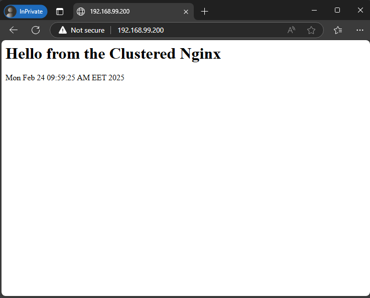
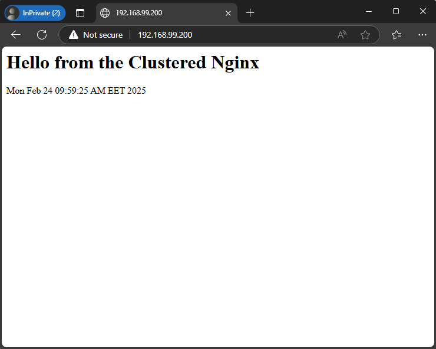

# Homework M6: Clustering and High Availability

Main goal is to build further on what was demonstrated during the practice

## Tasks

Implement the following:

- Research and implement two node failover cluster that hosts a web site served by LVM volume group managed by the cluster. The volume group must reside on a separate iSCSI target server

## Proof

Prepare a document that shows what you accomplished and how you did it. It can include (not limited to):

- The commands you used to achieve the above tasks

- A few pictures showing intermediary steps or results

## Solutions

alma/homework-alma.md
debian/homework-debian.md
suse/homework-suse.md

## Debian solution

### Diagram
```

------------+---------------------------+---------------------------+------------
            |                           |                           |
      enp0s8|192.168.99.101       enp0s8|192.168.99.102       enp0s8|192.168.99.103
+-----------+-----------+   +-----------+-----------+   +-----------+-----------+
|    [ fo-node-1 ]      |   |    [ fo-node-2 ]      |   |    [ iscsi-srv ]      |
|                       |   |                       |   |                       |
|  nginx                |   |     nginx             |   |     targetcli-fb      |
|  pacemaker            |   |     pacemaker         |   |                       |
|  pcs                  |   |     pcs               |   |                       |
|  open-iscsi           |   |     open-iscsi        |   |                       |
|  lvm2                 |   |     lvm2              |   |                       |
|                       |   |                       |   |                       |
+-----------------------+   +-----------+-----------+   +-----------------------+
```

### Steps
```
Step 1 - Setup iSCSI Target server.
Step 2 - Discover and log in to the iSCSI target on nodes.
Step 3 - Set up Pacemaker & Corosync for failover on nodes.
Step 4 - Create a Cluster Resource for LVM & Filesystem management.
Step 5 - Install Nginx and setup Cluster resource for it.
Step 6 - Test failover.
```

### Step 1. Setup iSCSI Target server
```sh
lsblk
NAME   MAJ:MIN RM  SIZE RO TYPE MOUNTPOINTS
sda      8:0    0   20G  0 disk 
├─sda1   8:1    0   19G  0 part /
├─sda2   8:2    0    1K  0 part 
└─sda5   8:5    0  975M  0 part [SWAP]
sdb      8:16   0    5G  0 disk 
sr0     11:0    1 1024M  0 rom
```
1. Install iSCSI package
```sh
sudo apt update && sudo apt install targetcli-fb -y
```
2. Start iSCSI administrative tool
```sh
sudo targetcli
```
3. Create block storage device
```sh
/backstores/block create name=iscsi_disk dev=/dev/sdb
```
4. Create an iSCSI target
```sh
/iscsi create iqn.2025-02.lab.homework:iscsi-srv.target
```
5. Attach `/dev/sdb` as LUN
```sh
/iscsi/iqn.2025-02.lab.homework:iscsi-srv.target/tpg1/luns create /backstores/block/iscsi_disk
```
6. Register initiators
```sh
/iscsi/iqn.2025-02.lab.homework:iscsi-srv.target/tpg1/acls create iqn.2025-02.lab.homework.fo-node-1.init

/iscsi/iqn.2025-02.lab.homework:iscsi-srv.target/tpg1/acls create iqn.2025-02.lab.homework.fo-node-2.init
```
7. Set **username** and **password** for initiator
```sh
# set username and password for first initiator
/iscsi/iqn.2025-02.lab.homework:iscsi-srv.target/tpg1/acls/iqn.2025-02.lab.homework.fo-node-1.init/ set auth userid=web-app
/iscsi/iqn.2025-02.lab.homework:iscsi-srv.target/tpg1/acls/iqn.2025-02.lab.homework.fo-node-1.init/ set auth password=New_123123

# set username and password for second initiator
/iscsi/iqn.2025-02.lab.homework:iscsi-srv.target/tpg1/acls/iqn.2025-02.lab.homework.fo-node-2.init/ set auth userid=web-app
/iscsi/iqn.2025-02.lab.homework:iscsi-srv.target/tpg1/acls/iqn.2025-02.lab.homework.fo-node-2.init/ set auth password=New_123123
```
8. Set authentication flag on for the target portal group (tpg1)
```sh
/iscsi/iqn.2025-02.lab.homework:iscsi-srv.target/tpg1/ set attribute authentication=1
```
9. Setup after save and exit
```sh
sudo targetcli ls
o- / ......................................................................................................................... [...]
  o- backstores .............................................................................................................. [...]
  | o- block .................................................................................................. [Storage Objects: 1]
  | | o- iscsi_disk ....................................................................... [/dev/sdb (5.0GiB) write-thru activated]
  | |   o- alua ................................................................................................... [ALUA Groups: 1]
  | |     o- default_tg_pt_gp ....................................................................... [ALUA state: Active/optimized]
  | o- fileio ................................................................................................. [Storage Objects: 0]
  | o- pscsi .................................................................................................. [Storage Objects: 0]
  | o- ramdisk ................................................................................................ [Storage Objects: 0]
  o- iscsi ............................................................................................................ [Targets: 1]
  | o- iqn.2025-02.lab.homework:iscsi-srv.target ......................................................................... [TPGs: 1]
  |   o- tpg1 .......................................................................................... [no-gen-acls, auth per-acl]
  |     o- acls .......................................................................................................... [ACLs: 2]
  |     | o- iqn.2025-02.lab.homework.fo-node-1.init .................................................. [1-way auth, Mapped LUNs: 1]
  |     | | o- mapped_lun0 ............................................................................ [lun0 block/iscsi_disk (rw)]
  |     | o- iqn.2025-02.lab.homework.fo-node-2.init .................................................. [1-way auth, Mapped LUNs: 1]
  |     |   o- mapped_lun0 ............................................................................ [lun0 block/iscsi_disk (rw)]
  |     o- luns .......................................................................................................... [LUNs: 1]
  |     | o- lun0 ................................................................. [block/iscsi_disk (/dev/sdb) (default_tg_pt_gp)]
  |     o- portals .................................................................................................... [Portals: 1]
  |       o- 0.0.0.0:3260 ..................................................................................................... [OK]
  o- loopback ......................................................................................................... [Targets: 0]
  o- vhost ............................................................................................................ [Targets: 0]
  o- xen-pvscsi ....................................................................................................... [Targets: 0]
```
10. Start and enable service
```sh
sudo systemctl restart rtslib-fb-targetctl
sudo systemctl enable rtslib-fb-targetctl
```
### Step 2. Discover and log in to the iSCSI target on `fo-node-1` and `fo-node-2`. Steps are similar for both nodes.

1. Install the iSCSI initiator package
```sh
sudo apt update && sudo apt install -y open-iscsi
```
2. Add initiator name into `/etc/iscsi/initiatorname.iscsi` (replace fo-node-1 with fo-node-2 for other node)
```plain
InitiatorName=iqn.2025-02.lab.homework.fo-node-1.init
```
3. Adjust the authentication settings in `/etc/iscsi/iscsid.conf` file
```conf
# Change the on line 54
node.startup = automatic

# Uncomment line 67
node.session.auth.authmethod = CHAP # uncomment

# Uncomment line 79 and 80 and set iscsi username and password
node.session.auth.username = web-app
node.session.auth.password = New_123123
```
4. Restart the service
```sh
sudo systemctl restart iscsid.service
```
5. Initiate a target discovery (on both nodes)
```sh
sudo iscsiadm -m discovery -t sendtargets -p iscsi-srv
```
6. Login to the target (on both nodes)
```sh
sudo iscsiadm -m node --login
```
7. Confirm the established session (on both nodes)
```sh
sudo iscsiadm -m session -o show
```

### Step 3. Set up Pacemaker & Corosync for failover on both `fo-node-1` and `fo-node-2.`

1. Install Hing Availability packages
```sh
sudo apt update && sudo apt install -y pacemaker pcs
```
2. Set password for `hacluster` user
```sh
sudo passwd hacluster
```
3. Remove corosync config file (on both nodes)
```sh
sudo rm /etc/corosync/corosync.conf
```
4. Authenticate both nodes (execute on one node)
```sh
sudo pcs host auth fo-node-1.homework.lab fo-node-2.homework.lab
```
5. Create and start the cluster (execute on one node)
```sh
sudo pcs cluster setup cluster-1 fo-node-1.homework.lab fo-node-2.homework.lab --force
```
6. Start and enable the cluster
```sh
sudo pcs cluster start --all
sudo pcs cluster enable --all
```
7. Check the cluster status
```sh
sudo pcs cluster status
```
8. Disable STONITH, we don’t have hardware fencing.
```sh
sudo pcs property set stonith-enabled=false
```

### Step 4. Create a Cluster Resource for LVM & Filesystem management.

1. Create a virtual IP address for the cluster
```sh
sudo pcs resource create cluster-virtual-ip ocf:heartbeat:IPaddr2 \
    ip=192.168.99.200 cidr_netmask=24 \
    op monitor interval=30s \
    --group web-application
```
2. Create iSCSI initiator resource
```sh
sudo pcs resource create iscsi_initiator ocf:heartbeat:iscsi \
    portal="iscsi-srv:3260" \
    target="iqn.2025-02.lab.homework:iscsi-srv.target" \
    op monitor interval=20s \
    op start interval=0 timeout=120s \
    op stop interval=0 timeout=120s \
    --group web-application
```
3. Install LVM package
```sh
sudo apt install -y lvm2
```
4. Modify LVM configuration `/etc/lvm/lvm.conf`. Ensures LVM is correctly handled in a clustered environment and avoids conflicts when both fo-node-1 and fo-node-2 access the same LVM resources (on both nodes)
```sh
system_id_source = "uname" # uncomment and set to "uname"
```
5. Create partition on `/dev/sdb`
```sh
sudo parted -s /dev/sdb -- mklabel msdos mkpart primary 16384s -0m set 1 lvm on
```
6. Create a physical volume.
```sh
sudo pvcreate /dev/sdb1
```
7. Create the Volume group `iscsi_vg`
```sh
sudo vgcreate iscsi_vg /dev/sdb1
```
8. Check if the system ID is correctly applied
```sh
sudo vgs -o+systemid
```
9. Create logical volume `web_lv`
```sh
sudo lvcreate -l 100%FREE -n web_lv iscsi_vg
```
10. Check the result with command
```sh
sudo lvs
```
11. Create filesystem
```sh
sudo mkfs.ext4 /dev/iscsi_vg/web_lv
```
12. Turn off automounting. Make sure Pacemaker manage volume groups instead system. Open and modify `/etc/lvm/lvm.conf`
```sh
# Unmount and add only system volume groups, exclude that we should create
auto_activation_volume_list = []
```
13. Check the configuration
```sh
sudo lvm lvmconfig
```
14.  Rebuild the initramfs by executing
```sh
sudo update-initramfs -u
```
15.  Reboot both nodes

16.  Create mounting point on both nodes
```sh
sudo mkdir -p /var/www/html
```
17.  Create iSCSI volume group resource
```sh
sudo pcs resource create lvm_ha ocf:heartbeat:LVM-activate \
    vgname=iscsi_vg \
    vg_access_mode=system_id \
    --group web-application
```
- `vgname=iscsi_vg` → Specifies the Volume Group to activate.
- `vg_access_mode=system_id` → Ensures LVM only activates on one node (as we already configured system_id_source in lvm.conf).
18.  Add Filesystem resource
```sh
sudo pcs resource create lvm_fs ocf:heartbeat:Filesystem \
    device="/dev/iscsi_vg/web_lv" \
    directory="/var/www/html" \
    fstype="ext4" \
    --group web-application
```
- `device="/dev/iscsi_vg/web_lv"` → The Logical Volume to mount.
- `directory="/var/www/html"` → The mount point for the website.
- `fstype="ext4"` → The filesystem type (you formatted it as XFS).
19.  Check resources status
```sh
sudo pcs resource status
```
### Step 5. Install Nginx and setup Cluster resource for it

1.  Install Nginx on both nodes
```sh
sudo apt update && sudo apt install nginx -y
```
2.  Set folder permissions on both nodes
```sh
sudo chmod -R 755 /var/www/html
```
3.  Crete index.html on both nodes
```sh
sudo echo "<h1>Hello from the Clustered Nginx</h1><p>You was served by $(hostname)</p><p>$(uname -a)</p>" | sudo tee /var/www/html/index.html
```
4.  Add Nginx resource
```sh
sudo pcs resource create nginx_service ocf:heartbeat:nginx \
    configfile="/etc/nginx/nginx.conf" \
    op monitor timeout="5s" interval="5s" \
    --group web-application
```
5.  Status of cluster
```sh
Cluster name: cluster-1
Status of pacemakerd: 'Pacemaker is running' (last updated 2025-02-23 10:25:10 +02:00)
Cluster Summary:
  * Stack: corosync
  * Current DC: fo-node-1.homework.lab (version 2.1.5-a3f44794f94) - partition with quorum
  * Last updated: Sun Feb 23 10:25:10 2025
  * Last change:  Sun Feb 23 10:24:34 2025 by root via cibadmin on fo-node-1.homework.lab
  * 2 nodes configured
  * 5 resource instances configured

Node List:
  * Online: [ fo-node-1.homework.lab fo-node-2.homework.lab ]

Full List of Resources:
  * Resource Group: web-application:
    * cluster-virtual-ip        (ocf:heartbeat:IPaddr2):         Started fo-node-1.homework.lab
    * iscsi_initiator   (ocf:heartbeat:iscsi):   Started fo-node-1.homework.lab
    * lvm_ha    (ocf:heartbeat:LVM-activate):    Started fo-node-1.homework.lab
    * lvm_fs    (ocf:heartbeat:Filesystem):      Started fo-node-1.homework.lab
    * nginx_service     (ocf:heartbeat:nginx):   Started fo-node-1.homework.lab

Daemon Status:
  corosync: active/enabled
  pacemaker: active/enabled
  pcsd: active/enabled
```

6.  Open webpage from outside



### Step 6. Test failover.

1. Put `fo-node-1.homework.lab` in standby mode
```sh
sudo pcs node standby fo-node-1.homework.lab
```
2. Check cluster status form `fo-node-1.homework.lab`
```sh
Cluster name: cluster-1
Status of pacemakerd: 'Pacemaker is running' (last updated 2025-02-23 10:32:35 +02:00)
Cluster Summary:
  * Stack: corosync
  * Current DC: fo-node-1.homework.lab (version 2.1.5-a3f44794f94) - partition with quorum
  * Last updated: Sun Feb 23 10:32:35 2025
  * Last change:  Sun Feb 23 10:32:06 2025 by root via cibadmin on fo-node-1.homework.lab
  * 2 nodes configured
  * 5 resource instances configured

Node List:
  * Node fo-node-1.homework.lab: standby
  * Online: [ fo-node-2.homework.lab ]

Full List of Resources:
  * Resource Group: web-application:
    * cluster-virtual-ip        (ocf:heartbeat:IPaddr2):         Started fo-node-2.homework.lab
    * iscsi_initiator   (ocf:heartbeat:iscsi):   Started fo-node-2.homework.lab
    * lvm_ha    (ocf:heartbeat:LVM-activate):    Started fo-node-2.homework.lab
    * lvm_fs    (ocf:heartbeat:Filesystem):      Started fo-node-2.homework.lab
    * nginx_service     (ocf:heartbeat:nginx):   Started fo-node-2.homework.lab

Daemon Status:
  corosync: active/enabled
  pacemaker: active/enabled
  pcsd: active/enabled
```

3. Open webpage from outside. Our web server should be served by second node.


