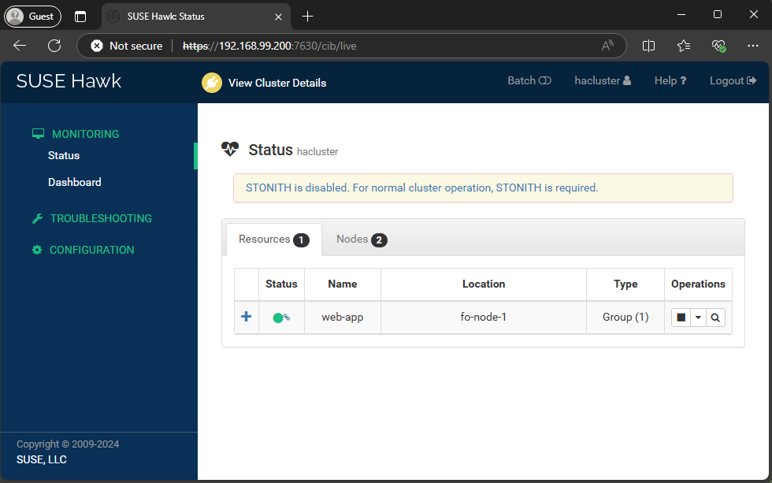

## Tasks
Implement the following:

- Research and implement two node failover cluster that hosts a web site served by LVM volume group managed by the cluster. The volume group must reside on a separate iSCSI target server
## Solution

### Diagram
```

------------+---------------------------+---------------------------+------------
            |                           |                           |
      enp0s8|192.168.99.101       enp0s8|192.168.99.102       enp0s8|192.168.99.103
+-----------+-----------+   +-----------+-----------+   +-----------+-----------+
|    [ fo-node-1 ]      |   |    [ fo-node-2 ]      |   |    [ iscsi-srv ]      |
|                       |   |                       |   |                       |
|  nginx                |   | nginx                 |   |     targetcli-fb      |
|  ha-cluster-bootstrap |   | ha-cluster-bootstrap  |   |                       |
|  lvm2                 |   | lvm2                  |   |                       |
|                       |   |                       |   |                       |
|                       |   |                       |   |                       |
|                       |   |                       |   |                       |
+-----------------------+   +-----------+-----------+   +-----------------------+
```

### Steps

```plain
Step 1 - Setup iSCSI Target server.
Step 2 - Initiator setup. Discover and log in to the iSCSI target.
Step 3 - Set up Failover Clusters.
Step 4 - Create a Cluster Resource for LVM & Filesystem management.
Step 5 - Install Nginx and setup Cluster resource for it.
Step 6 - Test failover.
```
### Step 1. Setup iSCSI Target server
- Install iSCSI package
  ```sh
  sudo zypper refresh && sudo zypper install targetcli-fb
  ```
- Start iSCSI administrative tool
  ```sh
  sudo targetcli
  ```
- Create block storage device
  ```sh
  /backstores/block create name=iscsi_disk dev=/dev/sdb
  ```
- Create an IQN
  ```
  /iscsi create iqn.2025-02.lab.homework:iscsi-srv.target
  ```
- Attach `/dev/sdb` as LUN
  ```
  /iscsi/iqn.2025-02.lab.homework:iscsi-srv.target/tpg1/luns create /backstores/block/iscsi_disk
  ```
- Register initiators
  ```sh
  /iscsi/iqn.2025-02.lab.homework:iscsi-srv.target/tpg1/acls create iqn.2025-02.lab.homework.fo-node-1.init

  /iscsi/iqn.2025-02.lab.homework:iscsi-srv.target/tpg1/acls create iqn.2025-02.lab.homework.fo-node-2.init
  ```
- Set username and password for initiator
  ```sh
  # set username and password for first initiator
  /iscsi/iqn.2025-02.lab.homework:iscsi-srv.target/tpg1/acls/iqn.2025-02.lab.homework.fo-node-1.init/ set auth userid=web-app
  /iscsi/iqn.2025-02.lab.homework:iscsi-srv.target/tpg1/acls/iqn.2025-02.lab.homework.fo-node-1.init/ set auth password=New_123123

  # set username and password for second initiator
  /iscsi/iqn.2025-02.lab.homework:iscsi-srv.target/tpg1/acls/iqn.2025-02.lab.homework.fo-node-2.init/ set auth userid=web-app
  /iscsi/iqn.2025-02.lab.homework:iscsi-srv.target/tpg1/acls/iqn.2025-02.lab.homework.fo-node-2.init/ set auth password=New_123123
  ```
- Set authentication flag on for the target portal group (tpg1)
  ```sh
  /iscsi/iqn.2025-02.lab.homework:iscsi-srv.target/tpg1/ set attribute authentication=1
  ```
- Setup after save and exit
  ```sh
  sudo targetcli ls
  o- / ......................................................................................................................... [...]
    o- backstores .............................................................................................................. [...]
    | o- block .................................................................................................. [Storage Objects: 1]
    | | o- iscsi_disk ....................................................................... [/dev/sdb (5.0GiB) write-thru activated]
    | |   o- alua ................................................................................................... [ALUA Groups: 1]
    | |     o- default_tg_pt_gp ....................................................................... [ALUA state: Active/optimized]
    | o- fileio ................................................................................................. [Storage Objects: 0]
    | o- pscsi .................................................................................................. [Storage Objects: 0]
    | o- ramdisk ................................................................................................ [Storage Objects: 0]
    o- iscsi ............................................................................................................ [Targets: 1]
    | o- iqn.2025-02.lab.homework:iscsi-srv.target ......................................................................... [TPGs: 1]
    |   o- tpg1 .......................................................................................... [no-gen-acls, auth per-acl]
    |     o- acls .......................................................................................................... [ACLs: 2]
    |     | o- iqn.2025-02.lab.homework.fo-node-1.init .................................................. [1-way auth, Mapped LUNs: 1]
    |     | | o- mapped_lun0 ............................................................................ [lun0 block/iscsi_disk (rw)]
    |     | o- iqn.2025-02.lab.homework.fo-node-2.init .................................................. [1-way auth, Mapped LUNs: 1]
    |     |   o- mapped_lun0 ............................................................................ [lun0 block/iscsi_disk (rw)]
    |     o- luns .......................................................................................................... [LUNs: 1]
    |     | o- lun0 ................................................................. [block/iscsi_disk (/dev/sdb) (default_tg_pt_gp)]
    |     o- portals .................................................................................................... [Portals: 1]
    |       o- 0.0.0.0:3260 ..................................................................................................... [OK]
    o- loopback ......................................................................................................... [Targets: 0]
    o- vhost ............................................................................................................ [Targets: 0]
    o- xen-pvscsi ....................................................................................................... [Targets: 0]
  ```
- Setup firewall
  ```sh
  sudo firewall-cmd --add-service iscsi-target --permanent
  sudo firewall-cmd --reload
  ```
- Start and enable target service
  ```sh
  sudo systemctl enable --now targetcli.service
  ```

### Step 2. Initiator setup. Discover and log in to the iSCSI target.
This step should be executed on both nodes.

- Install the initiator package
  ```sh
  sudo zypper install open-iscsi
  ```
- Reboot the system and login again.
- Open the initiator configuration file for editing (/etc/iscsi/initiatorname.iscsi). Replace `fo-node-1` with `fo-node-2` for second node.
  ```sh
  iqn.2025-02.lab.homework.fo-node-1.init
  ```
- Adjust the authentication settings in `/etc/iscsi/iscsid.conf` file
  ```sh
  # change mode from manual to automatic (line 54)
  node.startup = automatic

  # uncomment CHAP auth (line 67)
  node.session.auth.authmethod = CHAP

  # uncomment and set iscsi username and password (line 79 and 80)
  node.session.auth.username = web-app
  node.session.auth.password = New_123123
  ```
- Initiate a target discovery
  ```sh
  sudo iscsiadm -m discovery -t sendtargets -p iscsi-srv
  ```
- Login to the target server
  ```sh
  sudo iscsiadm -m node --login
  ```
- Confirm the established session
  ```sh
  sudo iscsiadm -m session -o show
  ```
### Step 3. Set up Failover Clusters.
Working on `fo-node-1.homework.lab`

- Lock the following package as will cause conflicts later.
  ```sh
  sudo zypper al ruby2.5-rubygem-railties-5.2
  ```
- Install the required packages
  ```sh
  sudo zypper install ha-cluster-bootstrap
  ```
- Reboot the virtual machine.
- Start the cluster creation procedure
  ```sh
  sudo crm cluster init
  ```
  - The user 'hacluster' will have the login shell configuration changed to /bin/bash - **Y**
  - Configure **Corosync** (unicast): 192.168.99.101
  - Do you wish to use **SBD** (disable **STONITH**) - **N**
  - Do you wish to configure a **virtual IP address** - **Y**. Enter the address you want (for example, **192.168.99.200**)
  - Do you want to configure **QDevice** - **N**
- Check cluster status
  ```sh
  sudo crm status
  ```
Working on `fo-node-2.homework.lab`

- Lock the following package as will cause conflicts
  ```sh
  sudo zypper al ruby2.5-rubygem-railties-5.2
  ```
- Install the required packages
  ```sh
  sudo zypper install ha-cluster-bootstrap
  ```
- Join `fo-node-2.homework.lab` to the cluster
  ```sh
  sudo crm cluster join -c fo-node-1.homework.lab
  ```
  - Enter the **root** password of `fo-node-1.homework.lab`
  - The user 'hacluster' will have the login shell configuration changed to /bin/bash - **Y**
  - Set the local ip address - **192.168.99.102**
- Check the cluster status after join of `fo-node-1`
  ```
  sudo crm status
  Cluster Summary:
    * Stack: corosync (Pacemaker is running)
    * Current DC: fo-node-1 (version 2.1.7+20231219.0f7f88312-150600.6.6.1-2.1.7+20231219.0f7f88312) - partition with quorum
    * Last updated: Sun Feb 23 14:11:54 2025 on fo-node-2
    * Last change:  Sun Feb 23 14:08:40 2025 by root via root on fo-node-2
    * 2 nodes configured
    * 1 resource instance configured

  Node List:
    * Online: [ fo-node-1 fo-node-2 ]

  Full List of Resources:
    * admin-ip    (ocf::heartbeat:IPaddr2):        Started fo-node-1
  ```
- Create group `web-app` and add `admin-ip` resource to it. This group will contain all resources.
  ```sh
  sudo crm configure group web-app admin-ip
  ```
- Test moving `web-app` group to the other node.
  ```sh
  sudo crm resource move web-app fo-node-2
  ```
- Log in to the web administrative console of the cluster. Can be used **virtual-admin-ip-address** set on HA setup. Default credentials are user **hacluster** and password **linux**.

  

### Step 4. Create a Cluster Resource for LVM & Filesystem management.
- Create the virtual IP address for the cluster
  ```sh
  sudo crm configure primitive p_IPaddr2 ocf:heartbeat:IPaddr2 \
    params \
      ip=192.168.99.201 \
      cidr_netmask=24 \
    op monitor interval=30s \
  ```
- Create iSCSI initiator resource
  ```sh
  sudo crm configure primitive p_iscsi ocf:heartbeat:iscsi \
    params \
      portal="192.168.99.103:3260" \
      target="iqn.2025-02.lab.homework:iscsi-srv.target" \
    op monitor interval="20s" timeout="40s" \
    op start interval="0" timeout="120s" \
    op stop interval="0" timeout="120s"
  ```
- Test failover
  ```sh
  sudo crm node standby fo-node-1
  ```
- Check the cluster status with `sudo crm status`
  ```sh
  Cluster Summary:
    * Stack: corosync (Pacemaker is running)
    * Current DC: fo-node-1 (version 2.1.7+20231219.0f7f88312-150600.6.6.1-2.1.7+20231219.0f7f88312) - partition with quorum
    * Last updated: Tue Feb 25 09:28:17 2025 on fo-node-1
    * Last change:  Tue Feb 25 09:28:14 2025 by root via root on fo-node-1
    * 2 nodes configured
    * 3 resource instances configured

  Node List:
    * Node fo-node-1: standby
    * Online: [ fo-node-2 ]

  Full List of Resources:
    * Resource Group: web-app:
      * admin-ip  (ocf::heartbeat:IPaddr2):        Started fo-node-2
      * p_IPaddr2 (ocf::heartbeat:IPaddr2):        Started fo-node-2
      * p_iscsi   (ocf::heartbeat:iscsi):  Started fo-node-2
  ```
- Install the LVM packages on both nodes in needed
  ```sh
  sudo zypper install lvm2
  ```
- Edit LVM configuration, open the file `/etc/lvm/lvm.conf` on both nodes
  ```sh
  system_id_source = "uname" # uncomment and set to "uname"
  ```
- Check if shell commands `sudo lvm systemid` and `uname -n` returned same node name on both nodes
- Bring back online `fo-node-1`
  ```sh
  sudo crm node online fo-node-1
  ```
- Move all resources to `fo-node-1` using group `web-app`
  ```sh
  sudo crm resource move web-app fo-node-1
  ```
- Create partition on `/dev/sdb` on `fo-node-1`
  ```sh
  sudo parted -s /dev/sdb -- mklabel msdos mkpart primary 16384s -0m set 1 lvm on
  ```
- Initialize it as physical volume on `fo-node-1`
  ```sh
  sudo pvcreate /dev/sdb1
  ```
- Create a volume group on `fo-node-1`
  ```sh
  sudo vgcreate iscsi_vg /dev/sdb1 
  ```
- Check if the system ID is correctly applied on `fo-node-1`
  ```sh
  sudo vgs -o+systemid
  ```
- Create a logical volume on `fo-node-1`
  ```sh
  sudo lvcreate -l 100%FREE -n web_lv iscsi_vg
  ```
- Create a filesystem on `fo-node-1`
  ```sh
  sudo mkfs.ext4 /dev/iscsi_vg/web_lv
  ```
- Turn off automounting. Make sure Pacemaker manage volume groups instead system. Open and modify `/etc/lvm/lvm.conf` on both nodes.
  ```sh
  # check for volume groups with `sudo vgs --noheadings -o vg_name`
  # uncomment and add only system volume groups, exclude that we should create
  auto_activation_volume_list = []
  ```
- Rebuild the **initrd** by executing
  ```sh
  sudo dracut -H -f /boot/initrd-$(uname -r) $(uname -r)
  ```
- Reboot the node
- Create mounting point on both nodes
  ```sh
  sudo mkdir -p /var/www/cluster
  ```
- Create iSCSI volume group resource.
  ```sh
  sudo crm configure primitive p_LVM-activate ocf:heartbeat:LVM-activate \
    params \
      vgname="iscsi_vg" \
      lvname="web_lv" \
      vg_access_mode="system_id" \
  ```
- Create Filesystem resource
  ```sh
  sudo crm configure primitive lvm_fs ocf:heartbeat:Filesystem params device="/dev/iscsi_vg/web_lv" directory="/var/www/cluster"  fstype="ext4" op monitor interval="20s" --group web-application
  ```

