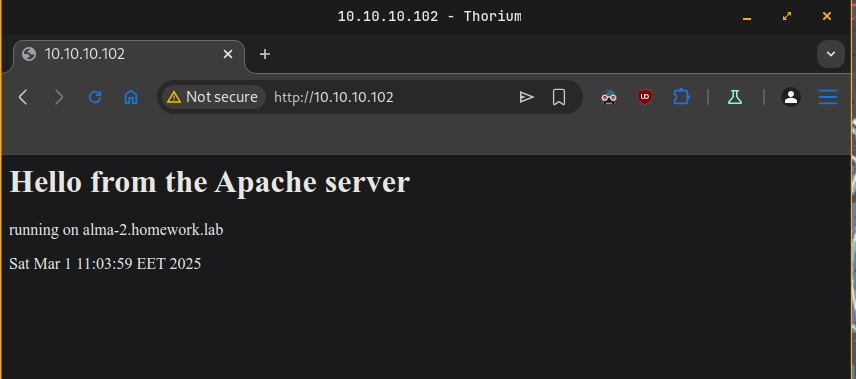
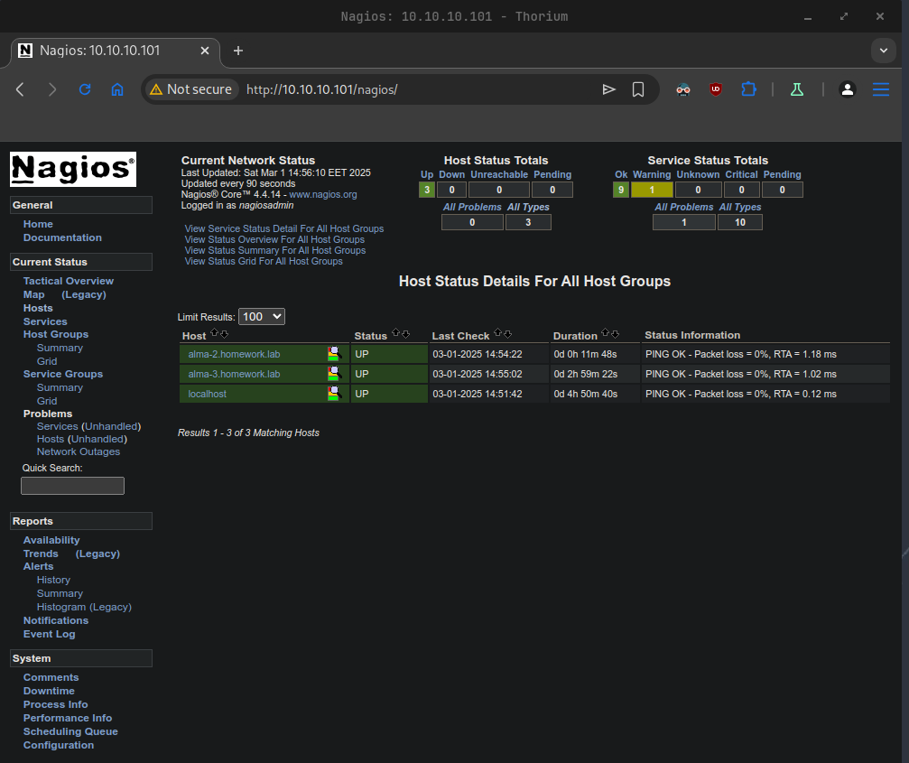
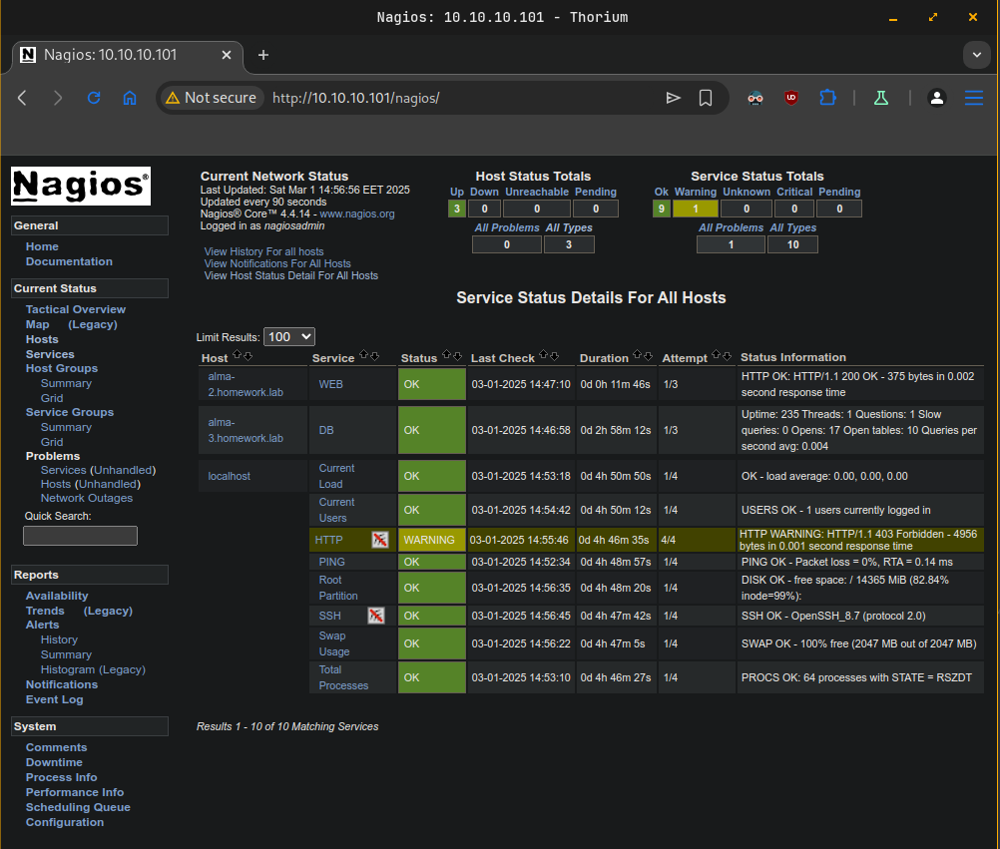
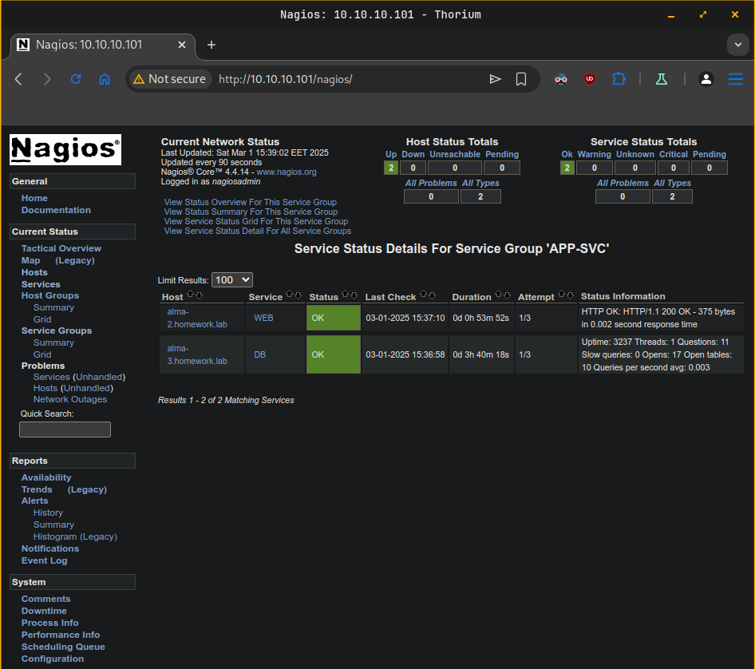
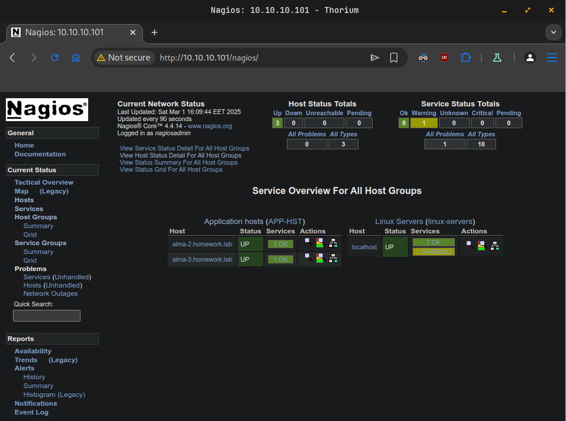
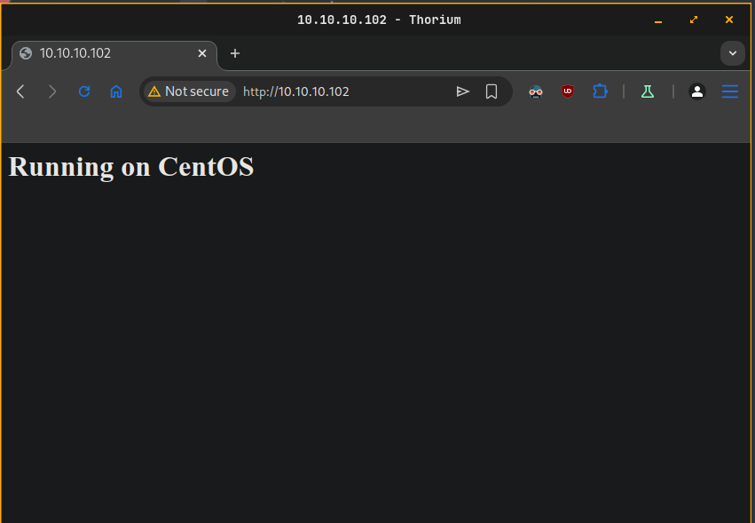
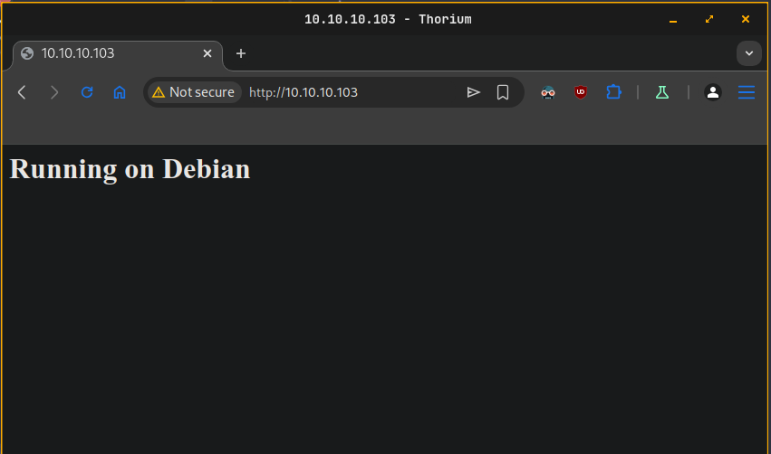

# Tasks

Chose and implement one or more of the following:

- Repeat the **Nagios** related practice (one server and two clients – one with **Apache** and one with **MariaDB**) but in addition to monitoring the individual services (**WEB** and **DB**) create a **service group** (**APP-SVC**) to monitor the two services as a group and **host group** (**APP-HST**) to monitor the two clients as a group

- Create a mixed environment with three machines (one with your favorite distribution you used in the course, one with **CentOS** / **AlmaLinux** and one with **Ubuntu** / **Debian**). The first one should act as an **Ansible** host (with inventory containing the other two machines). You should create and execute a **playbook** that installs and starts **Apache** on the other two machines, opens the firewall for HTTP, and creates a custom **index.html** containing the text **Running on %OS%** where **%OS%** must be either **Red Hat** or **Debian** (or **CentOS** / **AlmaLinux** and **Ubuntu** / **Debian**)

# Solution

## Task 1

### Diagram
```
------------+---------------------------+---------------------------+------------
            |                           |                           |
      enp0s8|10.10.10.101         enp0s8|10.10.10.102         enp0s8|10.10.10.103
+-----------+-----------+   +-----------+-----------+   +-----------+-----------+
|       [ alma-1 ]      |   |       [ alma-2 ]      |   |       [ alma-3 ]      |
|                       |   |                       |   |                       |
| nagios                |   | httpd                 |   | mariadb-server        |
| nagios-common         |   |                       |   |                       |
| nagios-selinux        |   |                       |   |                       |
| nagios-plugins-all    |   |                       |   |                       |
|                       |   |                       |   |                       |
|                       |   |                       |   |                       |
+-----------------------+   +-----------------------+   +-----------------------+
```

### Steps
```plain
Step 1 - Setup Nagios on suse-1.homework.lab
Step 2 - Setup Apache on suse-2.homework.lab
Step 3 - Setup MariaDB on suse-3.homework.lab
Step 4 - Configure hosts and services monitoring in Nagios.
Step 5 - Create configuration for Service Group.
Step 6 - Create configuration for Host Group.
```

### Step 1 - Setup Nagios on suse-1.homework.lab
- Install EPEL repository
  ```sh
  sudo dnf install epel-release    
  ```
- Then enable the **PowerTools** or the **CodeReady Builder (CRB)** repository
  ```sh
  sudo dnf config-manager --set-enabled crb
  ```
- Install **Nagios** and the required packages
  ```sh
  sudo dnf install nagios nagios-common nagios-selinux nagios-plugins-all
  ```
- Start and enable Nagios service
  ```sh
  sudo systemctl enable --now nagios
  ```
- Start and enable Apache service used by Nagios
  ```sh
  sudo systemctl enable --now httpd
  ```
- Setup firewall
  ```sh
  sudo firewall-cmd --add-service={http,https} --permanent
  sudo firewall-cmd --reload
  ``` 
- Update password for user **nagiosadmin**
  ```sh
  sudo htpasswd /etc/nagios/passwd nagiosadmin
  ```
- Try to login on http://10.10.10.101/nagios with nagiosadmin and password from above.

### Step 2 - Setup Apache on suse-2.homework.lab
- Install Apache
  ```sh
  sudo dnf install httpd
  ```
- Create custom **index.html** file
  ```sh
  sudo echo "<h1>Hello from the Apache server</h1><p>running on $(hostname)</p><p>$(date)</p>" | sudo tee /var/www/html/index.html
  ```
- Start and enable Apache service
  ```sh
  sudo systemctl enable --now httpd
  ```
- Setup firewall
  ```sh
  sudo firewall-cmd --add-service http --permanent
  sudo firewall-cmd --reload
  ```
- Check service from outside.
  
  
### Step 3 - Setup MariaDB on suse-3.homework.lab
- Install **MariaDB**
  ```sh
  sudo dnf install mariadb-server
  ```
- Start and enable MariaDB service
  ```sh
  sudo systemctl enable --now mariadb
  ```
- Set up initial configuration
  ```sh
  sudo mysql_secure_installation
  ```
- Create a user for Nagios to connect to the database
  ```sh
  mysql -u root -p -e "CREATE USER 'nagios-mon'@'10.10.10.101' IDENTIFIED BY 'pass-123123'; FLUSH PRIVILEGES;"
  ```
- Setup firewall
  ```sh
  sudo firewall-cmd --add-port 3306/tcp --permanent
  sudo firewall-cmd --reload
  ```

### Step 4 - Configure hosts and services monitoring in Nagios.
- Edit Nagios configuration file `/etc/nagios/nagios.cfg`. Uncomment folder where servers configuration files will stored. 
  ```cfg
  cfg_dir=/etc/nagios/servers
  ```
- Create `servers` folder
  ```sh
  sudo mkdir -p /etc/nagios/servers
  ```
- Set permissions
  ```sh
  sudo chown root:nagios /etc/nagios/servers
  sudo chmod 750 /etc/nagios/servers
  ```
- Setup `apache.cfg` configuration for host and Apache running on `alma-1.homework.lab`
  ```conf
  define host {
          use linux-server
          host_name alma-2.homework.lab
          alias ALMA-2 VM
          address 10.10.10.102
  }

  define service {
          use generic-service
          host_name alma-2.homework.lab
          service_description WEB
          check_command check_http!$HOSTADDRESS$
  }
  ```
- Setup `mariadb.cfg` configuration for host and MariaDB running on `alma-2.homework.lab`
  ```cfg
  define host {
          use linux-server
          host_name alma-3.homework.lab
          alias ALMA-3 VM
          address 10.10.10.103
  }

  define command {
          command_name check_mysql_cmdlinecred
          command_line $USER1$/check_mysql -H '$HOSTADDRESS$' -u '$ARG1$' -p '$ARG2$'
  }

  define service {
          use generic-service
          host_name alma-3.homework.lab
          service_description DB
          check_command check_mysql_cmdlinecred!nagios-mon!pass-123123
  }
  ```
- Test `Nagios` configuration
  ```sh
  sudo nagios -v /etc/nagios/nagios.cfg
  ```
- Restart `Nagios` service
  ```sh
  sudo systemctl restart nagios
  ```
- Check hosts
  
  

- Check services

  

### Step 5 - Create configuration for Service Group.
- Create folder `groups` to gather all group types.
  ```sh
  sudo mkdir -p /etc/nagios/groups
  ```
- Set permissions
  ```sh
  sudo chown root:nagios /etc/nagios/groups/
  sudo chmod 750 /etc/nagios/groups/
  ```
- Edit Nagios configuration file `/etc/nagios/nagios.cfg`. Add new line for new created folder. 
  ```cfg
  cfg_dir=/etc/nagios/groups
  ```
- Create a new file called `servicegroups.cfg` inside `/etc/nagios/groups`
  ```cfg
  define servicegroup {
          servicegroup_name  APP-SVC
          alias              Application service
          members            alma-2.homework.lab,WEB,alma-3.homework.lab,DB
  }
  ```
- Check for configuration errors
  ```sh
  sudo nagios -v /etc/nagios/nagios.cfg
  ```
- Restart `Nagios` service
  ```sh
  sudo systemctl restart nagios
  ```
- Check **Nagios** web page.
  
  

### Step 6 - Create configuration for Host Group.
- - Create a new file called `hostgroups.cfg` inside `/etc/nagios/groups`
  ```cfg
  define hostgroup {
          hostgroup_name     APP-HST
          alias              Application hosts
          members            alma-2.homework.lab,alma-3.homework.lab
  }
  ```
- Check for configuration errors
  ```sh
  sudo nagios -v /etc/nagios/nagios.cfg
  ```
- Restart `Nagios` service
  ```sh
  sudo systemctl restart nagios
  ```
- Check **Nagios** web page.
  
  
  
## Task 2

### Diagram
```
------------+---------------------------+---------------------------+------------
            |                           |                           |
      enp0s8|10.10.10.101         enp0s8|10.10.10.102         enp0s8|10.10.10.103
+-----------+-----------+   +-----------+-----------+   +-----------+-----------+
|    [ ansible-alma ]   |   |     [ web-centos ]    |   |     [ web-debian ]    |
|                       |   |                       |   |                       |
| nagios                |   | httpd                 |   | apache2               |
| nagios-common         |   |                       |   | ufw                   |
| nagios-selinux        |   |                       |   |                       |
| nagios-plugins-all    |   |                       |   |                       |
|                       |   |                       |   |                       |
|                       |   |                       |   |                       |
+-----------------------+   +-----------------------+   +-----------------------+
```

### Steps
```plain
Step 1 - Setup ansible on ansible-alma.homework.lab
Step 2 - Create playbook.yaml
```

### Step 1 - Setup ansible on ansible-alma.homework.lab
- Install the **EPEL** repository
  ```sh
  sudo dnf install epel-release
  ```
- Install the **Ansible** package
  ```sh
  sudo dnf install ansible
  ```
- Generate key pair for ansible connection to clients
  ```sh
  ssh-keygen -t ed25519 -C "ansible"
  ```
- Send ssh key to target machines
  ```sh
  ssh-copy-id -i ~/.ssh/ansible.pub vagrant@web-centos.homework.lab
  ssh-copy-id -i ~/.ssh/ansible.pub vagrant@web-debian.homework.lab
  ```
- Create `inventory.ini` file to store target machines.
  ```ini
  [webservers]
  web-centos.homework.lab
  web-debian.homework.lab

  [centos]
  web-centos.homework.lab

  [debian]
  web-debian.homework.lab

  [all:vars]
  ansible_user=vagrant
  ansible_ssh_private_key_file=~/.ssh/ansible
  ansible_ssh_common_args='-o StrictHostKeyChecking=no'
  ```
- Test connection to targets
  ```sh
  ansible -i inventory.ini all -m ping
  ```

### Step 2 - Create playbook.yaml
- Create `index.html` file
  ```sh
  echo "<h1>Running on {{ ansible_distribution }}</h1>" | tee index.html
  ```
- Create `playbook.yaml`
  ```yaml
  ---
  - hosts: centos
    become: true

    tasks:
      - name: Install Apache server
        dnf:
          name: httpd
          state: present

      - name: Ensure Apache is started and enabled at boot
        service:
          name: httpd
          state: started
          enabled: true

      - name: Copy webpage
        template:
          src: index.html.j2
          dest: /var/www/html/index.html

      - name: Allow Apache service in firewall
        firewalld:
          service: http
          state: enable
          permanent: true
          immediate: true
   
  - hosts: debian
    become: true

    tasks:
      - name: Install Apache server
        apt:
          name: apache2
          state: present

      - name: Ensure Apache is started and enabled at boot
        service:
          name: apache2
          state: started
          enabled: true

      - name: Copy webpage
        template:
          src: index.html.j2
          dest: /var/www/html/index.html

      - name: Ensure UFW is enabled
        community.general.ufw:
          state: enabled

      - name: Allow Apache service in firewall
        community.general.ufw:
          rule: allow
          port: '80'
          proto: tcp
  ``` 
- Check syntax errors
  ```sh
  ansible-playbook -i inventory.ini playbook.yaml --syntax-check
  ```
- Execute Ansible playbook
  ```sh
  ansible-playbook -i inventory.ini playbook.yaml
  ```
- CentOS web greeting
  
  

- Debian web greeting

  