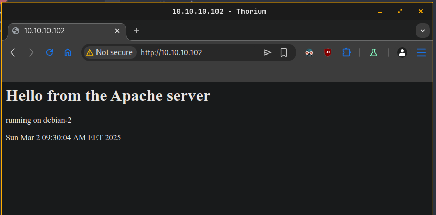
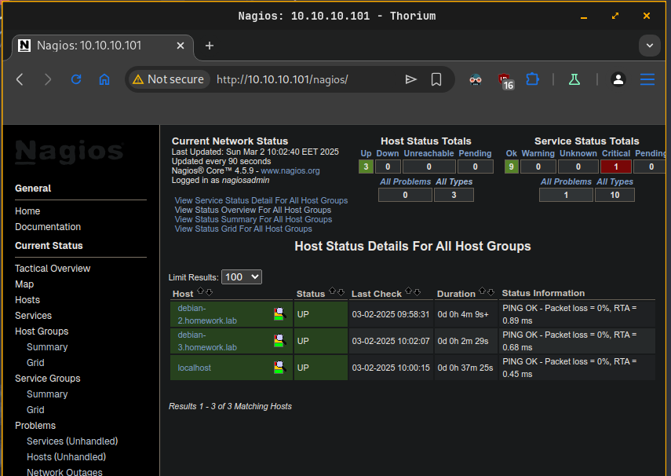
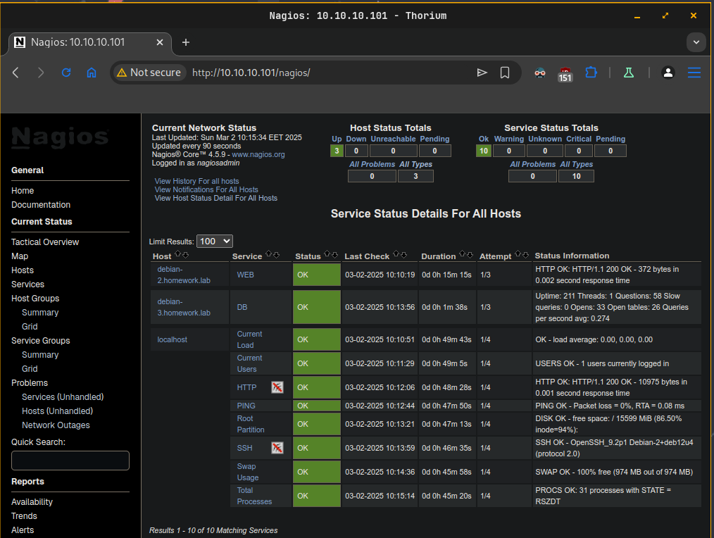
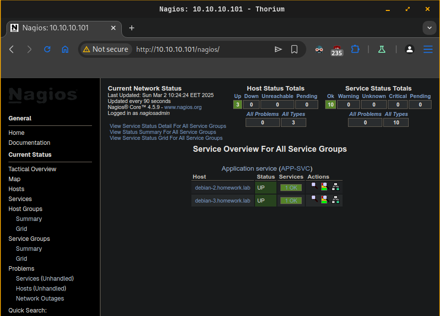
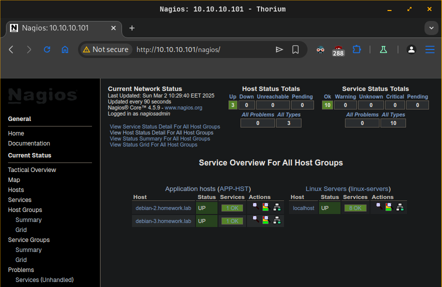
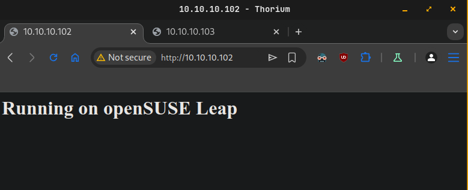
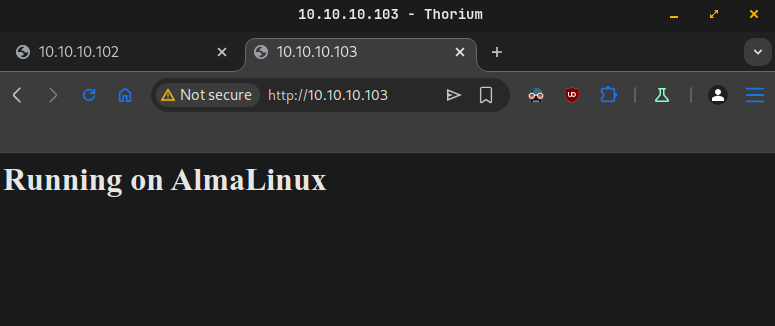

# Tasks

Chose and implement one or more of the following:

- Repeat the **Nagios** related practice (one server and two clients – one with **Apache** and one with **MariaDB**) but in addition to monitoring the individual services (**WEB** and **DB**) create a **service group** (**APP-SVC**) to monitor the two services as a group and **host group** (**APP-HST**) to monitor the two clients as a group

- Create a mixed environment with three machines (one with your favorite distribution you used in the course, one with **CentOS** / **AlmaLinux** and one with **Ubuntu** / **Debian**). The first one should act as an **Ansible** host (with inventory containing the other two machines). You should create and execute a **playbook** that installs and starts **Apache** on the other two machines, opens the firewall for HTTP, and creates a custom **index.html** containing the text **Running on %OS%** where **%OS%** must be either **Red Hat** or **Debian** (or **CentOS** / **AlmaLinux** and **Ubuntu** / **Debian**)

# Solution

## Task 1

### Diagram
```
------------+---------------------------+---------------------------+------------
            |                           |                           |
      enp0s8|10.10.10.101         enp0s8|10.10.10.102         enp0s8|10.10.10.103
+-----------+-----------+   +-----------+-----------+   +-----------+-----------+
|      [ debian-1 ]     |   |      [ debian-2 ]     |   |      [ debian-3 ]     |
|                       |   |                       |   |                       |
| ! build from source ! |   | apache2               |   | mariadb-server        |
|                       |   |                       |   |                       |
|                       |   |                       |   |                       |
|                       |   |                       |   |                       |
|                       |   |                       |   |                       |
|                       |   |                       |   |                       |
+-----------------------+   +-----------------------+   +-----------------------+
```

### Steps
```plain
Step 1 - Setup Nagios on debian-1.homework.lab
Step 2 - Setup Apache on debian-2.homework.lab
Step 3 - Setup MariaDB on debian-3.homework.lab
Step 4 - Configure hosts and services monitoring in Nagios.
Step 5 - Create configuration for Service Group.
Step 6 - Create configuration for Host Group.
```

### Step 1 - Setup Nagios on debian-1.homework.lab
- Install required packages
  ```sh
  sudo apt-get update && sudo apt-get install -y apache2 autoconf bc build-essential dc gawk gcc gettext libapache2-mod-php libc6 libgd-dev libmcrypt-dev libmariadb-dev-compat libmariadb-dev libnet-snmp-perl libssl-dev make php snmp unzip wget
  ```
- Enter the `/tmp` folder
  ```sh
  cd /tmp
  ```
- Download the source
  ```sh
  wget -O nagioscore.tar.gz https://github.com/NagiosEnterprises/nagioscore/releases/download/nagios-4.5.9/nagios-4.5.9.tar.gz
  ```
- Extract file `nagioscore.tar.gz`
  ```sh
  tar xzf nagioscore.tar.gz
  ```
- Enter the folder
  ```sh
  cd /tmp/nagios-4.5.9/
  ```
- Configure the building process
  ```sh
  sudo ./configure --with-httpd-conf=/etc/apache2/sites-enabled
  ```
- Compile the code
  ```sh
  sudo make all
  ```
- Create the required groups and users
  ```sh
  sudo make install-groups-users
  sudo usermod -a -G nagios www-data
  ```
- Install binaries
  ```sh
  sudo make install
  ```
- Install the service
  ```sh
  sudo make install-daemoninit
  ```
- Install and configure external command file
  ```sh
  sudo make install-commandmode
  ```
- Install sample configuration files
  ```sh
  sudo make install-config
  ```
- Install Apache configuration files and enable modules
  ```sh
  sudo make install-webconf
  sudo a2enmod rewrite
  sudo a2enmod cgi
  ```
- Configure firewall if needed
  ```sh
  sudo ufw allow 'WWW Full'
  sudo ufw reload
  ```
- Create Nagios admin user
  ```sh
  sudo htpasswd -c /usr/local/nagios/etc/htpasswd.users nagiosadmin
  ```
- Restart Apache service
  ```sh
  sudo systemctl restart apache2.service
  ```
- Download plugin source package
  ```sh
  wget --no-check-certificate -O nagios-plugins.tar.gz https://github.com/nagios-plugins/nagios-plugins/releases/download/release-2.4.12/nagios-plugins-2.4.12.tar.gz
  ```
- Extract it
  ```sh
  tar zxf nagios-plugins.tar.gz
  ```
- Enter the folder
  ```sh
  cd /tmp/nagios-plugins-2.4.12/
  ```
- Configure the build process
  ```sh
  sudo ./configure
  ```
- Compile from source
  ```sh
  sudo make
  ```
- Install the plugins
  ```sh
  sudo make install
  ```
- Start **Nagios** service
  ```sh
  sudo systemctl start nagios.service
  ```

### Step 2 - Setup Apache on debian-2.homework.lab
- Install Apache
  ```sh
  sudo apt-get update && sudo apt-get install apache2
  ```
- Create custom `index.html` file
  ```sh
  sudo echo "<h1>Hello from the Apache server</h1><p>running on $(hostname)</p><p>$(date)</p>" | sudo tee /var/www/html/index.html
  ```
- Start and enable Apache service
  ```sh
  sudo systemctl enable --now apache2
  ```
- Setup firewall if needed
  ```sh
  sudo ufw allow 'WWW Full'
  sudo ufw reload
  ```
- Check the web service outside
  
  

### Step 3 - Setup MariaDB on debian-3.homework.lab
- Install **MariaDB**
  ```sh
  sudo apt-get update && sudo apt-get install mariadb-server
  ```
- Start and enable the service
  ```sh
  sudo systemctl enable --now mariadb
  ```
- Execute the initial configuration
  ```sh
  sudo mysql_secure_installation
  ```
- Create a user used by **Nagios** to access the database
  ```sh
  mysql -u root -p -e "CREATE USER 'nagios-mon'@'10.10.10.101' IDENTIFIED BY 'pass-123123'; FLUSH PRIVILEGES;"
  ```
- Setup firewall if needed
  ```sh
  sudo ufw allow 3306/tcp
  sudo ufw reload
  ```
- Made **MariaDB** to listen on all interfaces. Open for edit `/etc/mysql/mariadb.conf.d/50-server.cnf` and modify `bind-address`.
  ```plain
  bind-address = 0.0.0.0
  ```
### Step 4 - Configure hosts and services monitoring in Nagios.
- Edit Nagios configuration file `/usr/local/nagios/etc/nagios.cfg`. Uncomment folder where servers configuration files will stored.
  ```sh
  cfg_dir=/usr/local/nagios/etc/servers
  ```
- Create `servers` folder
  ```sh
  sudo chown nagios:nagios /usr/local/nagios/etc/servers
  sudo chmod 775 /usr/local/nagios/etc/servers
  ```
- Create `apache.cfg` configuration file in `/usr/local/nagios/etc/servers` to monitor host and Apache service running on `debian-2.homework.lab`
  ```cfg
  define host {
          use linux-server
          host_name debian-2.homework.lab
          alias DEBIAN-2 VM
          address 10.10.10.102
  }

  define service {
          use generic-service
          host_name debian-2.homework.lab
          service_description WEB
          check_command check_http!$HOSTADDRESS$
  }
  ```
- Create `mariadb.cfg` configuration file in `/usr/local/nagios/etc/servers` to monitor host and MariaDB service running on `debian-3.homework.lab`
  ```sh
  define host {
          use linux-server
          host_name debian-3.homework.lab
          alias DEBIAN-3 VM
          address 10.10.10.103
  }

  define command {
          command_name check_mysql_cmdlinecred
          command_line $USER1$/check_mysql -H '$HOSTADDRESS$' -u '$ARG1$' -p '$ARG2$'
  }

  define service {
          use generic-service
          host_name debian-3.homework.lab
          service_description DB
          check_command check_mysql_cmdlinecred!nagios-mon!pass-123123
  }
  ```
- Test **Nagios** configuration
  ```sh
  sudo /usr/local/nagios/bin/nagios -v /usr/local/nagios/etc/nagios.cfg
  ```
- Restart the **Nagios** service
  ```sh
  sudo systemctl restart nagios.service
  ```
- Check hosts
  
  

- Check services
  
  

### Step 5 - Create configuration for Service Group.
- Create folder `groups` to gather all group types.
  ```sh
  sudo mkdir -p /usr/local/nagios/etc/groups
  ```
- Set permissions and ownership
  ```sh
  sudo chown nagios:nagios /usr/local/nagios/etc/groups
  sudo chmod 775 /usr/local/nagios/etc/groups
  ```
- Edit Nagios configuration file `/usr/local/nagios/etc/nagios.cfg`. Add new line for the new created folder.
  ```sh
  cfg_dir=/usr/local/nagios/etc/groups
  ```
- Create `servicegroups.cfg` configuratiom file inside `/usr/local/nagios/etc/groups`
  ```cfg
  define servicegroup {
          servicegroup_name  APP-SVC
          alias              Application service
          members            debian-2.homework.lab,WEB,debian-3.homework.lab,DB
  }
  ```
- Restart **Nagios** service
  ```sh
  sudo systemctl restart nagios.service 
  ```
- Check **Nagios** web page.
  
  

### Step 6 - Create configuration for Host Group.
- Create `hostgroups.cfg` configuration file inside `/usr/local/nagios/etc/groups`
  ```cfg
  define hostgroup {
          hostgroup_name     APP-HST
          alias              Application hosts
          members            debian-2.homework.lab,debian-3.homework.lab
  }
  ```
- Check for configuration errors
  ```sh
  sudo /usr/local/nagios/bin/nagios -v /usr/local/nagios/etc/nagios.cfg
  ```
- Restart **Nagios** service
  ```sh
  sudo systemctl restart nagios.service
  ```
- Check **Nagios** web page.
  
  

## Task 2

### Diagram
```
------------+---------------------------+---------------------------+------------
            |                           |                           |
      enp0s8|10.10.10.101         enp0s8|10.10.10.102         enp0s8|10.10.10.103
+-----------+-----------+   +-----------+-----------+   +-----------+-----------+
|  [ ansible-debian ]   |   |      [ web-suse ]     |   |     [ web-alma ]      |
|                       |   |                       |   |                       |
| ansible               |   | apache2               |   | httpd                 |
|                       |   |                       |   |                       |
|                       |   |                       |   |                       |
|                       |   |                       |   |                       |
|                       |   |                       |   |                       |
|                       |   |                       |   |                       |
+-----------------------+   +-----------------------+   +-----------------------+
```

### Steps
```plain
Step 1 - Setup ansible on ansible-debian.homework.lab
Step 2 - Create and execute playbook.yaml
```

### Step 1 - Setup ansible on ansible-debian.homework.lab
- Install **Ansible** package
  ```sh
  sudo apt update && sudo apt install ansible
  ```
- Generate key pair for **Ansible** connect to targets
  ```sh
  ssh-keygen -t ed25519 -C "ansible"
  ```
- Send ssh key to target machines
  ```sh
  ssh-copy-id -i ~/.ssh/ansible.pub vagrant@web-suse.homework.lab
  ssh-copy-id -i ~/.ssh/ansible.pub vagrant@web-alma-homework.lab
  ```
- Create `inventory.ini` file with target machines.
  ```ini
  [suse]
  web-suse.homework.lab ansible_host=10.10.10.102

  [alma]
  web-alma.homework.lab ansible_host=10.10.10.103

  [all:vars]
  ansible_user=vagrant
  ansible_ssh_private_key_file=~/.ssh/ansible
  ansible_ssh_common_args='-o StrictHostKeyChecking=no'
  ```
- Test connection to target machines
  ```sh
  ansible -i inventory.ini all -m ping
  ```

### Step 2 - Create and execute playbook.yaml
- Create `templates` folder
  ```sh
  sudo mkdir templates
  ```
- Create `index.html.j2` file
  ```sh
  echo "<h1>Running on {{ ansible_distribution }}</h1>" | tee templates/index.html.j2
  ```
- Create `playbook.yaml`
  ```yaml
  ---
  - hosts: alma
    become: true

    tasks:
      - name: Install Apache server
        dnf:
          name: httpd
          state: present

      - name: Ensure Apache is started and enabled at boot
        service:
          name: httpd
          state: started
          enabled: true

      - name: Copy webpage
        template:
          src: index.html.j2
          dest: /var/www/html/index.html

      - name: Allow Apache service in firewall
        firewalld:
          service: http
          state: enabled
          permanent: true
          immediate: true
  
  - hosts: suse
    become: true

    tasks:
      - name: Install Apache server
        zypper:
          name: apache2
          state: present

      - name: Ensure Apache is started and enabled at boot
        service:
          name: apache2
          state: started
          enabled: true

      - name: Copy webpage
        template:
          src: index.html.j2
          dest: /srv/www/htdocs/index.html
      
      - name: Ensure firewalld is installed
        zypper:
          name: firewalld
          state: present

      - name: Ensure firewalld is started and enabled
        service:
          name: firewalld
          state: started
          enabled: true

      - name: Allow Apache service in firewall
        firewalld:
          service: http
          state: enabled
          permanent: true
          immediate: true
  ```
- Execute Ansible playbook
  ```sh
  ansible-playbook -i inventory.ini playbook.yaml
  ```
- openSUSE Leap web greeting
  
  

- AlmaLinux web greeting

  