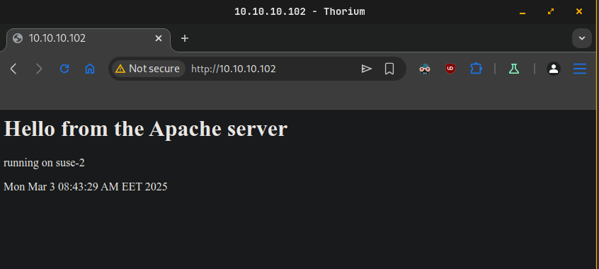
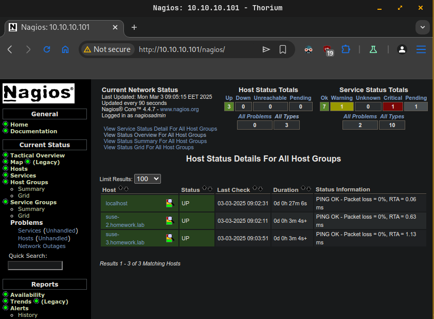
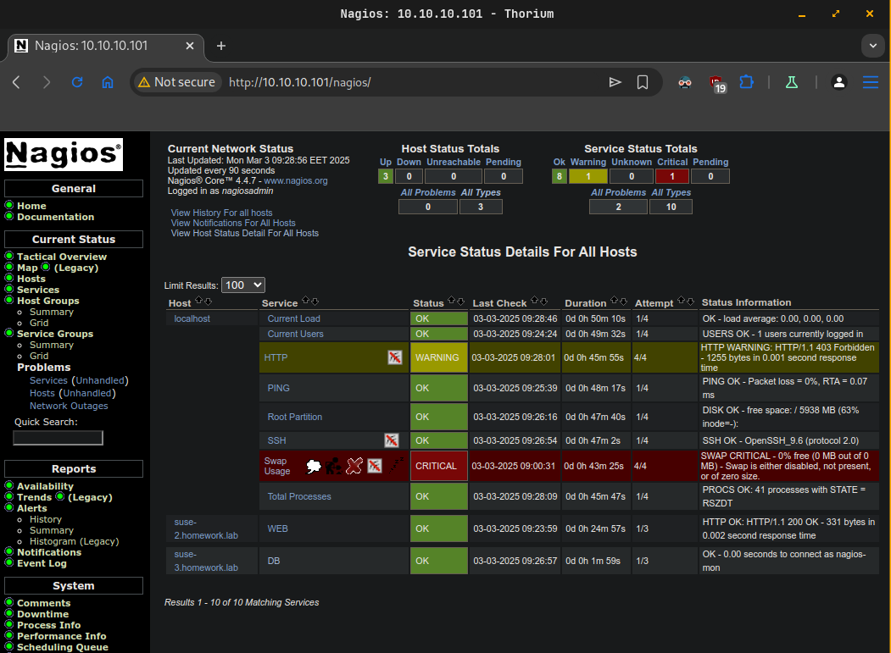
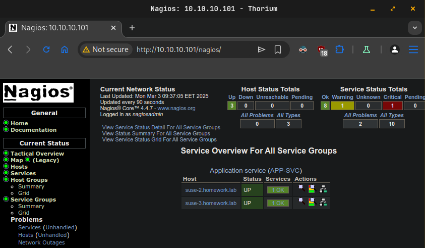
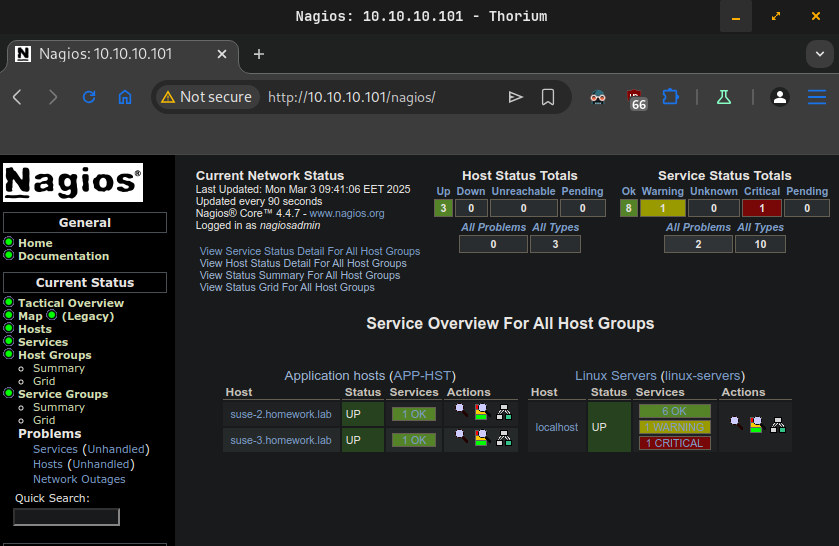
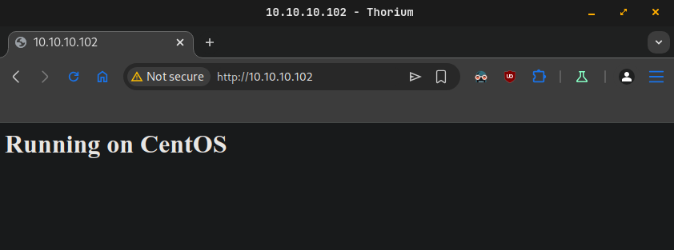
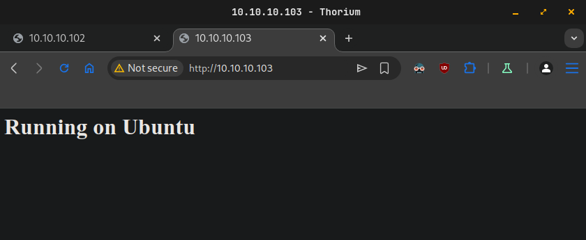

# Homework M7: Management and Maintenance

Main goal is to build further on what was demonstrated during the practice

Prerequisites may vary between different tasks. You should adjust your infrastructure according to the task you chose to implement

## Tasks

Chose and implement one or more of the following:

- Repeat the Nagios related practice (one server and two clients – one with Apache and one with MariaDB) but in addition to monitoring the individual services (WEB and DB) create a service group (APP-SVC) to monitor the two services as a group and host group (APP-HST) to monitor the two clients as a group

- Create a mixed environment with three machines (one with your favorite distribution you used in the course, one with CentOS / AlmaLinux and one with Ubuntu / Debian). The first one should act as an Ansible host (with inventory containing the other two machines). You should create and execute a playbook that installs and starts Apache on the other two machines, opens the firewall for HTTP, and creates a custom index.html containing the text Running on %OS% where %OS% must be either Red Hat or Debian (or CentOS / AlmaLinux and Ubuntu / Debian)

*Please note, that even if you choose to implement more than one task, they are quite independent and different, so you may need to create a separate infrastructure (environment) for each

## Proof

Prepare a document that show what you accomplished and how you did it. It can include (not limited to):

- The commands you used to achieve the above tasks

- A few pictures showing intermediary steps or results

## Solutions

alma/homework-alma.md
debian/homework-debian.md
suse/homework-suse.md

## openSUSE Leap solution

## Task 1

### Diagram
```
------------+---------------------------+---------------------------+------------
            |                           |                           |
      enp0s8|10.10.10.101         enp0s8|10.10.10.102         enp0s8|10.10.10.103
+-----------+-----------+   +-----------+-----------+   +-----------+-----------+
|       [ suse -1 ]     |   |       [ suse-2 ]      |   |       [ suse-3 ]      |
|                       |   |                       |   |                       |
| nagios                |   | apache2               |   | mariadb               |
| monitoring-plugins    |   |                       |   |                       |
|                       |   |                       |   |                       |
|                       |   |                       |   |                       |
|                       |   |                       |   |                       |
|                       |   |                       |   |                       |
+-----------------------+   +-----------------------+   +-----------------------+
```

### Steps
```plain
Step 1 - Setup Nagios on suse-1.homework.lab
Step 2 - Setup Apache on suse-2.homework.lab
Step 3 - Setup MariaDB on suse-3.homework.lab
Step 4 - Configure hosts and services monitoring in Nagios.
Step 5 - Create configuration for Service Group.
Step 6 - Create configuration for Host Group.
```

### Step 1 - Setup Nagios on suse-1.homework.lab
- Install **Nagios** and plugins
  ```sh
  sudo zypper install nagios monitoring-plugins
  ```
- Enable the following module
  ```sh
  sudo a2enmod php8
  ```
- Start and enable **Apache** service
  ```sh
  sudo systemctl enable --now apache2
  ```
- Start and enable **Nagios** service
  ```sh
  sudo systemctl enable --now nagios
  ```
- Setup firewall
  ```sh
  sudo firewall-cmd --add-service={http,https} --permanent
  sudo firewall-cmd --reload
  ```
- Create Nagios admin user
  ```sh
  sudo htpasswd /etc/nagios/htpasswd.users nagiosadmin
  ```

### Step 2 - Setup Apache on suse-2.homework.lab
- Install **Apache**
  ```sh
  sudo zypper install apache2
  ```
- Create custom `index.html` file
  ```sh
  sudo echo "<h1>Hello from the Apache server</h1><p>running on $(hostname)</p><p>$(date)</p>" | sudo tee /srv/www/htdocs/index.html
  ```
- Start and enable **Apache** service
  ```sh
  sudo systemctl enable --now apache2
  ```
- Setup firewall
  ```sh
  sudo firewall-cmd --add-service http --permanent
  sudo firewall-cmd --reload
  ```
- Check the web service outside
  
  

Step 3 - Setup MariaDB on suse-3.homework.lab
- Install MariaDB package
  ```sh
  sudo zypper install mariadb
  ```
- Start and enable the service
  ```sh
  sudo systemctl enable --now mariadb
  ```
- Execute the initial configuration
  ```sh
  sudo mysql_secure_installation
  ```
- Create a user used by **Nagios** to access the database
  ```sh
  mysql -u root -p -e "CREATE USER 'nagios-mon'@'10.10.10.101' IDENTIFIED BY 'pass-123123'; FLUSH PRIVILEGES;"
  ```
- Setup firewall
  ```sh
  sudo firewall-cmd --add-port 3306/tcp --permanent
  sudo firewall-cmd --reload
  ```
- Made **MariaDB** to listen on all interfaces. Open for edit `/etc/my.cnf` and modify bind-address.
  ```plain
  [mysqld]
  bind-address = 0.0.0.0
  ```
- Restart **MariaDB** service
  ```sh
  sudo systemctl restart mariadb
  ```

### Step 4 - Configure hosts and services monitoring in Nagios.
- Edit **Nagios** configuration file `/etc/nagios/nagios.cfg`. Uncomment folder where servers configuration files will stored.
  ```cfg
  cfg_dir=/etc/nagios/servers
  ```
- Create `servers` folder
  ```sh
  sudo mkdir -p /etc/nagios/servers
  ```
- Set ownership
  ```sh
  sudo chown root:nagcmd /etc/nagios/servers
  ```
- Setup `/etc/nagios/servers/apache.cfg` configuration for host and **Apache** running on `suse-2.homework.lab`
  ```cfg
  define host {
          use linux-server
          host_name suse-2.homework.lab
          alias SUSE-2 VM
          address 10.10.10.102
  }

  define service {
          use generic-service
          host_name suse-2.homework.lab
          service_description WEB
          check_command check_http!$HOSTADDRESS$
  }
  ```
- Install **check_mysql_health** plugin if missing.
  ```sh
  sudo zypper install monitoring-plugins-mysql_health
  ```
- Setup `/etc/nagios/servers/mariadb.cfg` configuration for host and **MariaDB** running on `alma-3.homework.lab`
  ```cfg
  define host {
          use linux-server
          host_name suse-3.homework.lab
          alias SUSE-3 VM
          address 10.10.10.103
  }

  define command {
          command_name check_mysql_cmdlinecred
          command_line $USER1$/check_mysql_health --hostname '$HOSTADDRESS$' --username '$ARG1$' --password '$ARG2$' --mode connection-time
  }

  define service {
          use generic-service
          host_name suse-3.homework.lab
          service_description DB
          check_command check_mysql_cmdlinecred!nagios-mon!pass-123123
  }
  ```
- Test **Nagios** configuration
  ```sh
  sudo nagios -v /etc/nagios/nagios.cfg
  ```
- Restart **Nagios** service
  ```sh
  sudo systemctl restart nagios
  ```
- Check hosts
  
  

- Check services

  

### Step 5 - Create configuration for Service Group.
- Create folder `groups` to gather all group types.
  ```sh
  sudo mkdir -p /etc/nagios/groups
  ```
- Set ownership
  ```sh
  sudo chown root:nagcmd /etc/nagios/groups/
  ```
- Edit **Nagios** configuration file `/etc/nagios/nagios.cfg`. Add new line for new created folder.
  ```plain
  cfg_dir=/etc/nagios/groups
  ```
- Create a new file called `servicegroups.cfg `inside `/etc/nagios/groups`
  ```cfg
  define servicegroup {
          servicegroup_name  APP-SVC
          alias              Application service
          members            suse-2.homework.lab,WEB,suse-3.homework.lab,DB
  }
  ```
- Check for configuration errors
  ```sh
  sudo nagios -v /etc/nagios/nagios.cfg
  ```
- Restart **Nagios** service
  ```sh
  sudo systemctl restart nagios
  ```
- Check **Service Groups** tab on web page.
  
  

### Step 6 - Create configuration for Host Group.
- Create a new file called `hostgroups.cfg` inside `/etc/nagios/groups`
  ```cfg
  define hostgroup {
          hostgroup_name     APP-HST
          alias              Application hosts
          members            suse-2.homework.lab,suse-3.homework.lab
  }
  ```
- Check for configuration errors
  ```sh
  sudo nagios -v /etc/nagios/nagios.cfg
  ```
- Restart **Nagios** service
  ```sh
  sudo systemctl restart nagios
  ```
- Check **Host Groups** tab on web page.
  
  


## Task 2

### Diagram
```
------------+---------------------------+---------------------------+------------
            |                           |                           |
      enp0s8|10.10.10.101         enp0s8|10.10.10.102         enp0s8|10.10.10.103
+-----------+-----------+   +-----------+-----------+   +-----------+-----------+
|   [ ansible-suse ]    |   |     [ web-centos ]    |   |    [ web-ubuntu ]     |
|                       |   |                       |   |                       |
| ansible               |   | httpd                 |   | apache2               |
|                       |   |                       |   |                       |
|                       |   |                       |   |                       |
|                       |   |                       |   |                       |
|                       |   |                       |   |                       |
|                       |   |                       |   |                       |
+-----------------------+   +-----------------------+   +-----------------------+
```

### Steps
```plain
Step 1 - Setup ansible on ansible-suse.homework.lab
Step 2 - Create and execute playbook.yaml
```

### Step 1 - Setup ansible on ansible-suse.homework.lab
- Install the ansible package
  ```sh
  sudo zypper install ansible
  ```
- Generate key pair for Ansible connect to targets
  ```sh
  ssh-keygen -t ed25519 -C "ansible"
  ```
- Send ssh key to target machines
  ```sh
  ssh-copy-id -i ~/.ssh/ansible.pub vagrant@web-centos.homework.lab
  ssh-copy-id -i ~/.ssh/ansible.pub vagrant@web-ubuntu.homework.lab
  ```
- Create `inventory.ini `file with target machines.
  ```ini
  [centos]
  web-centos.homework.lab ansible_host=10.10.10.102

  [ubuntu]
  web-ubuntu.homework.lab ansible_host=10.10.10.103

  [all:vars]
  ansible_user=vagrant
  ansible_ssh_private_key_file=~/.ssh/ansible
  ansible_ssh_common_args='-o StrictHostKeyChecking=no'
  ```
- Test connection to target machines
  ```sh
  ansible -i inventory.ini all -m ping
  ```
### Step 2 - Create and execute playbook.yaml
- Create templates folder
  ```sh
  sudo mkdir templates
  ```
- Create `index.html.j2` file, where placeholder `{{ ansible_distribution }}` will be replaced with OS name.
  ```sh
  echo "<h1>Running on {{ ansible_distribution }}</h1>" | sudo tee templates/index.html.j2
  ```
- Create `playbook.yaml`
  ```yaml
  ---
  - hosts: centos
    become: true

    tasks:
      - name: Install Apache server
        dnf:
          name: httpd
          state: present

      - name: Ensure Apache is started and enabled at boot
        service:
          name: httpd
          state: started
          enabled: true

      - name: Copy webpage
        template:
          src: index.html.j2
          dest: /var/www/html/index.html

      - name: Allow Apache service in firewall
        firewalld:
          service: http
          state: enabled
          permanent: true
          immediate: true
  
  - hosts: ubuntu
    become: true

    tasks:
      - name: Update APT package cache
        apt:
          update_cache: yes
          cache_valid_time: 3600

      - name: Install Apache server
        apt:
          name: apache2
          state: present

      - name: Ensure Apache is started and enabled at boot
        service:
          name: apache2
          state: started
          enabled: true

      - name: Copy webpage
        template:
          src: index.html.j2
          dest: /var/www/html/index.html

      - name: Ensure UFW is enabled
        community.general.ufw:
          state: enabled

      - name: Allow Apache service in firewall
        community.general.ufw:
          rule: allow
          port: '80'
          proto: tcp
  ```
- Check syntax errors
  ```sh
  ansible-playbook -i inventory.ini playbook.yaml --syntax-check
  ```
- Execute **Ansible** playbook
  ```sh
  ansible-playbook -i inventory.ini playbook.yaml
  ```
  Output
  ```sh
  PLAY [centos] ************************************************************************************************************************************

  TASK [Gathering Facts] ***************************************************************************************************************************
  ok: [web-centos.homework.lab]

  TASK [Install Apache server] *********************************************************************************************************************
  ok: [web-centos.homework.lab]

  TASK [Ensure Apache is started and enabled at boot] **********************************************************************************************
  ok: [web-centos.homework.lab]

  TASK [Copy webpage] ******************************************************************************************************************************
  ok: [web-centos.homework.lab]

  TASK [Allow Apache service in firewall] **********************************************************************************************************
  ok: [web-centos.homework.lab]

  PLAY [ubuntu] ************************************************************************************************************************************

  TASK [Gathering Facts] ***************************************************************************************************************************
  ok: [web-ubuntu.homework.lab]

  TASK [Update APT package cache] ******************************************************************************************************************
  ok: [web-ubuntu.homework.lab]

  TASK [Install Apache server] *********************************************************************************************************************
  changed: [web-ubuntu.homework.lab]

  TASK [Ensure Apache is started and enabled at boot] **********************************************************************************************
  ok: [web-ubuntu.homework.lab]

  TASK [Copy webpage] ******************************************************************************************************************************
  changed: [web-ubuntu.homework.lab]

  TASK [Ensure UFW is enabled] *********************************************************************************************************************
  changed: [web-ubuntu.homework.lab]

  TASK [Allow Apache service in firewall] **********************************************************************************************************
  changed: [web-ubuntu.homework.lab]

  PLAY RECAP ***************************************************************************************************************************************
  web-centos.homework.lab    : ok=5    changed=0    unreachable=0    failed=0    skipped=0    rescued=0    ignored=0   
  web-ubuntu.homework.lab    : ok=7    changed=4    unreachable=0    failed=0    skipped=0    rescued=0    ignored=0
  ```
- CentOS web greeting
  
  

- Ubuntu web greeting
  
  