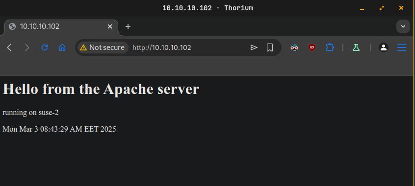
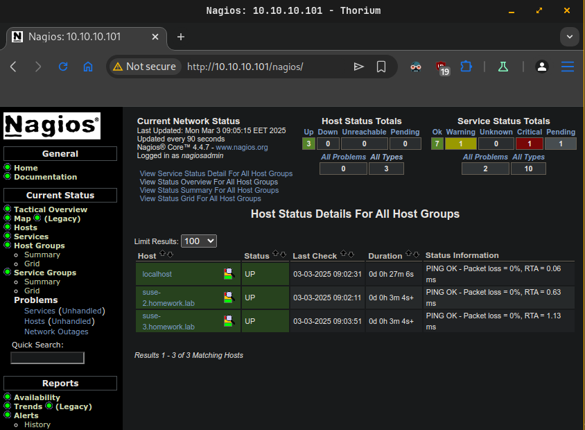
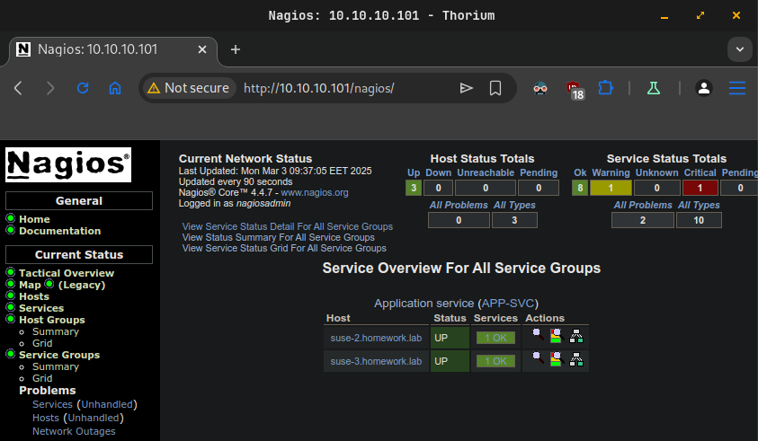
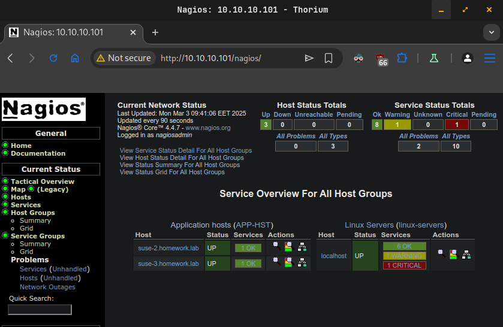
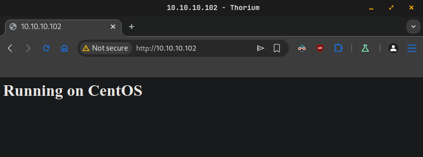
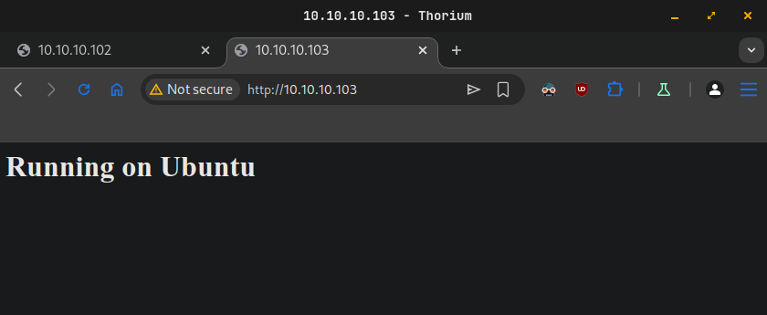

# Tasks

Chose and implement one or more of the following:

- Repeat the **Nagios** related practice (one server and two clients – one with **Apache** and one with **MariaDB**) but in addition to monitoring the individual services (**WEB** and **DB**) create a **service group** (**APP-SVC**) to monitor the two services as a group and **host group** (**APP-HST**) to monitor the two clients as a group

- Create a mixed environment with three machines (one with your favorite distribution you used in the course, one with **CentOS** / **AlmaLinux** and one with **Ubuntu** / **Debian**). The first one should act as an **Ansible** host (with inventory containing the other two machines). You should create and execute a **playbook** that installs and starts **Apache** on the other two machines, opens the firewall for HTTP, and creates a custom **index.html** containing the text **Running on %OS%** where **%OS%** must be either **Red Hat** or **Debian** (or **CentOS** / **AlmaLinux** and **Ubuntu** / **Debian**)

# Solution

## Task 1

### Diagram
```
------------+---------------------------+---------------------------+------------
            |                           |                           |
      enp0s8|10.10.10.101         enp0s8|10.10.10.102         enp0s8|10.10.10.103
+-----------+-----------+   +-----------+-----------+   +-----------+-----------+
|       [ suse -1 ]     |   |       [ suse-2 ]      |   |       [ suse-3 ]      |
|                       |   |                       |   |                       |
| nagios                |   | apache2               |   | mariadb               |
| monitoring-plugins    |   |                       |   |                       |
|                       |   |                       |   |                       |
|                       |   |                       |   |                       |
|                       |   |                       |   |                       |
|                       |   |                       |   |                       |
+-----------------------+   +-----------------------+   +-----------------------+
```

### Steps
```plain
Step 1 - Setup Nagios on suse-1.homework.lab
Step 2 - Setup Apache on suse-2.homework.lab
Step 3 - Setup MariaDB on suse-3.homework.lab
Step 4 - Configure hosts and services monitoring in Nagios.
Step 5 - Create configuration for Service Group.
Step 6 - Create configuration for Host Group.
```

### Step 1 - Setup Nagios on suse-1.homework.lab
- Install **Nagios** and plugins
  ```sh
  sudo zypper install nagios monitoring-plugins
  ```
- Enable the following module
  ```sh
  sudo a2enmod php8
  ```
- Start and enable **Apache** service
  ```sh
  sudo systemctl enable --now apache2
  ```
- Start and enable **Nagios** service
  ```sh
  sudo systemctl enable --now nagios
  ```
- Setup firewall
  ```sh
  sudo firewall-cmd --add-service={http,https} --permanent
  sudo firewall-cmd --reload
  ```
- Create Nagios admin user
  ```sh
  sudo htpasswd /etc/nagios/htpasswd.users nagiosadmin
  ```

### Step 2 - Setup Apache on suse-2.homework.lab
- Install **Apache**
  ```sh
  sudo zypper install apache2
  ```
- Create custom `index.html` file
  ```sh
  sudo echo "<h1>Hello from the Apache server</h1><p>running on $(hostname)</p><p>$(date)</p>" | sudo tee /srv/www/htdocs/index.html
  ```
- Start and enable **Apache** service
  ```sh
  sudo systemctl enable --now apache2
  ```
- Setup firewall
  ```sh
  sudo firewall-cmd --add-service http --permanent
  sudo firewall-cmd --reload
  ```
- Check the web service outside
  
  

Step 3 - Setup MariaDB on suse-3.homework.lab
- Install MariaDB package
  ```sh
  sudo zypper install mariadb
  ```
- Start and enable the service
  ```sh
  sudo systemctl enable --now mariadb
  ```
- Execute the initial configuration
  ```sh
  sudo mysql_secure_installation
  ```
- Create a user used by **Nagios** to access the database
  ```sh
  mysql -u root -p -e "CREATE USER 'nagios-mon'@'10.10.10.101' IDENTIFIED BY 'pass-123123'; FLUSH PRIVILEGES;"
  ```
- Setup firewall
  ```sh
  sudo firewall-cmd --add-port 3306/tcp --permanent
  sudo firewall-cmd --reload
  ```
- Made **MariaDB** to listen on all interfaces. Open for edit `/etc/my.cnf` and modify bind-address.
  ```plain
  [mysqld]
  bind-address = 0.0.0.0
  ```
- Restart **MariaDB** service
  ```sh
  sudo systemctl restart mariadb
  ```

### Step 4 - Configure hosts and services monitoring in Nagios.
- Edit **Nagios** configuration file `/etc/nagios/nagios.cfg`. Uncomment folder where servers configuration files will stored.
  ```cfg
  cfg_dir=/etc/nagios/servers
  ```
- Create `servers` folder
  ```sh
  sudo mkdir -p /etc/nagios/servers
  ```
- Set ownership
  ```sh
  sudo chown root:nagcmd /etc/nagios/servers
  ```
- Setup `/etc/nagios/servers/apache.cfg` configuration for host and **Apache** running on `suse-2.homework.lab`
  ```cfg
  define host {
          use linux-server
          host_name suse-2.homework.lab
          alias SUSE-2 VM
          address 10.10.10.102
  }

  define service {
          use generic-service
          host_name suse-2.homework.lab
          service_description WEB
          check_command check_http!$HOSTADDRESS$
  }
  ```
- Install **check_mysql_health** plugin if missing.
  ```sh
  sudo zypper install monitoring-plugins-mysql_health
  ```
- Setup `/etc/nagios/servers/mariadb.cfg` configuration for host and **MariaDB** running on `alma-3.homework.lab`
  ```cfg
  define host {
          use linux-server
          host_name suse-3.homework.lab
          alias SUSE-3 VM
          address 10.10.10.103
  }

  define command {
          command_name check_mysql_cmdlinecred
          command_line $USER1$/check_mysql_health --hostname '$HOSTADDRESS$' --username '$ARG1$' --password '$ARG2$' --mode connection-time
  }

  define service {
          use generic-service
          host_name suse-3.homework.lab
          service_description DB
          check_command check_mysql_cmdlinecred!nagios-mon!pass-123123
  }
  ```
- Test **Nagios** configuration
  ```sh
  sudo nagios -v /etc/nagios/nagios.cfg
  ```
- Restart **Nagios** service
  ```sh
  sudo systemctl restart nagios
  ```
- Check hosts
  
  

- Check services

  

### Step 5 - Create configuration for Service Group.
- Create folder `groups` to gather all group types.
  ```sh
  sudo mkdir -p /etc/nagios/groups
  ```
- Set ownership
  ```sh
  sudo chown root:nagcmd /etc/nagios/groups/
  ```
- Edit **Nagios** configuration file `/etc/nagios/nagios.cfg`. Add new line for new created folder.
  ```plain
  cfg_dir=/etc/nagios/groups
  ```
- Create a new file called `servicegroups.cfg `inside `/etc/nagios/groups`
  ```cfg
  define servicegroup {
          servicegroup_name  APP-SVC
          alias              Application service
          members            suse-2.homework.lab,WEB,suse-3.homework.lab,DB
  }
  ```
- Check for configuration errors
  ```sh
  sudo nagios -v /etc/nagios/nagios.cfg
  ```
- Restart **Nagios** service
  ```sh
  sudo systemctl restart nagios
  ```
- Check **Service Groups** tab on web page.
  
  

### Step 6 - Create configuration for Host Group.
- Create a new file called `hostgroups.cfg` inside `/etc/nagios/groups`
  ```cfg
  define hostgroup {
          hostgroup_name     APP-HST
          alias              Application hosts
          members            suse-2.homework.lab,suse-3.homework.lab
  }
  ```
- Check for configuration errors
  ```sh
  sudo nagios -v /etc/nagios/nagios.cfg
  ```
- Restart **Nagios** service
  ```sh
  sudo systemctl restart nagios
  ```
- Check **Host Groups** tab on web page.
  
  


## Task 2

### Diagram
```
------------+---------------------------+---------------------------+------------
            |                           |                           |
      enp0s8|10.10.10.101         enp0s8|10.10.10.102         enp0s8|10.10.10.103
+-----------+-----------+   +-----------+-----------+   +-----------+-----------+
|   [ ansible-suse ]    |   |     [ web-centos ]    |   |    [ web-ubuntu ]     |
|                       |   |                       |   |                       |
| ansible               |   | httpd                 |   | apache2               |
|                       |   |                       |   |                       |
|                       |   |                       |   |                       |
|                       |   |                       |   |                       |
|                       |   |                       |   |                       |
|                       |   |                       |   |                       |
+-----------------------+   +-----------------------+   +-----------------------+
```

### Steps
```plain
Step 1 - Setup ansible on ansible-suse.homework.lab
Step 2 - Create and execute playbook.yaml
```

### Step 1 - Setup ansible on ansible-suse.homework.lab
- Install the ansible package
  ```sh
  sudo zypper install ansible
  ```
- Generate key pair for Ansible connect to targets
  ```sh
  ssh-keygen -t ed25519 -C "ansible"
  ```
- Send ssh key to target machines
  ```sh
  ssh-copy-id -i ~/.ssh/ansible.pub vagrant@web-centos.homework.lab
  ssh-copy-id -i ~/.ssh/ansible.pub vagrant@web-ubuntu.homework.lab
  ```
- Create `inventory.ini `file with target machines.
  ```ini
  [centos]
  web-centos.homework.lab ansible_host=10.10.10.102

  [ubuntu]
  web-ubuntu.homework.lab ansible_host=10.10.10.103

  [all:vars]
  ansible_user=vagrant
  ansible_ssh_private_key_file=~/.ssh/ansible
  ansible_ssh_common_args='-o StrictHostKeyChecking=no'
  ```
- Test connection to target machines
  ```sh
  ansible -i inventory.ini all -m ping
  ```
### Step 2 - Create and execute playbook.yaml
- Create templates folder
  ```sh
  sudo mkdir templates
  ```
- Create `index.html.j2` file, where placeholder `{{ ansible_distribution }}` will be replaced with OS name.
  ```sh
  echo "<h1>Running on {{ ansible_distribution }}</h1>" | sudo tee templates/index.html.j2
  ```
- Create `playbook.yaml`
  ```yaml
  ---
  - hosts: centos
    become: true

    tasks:
      - name: Install Apache server
        dnf:
          name: httpd
          state: present

      - name: Ensure Apache is started and enabled at boot
        service:
          name: httpd
          state: started
          enabled: true

      - name: Copy webpage
        template:
          src: index.html.j2
          dest: /var/www/html/index.html

      - name: Allow Apache service in firewall
        firewalld:
          service: http
          state: enabled
          permanent: true
          immediate: true
  
  - hosts: ubuntu
    become: true

    tasks:
      - name: Update APT package cache
        apt:
          update_cache: yes
          cache_valid_time: 3600

      - name: Install Apache server
        apt:
          name: apache2
          state: present

      - name: Ensure Apache is started and enabled at boot
        service:
          name: apache2
          state: started
          enabled: true

      - name: Copy webpage
        template:
          src: index.html.j2
          dest: /var/www/html/index.html

      - name: Ensure UFW is enabled
        community.general.ufw:
          state: enabled

      - name: Allow Apache service in firewall
        community.general.ufw:
          rule: allow
          port: '80'
          proto: tcp
  ```
- Check syntax errors
  ```sh
  ansible-playbook -i inventory.ini playbook.yaml --syntax-check
  ```
- Execute **Ansible** playbook
  ```sh
  ansible-playbook -i inventory.ini playbook.yaml
  ```
  Output
  ```sh
  PLAY [centos] ************************************************************************************************************************************

  TASK [Gathering Facts] ***************************************************************************************************************************
  ok: [web-centos.homework.lab]

  TASK [Install Apache server] *********************************************************************************************************************
  ok: [web-centos.homework.lab]

  TASK [Ensure Apache is started and enabled at boot] **********************************************************************************************
  ok: [web-centos.homework.lab]

  TASK [Copy webpage] ******************************************************************************************************************************
  ok: [web-centos.homework.lab]

  TASK [Allow Apache service in firewall] **********************************************************************************************************
  ok: [web-centos.homework.lab]

  PLAY [ubuntu] ************************************************************************************************************************************

  TASK [Gathering Facts] ***************************************************************************************************************************
  ok: [web-ubuntu.homework.lab]

  TASK [Update APT package cache] ******************************************************************************************************************
  ok: [web-ubuntu.homework.lab]

  TASK [Install Apache server] *********************************************************************************************************************
  changed: [web-ubuntu.homework.lab]

  TASK [Ensure Apache is started and enabled at boot] **********************************************************************************************
  ok: [web-ubuntu.homework.lab]

  TASK [Copy webpage] ******************************************************************************************************************************
  changed: [web-ubuntu.homework.lab]

  TASK [Ensure UFW is enabled] *********************************************************************************************************************
  changed: [web-ubuntu.homework.lab]

  TASK [Allow Apache service in firewall] **********************************************************************************************************
  changed: [web-ubuntu.homework.lab]

  PLAY RECAP ***************************************************************************************************************************************
  web-centos.homework.lab    : ok=5    changed=0    unreachable=0    failed=0    skipped=0    rescued=0    ignored=0   
  web-ubuntu.homework.lab    : ok=7    changed=4    unreachable=0    failed=0    skipped=0    rescued=0    ignored=0
  ```
- CentOS web greeting
  
  

- Ubuntu web greeting
  
  